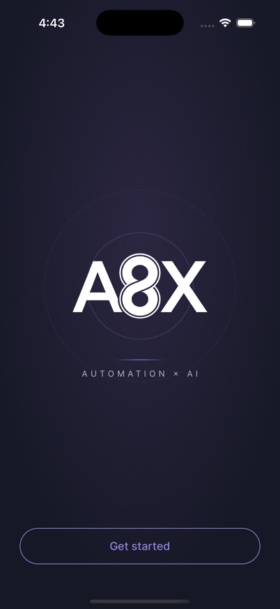
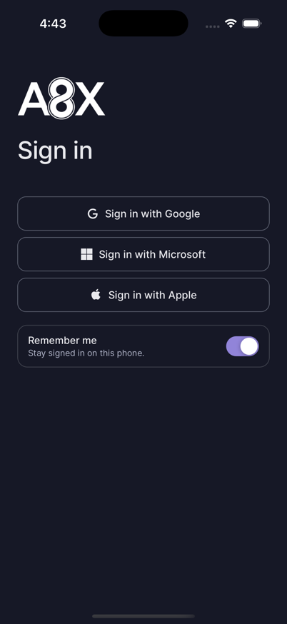

# Round 6 — fresh-audit record

A session that wrote none of the implementation re-ran Gate 8 on 2026-08-18,
against the working tree rather than against `HEAD`, and did not inherit a PASS
from any earlier document. This file replaces the handoff it was written as: it
now records what that audit observed, what it found, what was repaired in
response, and what is still **NOT OBSERVED**.

## Verdict

Gate 8's commands all pass and the native build, boot and route boundary were
observed directly. Two gate lines failed on inspection and were repaired; the
authenticated §1 journey remains unobservable in this environment and is
recorded as NOT OBSERVED, not as a PASS.

**Second fresh audit, 2026-08-18.** A further session that wrote none of this
code re-ran every line above from scratch and did not inherit any PASS from this
file. It reproduced every headline number (1109 packages; 32 / 397 / 78; 12 high
/ 10 moderate / 0 critical; 21 operations; 12 SecureStore call sites; 21 non-ASCII
fixture strings absent from both shipped bundles in **both** encodings), proved
the visual gate and 26 of 30 injected architecture violations bite, and pushed
the branch so **CI ran green against a Round 6 commit for the first time**. It
found three things this file had wrong, each corrected in place below and none
of them a failed gate line: repair #5 has no test behind it, four gate blind
spots are open, and the "0 unreachable objects" figure was vacuous. It also
found the four tracked files this file called unreadable are readable again.

## What the audit ran, and what it saw

| Line | Result | Evidence |
| --- | --- | --- |
| `npm ci` | PASS | exit 0, 1109 packages |
| `npm run verify` | PASS | exit 0 — **32 suites / 397 tests / 78 snapshots**. (The audit itself first ran 33/401; deleting `lib/fixtures.ts` took `__tests__/fixtures.test.ts` — which only asserted that data against itself — with it, and the repairs added suites of their own.) |
| `npm run audit:dependencies` | PASS | exit 0; 22 production advisories (12 high, 10 moderate, **0 critical**) |
| `npm run export:ios` / `:android` | PASS | exit 0 each, ~11.1 MB `.hbc` per platform. Re-run after the repairs with the output redirected out of the iCloud-synced tree — the gate's own `dist/` could not complete while iCloud wrote conflict copies into it (see below). The fresh iOS bundle was grepped in **both ASCII and UTF-16**: all ten fixture-only strings absent, every new string present. Hermes stores non-ASCII strings as UTF-16, so an ASCII-only grep would have missed anything containing `·` or `—`. |
| 0 runtime `lib/fixtures` imports | PASS | the gate reports 0, **and the shipped Hermes bundle contains none of the fixture-only strings** (`Beacon Supply Co`, `4821`, `Invoice triage`, `ap@acme.co`, `solutionDefs`) while control strings are present |
| `audit:credentials` | PASS | allowlist empty |
| Nocturne visual unchanged | PASS | 78 snapshots unchanged across the repair; the gate was proved to bite — a one-digit accent change fails 10 snapshots, +1pt padding 8, +1pt radius 6, a font-family change 14 |
| No hand-written fetch | PASS | 21 operations, all through the generated clients; 0 raw `fetch`/XHR/WebSocket/axios in runtime source |
| Tokens in the enclave | PASS | 12 SecureStore call sites, all `WHEN_UNLOCKED_THIS_DEVICE_ONLY`; no AsyncStorage, no `console.*`, no `process.env` in app source |
| Gates fail on violation | PASS | 19 representative violations injected into an isolated copy; all 19 caught |
| iOS 17.4 floor | PASS | app-target `IPHONEOS_DEPLOYMENT_TARGET = 17.4`, shipped `Info.plist MinimumOSVersion 17.4`, compiler `-target arm64-apple-ios17.4-simulator`; `expo-web-browser@15.0.11` uses `ASWebAuthenticationSession(callback: .https(host:path:))` |
| Fail-closed route guard | PASS | observed at runtime: four protected deep links each land on the auth stack, while a control deep link to `/(auth)/login` navigates, so the bounce is the guard and not a dead link |
| Both clients, same journey | **repaired** | mobile discarded `available`; see below |
| Status vocabulary mapped, not redefined | **repaired** | Activity collapsed five tones into three; see below |
| Android native launch | **NOT OBSERVED** | this host has no `adb`, no `emulator`, and no Android SDK |
| EAS preview/production cloud build | **NOT OBSERVED** | `eas` CLI is not installed and no EAS project is linked |
| Authenticated §1 journey | **NOT OBSERVED** | native login answers 503 |

The three NOT OBSERVED rows above are the Round 6 record and stand unedited.
Round 7.5 (2026-08-27) exists to observe exactly those three lines; its
evidence, and the current state of each, is in `ROUND-7.5-OBSERVATIONS.md` —
this table is no longer the live register for them.

## What the audit found, and what was repaired

Each of these failed a line this repository asserts. Six of the seven are
covered by a test that fails against the previous code — **verified by a second
fresh audit on 2026-08-18, which reverted each repair in an isolated copy and
watched the suite go red.** The seventh, #5, is **not** covered; see the
correction under it.

1. **`AutomationCatalogEntry.available` was dropped.** The published probe result
   never reached a view, so mobile offered Add and Activate for automations the
   platform had already found unreachable — while the web client refuses both on
   the same field. That is two clients driving different journeys against one
   Edge. Now carried through `lib/view/catalog.ts` and enforced at all three
   action sites.
2. **Activity redefined the run-status vocabulary.** Five tones were narrowed
   into three by mapping `accent` and `neutral` onto `warn`, and `warn` *is* the
   "Needs review" chip — so running, queued and cancelled runs were listed as
   awaiting a human decision. The chips now select on the published run status.
3. **A session that expired while the app was open dead-ended.** Refresh ran
   only at launch and no 401 was handled anywhere in the transport, so every
   screen read "Sign in is required" until the app was killed. The transport now
   renews once and retries once, single-flight, with the three credential routes
   exempt; a renewal that proves the token dead moves the session to
   `signed-out` so the guard fails closed.
4. **Client-side overrides outlived sign-out.** `use-solutions` and
   `use-workflows` are mounted above the route tree and had no clear site, so one
   account's local state was layered over the next account's catalog in the same
   process. Both are now scoped to person + workspace.
5. **Two idempotency keys were reused across changed intents.** `flows/configure`
   never re-minted after a success (a second create replayed the first), and
   `solutions/setup` reused one key across bodies computed from different
   sources (an inescapable 409). Both re-mint on the boundary that changed.

   **Correction, 2026-08-18 (second fresh audit).** This repair alone has no
   test behind it. Deleting every `Key.current = newIdempotencyKey(...)` re-mint
   from `app/(tabs)/flows/configure.tsx` and `app/(tabs)/solutions/setup.tsx`
   leaves the whole suite green — 32 suites / 397 tests / 78 snapshots. The
   idempotency assertions in `__tests__/platform-mutations.test.ts` only check
   that the transport forwards the key it is handed (`'intent-1'`, `'intent-2'`);
   nothing exercises the screen-level re-mint, which is where the defect lived
   and where the fix went. The fix is real in source and correct on inspection;
   the claim that a test held it was not. Filed as a manifest §12.2 row rather
   than repaired here, because writing the missing test is implementation work
   and this was an audit.
6. **Sign-out cleared the credential on non-terminal failures.** A 500 or 503
   deleted the keychain entry for a session still live upstream. Only 400 and
   401 clear now.
7. **CI and `verify` ran the suite differently.** CI omitted `--runInBand`, so a
   flake could appear in exactly one of the two places. Both now use it, and both
   pass `--ci` so a missing snapshot fails instead of being written.

## Closed after the audit, in the same round

The audit's own "still open" list was worked down rather than carried forward:

- **`lib/fixtures.ts` is gone.** 410 lines of prototype data sat in a runtime
  root with zero runtime importers, and the fixture gate passed because the
  script exempted that one path *by name* — the rule held by exemption rather
  than by the tree. The eight symbols the suites actually use moved to
  `test/design-data.ts`; the other eleven exports had a single consumer,
  `__tests__/fixtures.test.ts`, which asserted the data against itself. The gate
  now fails on prototype fixture data merely **existing** in a runtime root, so
  the count cannot drift back.
- **`unconfigured` is its own state.** `components/screen-state.tsx` gains
  `ScreenUnavailable`, and the eight workspace-scoped screens no longer fold it
  into a load error whose Retry can never succeed.
- **Login and Signup show a pending state** while the provider policy resolves,
  and neither draws an "or" divider above an empty provider column.
- **Approvals has a real empty state**, and its "all caught up — decisions
  synced" line now fires only when this person actually decided something.
- **The `space` scale is deleted** — zero product call sites; its only reference
  was a test pinning its own value.
- **The gate blind spots are closed** and pinned by
  `__tests__/audit-gates.test.js`: a hex hoisted to a const, a template-literal
  hex, a `const DEMO_PASSWORD`, a credential in an object literal, an aliased
  `globalThis.fetch`, a fixture import from a `.js` file, and the fixtures
  module existing at all. Two counter-cases assert the credential gate does
  **not** fire on a keychain key name or a UI label, because a gate that cries
  wolf earns an allowlist and then gets ignored.
- **`eas.json` no longer describes capabilities that do not exist.** Both
  `channel` keys were inert (`expo-updates` is not installed and `app.json` has
  no `updates`/`runtimeVersion`), and `submit.production` was an empty object
  that read as configured-and-ready. Both are gone. Their reasons were
  recorded in the file itself until Round 7.5 (2026-08-27), when eas-cli 22's
  strict schema validation forced the `$comment` out — it refuses the whole
  file over an unknown key. Both absences still hold; the living rationale
  now sits in README's build section, and the move itself is recorded in
  `ROUND-7.5-OBSERVATIONS.md`.

## Still open, recorded rather than fixed

- **Four gate blind spots remain, found by the second fresh audit on
  2026-08-18.** They are *latent, not live*: no tracked `.js`/`.jsx` file exists
  in any runtime root, and `constants/` contains only `theme.ts`, so nothing
  evades a gate today. But the ratchets do not cover what they claim to, and a
  future commit walks straight through them. Proved by injection in an isolated
  copy — 26 of 30 violations caught, these 4 missed:

  | Gate | Blind spot | Why |
  | --- | --- | --- |
  | `audit:tokens` | a hex in `constants/` outside `theme.ts` | `sourceRoots` is `app, components, hooks, lib` — `constants` is absent |
  | `audit:tokens` | a hex in any `.js`/`.jsx` runtime file | its `walk()` accepts only `.ts`/`.tsx` |
  | `audit:credentials` | a `const DEMO_PASSWORD` in `constants/` | same missing root |
  | `audit:credentials` | a `const DEMO_PASSWORD` in a `.js` file | same extension filter |

  The asymmetry is the tell: `audit:fixtures` and `audit:platform` *do* scan
  `constants/` and *do* accept `.js`, and the previous round deliberately closed
  "a fixture import from a `.js` file". The same fix was never carried across to
  the other two scripts. Two counter-cases were also re-proved: the credential
  gate correctly does **not** fire on `ACCESS_TOKEN_KEY = 'autom8x.access-token'`
  or on a `'Show password'` label.

- **`npm ci` is not idempotent in this checkout.** Run against an existing
  `node_modules`, it fails `ENOTEMPTY … rmdir node_modules/@react-native/
  debugger-frontend/dist` (exit 254). `rm -rf node_modules && npm ci` then
  succeeds, exit 0, 1109 packages in 18 s. This is the iCloud tree, not the
  lockfile — but Gate 8's first command does not pass from a dirty tree without
  a manual clean, and that belongs in the record rather than in a rerun nobody
  saw fail.

- **Home's failure state is one state, not three — closed by Gate 24's parity line
  (G3), 2026-10-07, below: Home now says what happened, and that nobody was signed
  out, in the website's words.** The design (`Screen.dc.html`,
  `sHomeErr`) draws a single connectivity-worded failure for Home, so a platform
  refusal and an unresolved workspace both read "Check your connection". The
  client is faithful to the design; splitting it is a design decision, not a
  client one. `DESIGN-CONTRACT.md` states the carve-out instead of claiming
  uniformity.
- **The appearance preference is not persisted — closed by Gate 24's parity line
  (G2), 2026-10-07, below: kept on the device, as the website keeps its theme**;
  Settings → Appearance returned
  to Dark on every cold launch. No published contract covers it and the design
  does not say it should survive a launch, so it is recorded rather than decided
  here.
- **`eas.json` could not build until an EAS project was linked — resolved in
  Round 7.5, 2026-08-27, no longer open.** `appVersionSource: "remote"`
  requires a linked project, and through Round 6 there was deliberately no
  `extra.eas.projectId` anywhere; that needed an account, which was Round 7's
  to provision. `eas init` against the owner's account has since created
  `@autom8x.ai/snoopy-mobile`, `app.json` carries the link and owner, and the
  id is real, not a placeholder — the evidence, including a cloud build whose
  EAS record names this repository's commit hash, is in
  `ROUND-7.5-OBSERVATIONS.md`.
- **A stray 4-object pack from May 4 was *evicted*, not corrupt.** The earlier
  record called it unreadable and reported "0 unreachable objects from HEAD";
  that number was **vacuous** — `git rev-list --objects HEAD` was itself failing
  (`error reading from .git/objects/pack/pack-5e2474d2….pack: Operation timed
  out`) and its empty output was counted as a zero. The pack is an iCloud
  dataless stub; `brctl download` materialised it on the first attempt, after
  which the same command returns **862 objects with no error**, and `HEAD`,
  `main` and `round-6-client` are each fully traversable (50 / 15 / 50 commits).
  `git fsck` still times out against the evicted object store, so `git gc`
  remains a bad idea here — but the object store is intact, not damaged.
- **This checkout sits under iCloud Drive, and it is not a cosmetic problem.**
  iCloud creates numbered conflict copies inside the tree while tools write to
  it. Measured on 2026-08-18: **6,159** such copies under
  `snoopy-mobile/node_modules`, 21 of them empty `@types/* 2` directories —
  and TypeScript treats every directory under `@types/` as an implicit type
  library, so `tsc` failed outright on all 21 until they were removed. The
  performance cost is the larger half: with the copies present `tsc --noEmit`
  used **4.5 s of CPU spread over 9 min 47 s of wall clock at 1% CPU**; with
  them removed, **3.0 s wall at 162% CPU**. One test suite reported 578 s that
  runs in 4.1 s clean. `expo export` could not finish at all while writing into
  the synced `dist/`, where iCloud had produced `_expo 3`, `assets 2` and
  `metadata 2.json`; redirecting the same command to a non-synced output
  directory completed both platforms with exit 0. **Re-measured 2026-08-18 by the
  second fresh audit: with the conflict copies cleared, the gate commands run
  unmodified into the synced `dist/` and both exit 0** — iOS 13 s, Android 11 s,
  ~11.1 MB `.hbc` each; `tsc` is 3 s and the full suite 21 s. So the failure is a
  function of accumulated conflict copies, not a standing property of the path:
  the honest statement is that it recurs, not that it always holds.

  The four tracked files this record listed as unreadable in the working tree —
  two Android icon PNGs, `Autom8x iOS App.dc.html` and a `_ds/*/styles.css` —
  **are all readable again as of 2026-08-18**, materialised by iCloud without any
  `git checkout --`. The governance documents went the other way and had to be
  forced: `AUTOM8X-MASTER-PLAN.md` and `AUTOM8X-ROUND-PLAYBOOK.md` were both
  unreadable at the start of the second audit and took **24 `brctl download`
  attempts** to materialise. Eviction here is bidirectional and unpredictable,
  which is the operational point.

  **No tracked file in any of the four repositories is affected** — verified by
  `git ls-files` across all four. The damage is confined to ignored build and
  dependency trees, plus two untracked strays in the sibling web repo
  (`snoopy/compose 2.yml`, `snoopy/test/session-contract.test 2.mjs`), which a
  `snoopy` session should clear.

  This is the same iCloud conflict-copy failure the master plan's §2.1 item 15
  screens the repositories for. It will recur here, and Round 7's container
  builds will meet it on a volume that is already 95% full.

## Live environment, re-probed

Re-run 2026-08-18, not inherited:

- `GET /health/ready` → **503** `not-ready`; identity, connections and object
  storage all `adapter_not_configured`.
- `GET /v1/session` → **401** `UNAUTHENTICATED`.
- A schema-valid `GET /v1/auth/native/google/start` (43-character S256
  challenge) → **503**, `details.component: native_app_redirect_uris`.
- `GET /v1/auth/providers` → **200**. This is the one live read the app
  exercises, and the login screen renders its refusal honestly when it fails.

A real authenticated §1 journey is therefore not observable here. Round 7 owns
deployed identity, a claimed HTTPS domain, build credentials and secret
injection. A Release build additionally refuses cleartext by design, so it
cannot reach a local `http://localhost:8080` Edge at all; observing one would
need a TLS front end, which this audit was not permitted to start.

## Native build and boot, observed

- A direct Release build from this checkout **fails**, exit 65, at the Expo
  Constants CocoaPods phase: `bash: /Users/siddaksingh/Desktop/Business: No such
  file or directory`. The upstream script splits the path at the space in
  `Business Infra`. No source or generated native file was patched around it.
- An exact copy at a path without spaces — proved byte-identical first, 150
  tracked files with an identical SHA-256 manifest — **BUILD SUCCEEDED**, exit 0,
  0 errors and 0 app-target warnings (~2,700 warnings, all in `ios/Pods`).
- Installed as `ai.autom8x.snoopy` and cold-launched on simulator
  `2F8CA2CB-2A74-4B4E-A1B8-583D63560E1C` (iPhone 16 Pro / iOS 18.6), **PID
  49039**, process alive, real onboarding screen rendered.

This is local native-build and boot evidence. It is not a cloud build and not an
authenticated journey.

## Deliberate non-Round-6 gaps

Unchanged, and not unfinished 8.5–8.7 work: Builder authoring, saving,
reordering, branch editing and client-triggered test runs; a run retry
preserving continuation identity; notification push permission, delivery and
cross-device read state; billing, payment methods, invoices and a plan base
price; profile editing, workspace switching and member management; full
satisfied-provider detail, per-step manifest icons, and branch/delay/human-review
kickers; reduced-motion alternatives and exhaustive small-phone/tablet approval.
Workspace switching was on this list until Round 7.5M (2026-09-03) added it over
the published active-workspace operation; profile editing and member management
remain out.

## Dependency boundary

`npm audit fix` was applied only within compatible ranges and `postcss` is
overridden to a patched release. The 12 high advisories all reduce to two roots
— `image-size` (two DoS parsers, reached through `metro`) and `uuid` (reached
through `xcode`) — both build-time tooling that npm classifies as production
because `expo` and `react-native` are runtime dependencies. npm's fix is an Expo
SDK major. That is an SDK migration, not permission to force a major upgrade
inside Round 6. The CI gate fails on critical advisories; there are none.

## What must still happen before Round 6 closes

1. ~~Push `round-6-client` and let CI run.~~ ✅ **Done 2026-08-18 by the second
   fresh audit.** `origin/round-6-client` exists and tracks. Pushing alone did
   **not** run CI: `.github/workflows/ci.yml` triggers on `pull_request` and
   `push: [main]` only, and there is no `workflow_dispatch`, so a PR was the one
   mechanism that could satisfy this line — PR #5. **CI is green on run
   `32187060170`, all five jobs**: Lint 39 s, Typecheck 39 s, Architecture gates
   40 s, Test 1 m 33 s, Native bundle export 2 m 4 s. The Test job reproduces the
   local counts exactly — 32 suites / 397 tests / 78 snapshots — on an Ubuntu
   runner with no iCloud, which is what makes those counts a property of the code
   rather than of this laptop. All four architecture gates report their zero.
2. Close the round in the governing master plan. That file lives in the sibling
   `snoopy-backend` repository, which a mobile session may read and must never
   edit; it belongs to a separately authorized backend/governance session.

## Round 16 — findings and observations (ADR-0032)

Recorded by the session building BUILD-PLAN Phase 24 on 2026-09-29. None of
this closes a line of Gate 24; a fresh session re-runs every one.

### Findings, 24.4

- **Backend: the catalog's `subscribed` counts an archived subscription.**
  `apps/catalog/src/postgres-automations.ts` answers `subscribed` from any
  `catalog.subscriptions` row for the template, with no `status <> 'archived'`,
  while the same service leaves archived rows out of the subscription list, the
  plan counts and the one-per-template check (`postgres-subscriptions.ts`). The
  contract says `subscribed` "drives Add versus Added", so after an Archive it
  would still say Added. The app no longer uses the flag for that: Solutions'
  Added and Settings' totals answer from the subscription list, and drop any
  archived row it holds, as the website does — the list's contract does not
  promise to omit them (`withoutArchived`). Home keeps the flag on purpose: it
  asks whether the workspace has set anything up at all, and the list shows only
  what the person can see. For a `snoopy-backend` session to file in manifest
  §12.1.
- **Backend contract: Set up cannot show the pinned version's settings.** A
  `config` change is validated against the version the subscription PINNED,
  but the only published `setup` is the catalog's, which is the newest
  version's. Both clients therefore draw the newest version's fields; when the
  two versions' settings differ, a save can be refused as undeclared, and a move
  refused `invalid_config` can have no way out ("Open Set up, fix them, then
  move" edits the old version's fields). The website has the same gap. For a
  `snoopy-backend` session: publish the pinned version's `setup` on
  `Subscription`, as `runInput` already is.
- **Carried to 24.5.2: Add to a project, and each workflow's scope.** The
  website adds an automation to the whole workspace or to one project, and
  labels each subscription with its scope. Both need the workspace's projects,
  which 24.5.2 reads. Until then the app adds workspace-wide, as it always has,
  and lists every subscription the platform shows it.
- **24.3.6's binding, completed in 24.4.** Five actions that predate the rule —
  the approval decision, Solutions' pause, setup's activate, configure's create
  and Flow detail's status — read the active workspace at the moment of the
  press. Each now acts on its screen's `loadedFor` through `workspaceIfShown`.
- **Known limit, for the refinement pass: a large file for a run.** The upload
  reads the whole file into JavaScript, and React Native's `fetch` copies and
  base64-encodes it on the JS thread. The code review measured about 2.5 s of
  frozen UI and about 215 MB at peak for a 25 MiB file on an M1 Pro; a phone is
  slower. The streaming path is expo-file-system's native upload, placed inside
  `lib/platform/client.ts` beside the one `fetch` the transport audit admits.
  Not done in 24.4: it reworks 24.3.4's upload and its audit, and the owner's
  direction is a working baseline first, tuning after.
- **Known limit, for the refinement pass: a return re-reads everything.**
  24.4.4 re-reads a screen each time it regains focus, with no staleness window
  and no abort, and each read counts against the Edge's per-person limit. A 429
  keeps the rows and says the wait (24.3.3).

### What `/code-review` found in 24.4, and what became of it

Fifteen findings and a further list cut by its cap. Fixed, each with a test:

- `reload()` after a change now starts from `loading`. Only a RETURN to a
  screen keeps its rows. Kept rows had let Set up re-seed from the settings it
  had just replaced, so the next save undid the one before, and a failed reload
  hid behind them.
- Flow detail shows the platform's status. The list shows what detail
  recorded only until the list reads again (`record`/`settle`). Run is offered
  on the status as read, never on what this device changed last.
- A status change is keyed by its target, and a move by its version, so a
  Resume after a lost Pause answer is a new intent and not a 409.
- Archive forgets this device's plan statement for its template, and returns to
  the Flows list with `dismissTo`: a cross-tab replace from Setup leaves nothing
  to go back to.
- Setup renews its create key once the create succeeds, as configure does.
- Connections: Connect/Disconnect and Replace are one dialog in two modes,
  because iOS will not present a second modal while the first is dismissing.
  Closing after a stale 409 re-reads the rows.
- The dialog rises above the iOS keyboard, and its actions wrap on a narrow
  phone.
- The upload `PUT` carries the type it was opened for; Android refuses a body
  with none, and the store signs only its length and host.
- A money field reads "12,50" from a comma-decimal keyboard as 12.5.
- Approvals counts only decisions on approvals still listed.
- Notifications marks read the rows "Mark all read" covered, not rows a later
  re-read brings in.
- The webhook dialog is held open only while a secret is being made.
- Login's unlock button uses the device's biometric wording.

Not changed:

- Home's first-run test is left as it was (see the first finding).
- A non-platform error's own words may reach a refusal line, as
  `refusalMessage` was built to allow in 24.3.6.

### Guards proved to bite, 24.4

Each guard was broken by hand in the working tree, its test run and seen to
fail, and the file restored and checked byte-identical by SHA-256:

| Guard | Broken by | Test that failed |
| --- | --- | --- |
| Webhook address for owner or admin only | dropping `canAdminister` | `automation-actions` "to no one else" |
| The webhook secret stored nowhere | a `SecureStore.setItemAsync` of it | `automation-actions` "stores it nowhere" |
| The upload's exact size | sending bytes of another length | `run-file` "sends nothing when…" |
| The platform asked before the file is read | reading first | `run-file` "asks before reading" |
| The upload's type | no `Content-Type` | `platform-request` "no credential" |
| Workspace binding (Archive and Move) | the active workspace used directly | `automation-actions` "once another workspace is active" |
| Archived is absent | `withoutArchived` returning every row | `flows-view`, Solutions, Setup |
| Run key renewed on a changed value | no renewal | `automation-actions` "a change is a new run" |
| Run key kept for a resubmission | a new key each press | the same test |
| Status key per target | one key for both | `tab-screens` "own key" |
| Go live held back with an unmet connection | both its guards removed | `tab-screens` "holds Publish back" |
| Move offered only for a newer version | `<` made `<=` | `automation-actions` "newer version" |
| Run offered only with declared input | the `runInput` check dropped | `automation-actions` "declares input" |
| Cancel only for a pending or running run | always cancellable | `tab-screens` "offers no Cancel" |
| Pause never sent to an archived subscription | the filter dropped | `tab-screens` "never an archived one" |
| Archive forgets the plan statement | no `forget` | `automation-actions` "answer Added again" |
| Archive returns to the list | `router.back()` | `tab-screens` "however detail was reached" |
| A reload starts from `loading` | rows kept | `use-resource` "starts a reload" |
| The list settles what detail recorded | no `settle` | `return-reread` "Flows list reads again" |
| Approvals counts what is still listed | every decision counted | `return-reread` "still pending" |
| A stale Replace re-reads when closed | no re-read | `settings-connections` "re-reads when closed" |
| A comma decimal | no normalising | `setup-field` "comma-decimal" |

### Findings, 24.5

- **The website's join page is reached only by a link that names the
  organization** (`/onboarding/join-org?w=`), and neither the website nor the
  backend makes that link. The app's Organization screen lists what
  `organization-discovery` returns instead — the same operation, which takes no
  parameter and answers only for the person's verified email domain.
- **Website: a retry after a failed domain claim creates a second
  organization.** `createOrgWorkspaceAction` creates the workspace and then
  claims the email domain; each create mints a new key
  (`snoopy/lib/tenancy.ts`), so pressing Create again after the claim failed
  makes another organization. The app keeps the one it made and retries the
  claim alone. For a `snoopy` session to file.
- **Not carried over, on purpose.** Onboarding's "create a personal account
  instead": every signed-in person already has a personal workspace (backend
  `ensurePersonalWorkspace`), and the app has no onboarding step. Delete on the
  projects list: it is on the project's own screen, with the same operation and
  the same confirmation.
- **A project action acts on the project's own workspace**, which the screen
  read it from and which can be other than the active one — as the website's
  `findAccessibleProject` resolves it.
- **An automation added to a project alone can still be added to the whole
  workspace**, projects or not — the website's Add offers every scope not taken.
  The app's "Add to…" follows that.

### Guards proved to bite, 24.5

| Guard | Broken by | Test that failed |
| --- | --- | --- |
| Organization managed by its owners and admins | the role check dropped | `organization-screen` "reads nothing it would be refused" |
| Never an owner, never oneself, removed | every row removable | `organization-screen` "never an owner" |
| Set up only on a company domain | the mailbox-provider check dropped | `organization-screen` "company domain" |
| One organization, however often Create is pressed | the made one forgotten | `organization-screen` "creates the organization once" |
| Member removal bound to the loaded workspace | the active workspace used directly | `organization-screen` "once another workspace is active" |
| The DNS value seen before the re-read | re-read at once | `organization-screen` "DNS verification value" |
| A project deleted in its own workspace | the active workspace used | ~~`projects-screens` "own workspace"~~ — a team since 24.11.7, and the file gone with Projects (bda1136): `teams-screens` "deletes its owner's team in the team's own workspace, saying what becomes of its flows", re-proved at Gate 24 (B43, below) |
| Leave only after typing DELETE | no word asked | ~~`projects-screens` "typing DELETE"~~ `teams-screens` "lets a member leave only after typing DELETE, and shows them no requests", re-proved at Gate 24 (B44, below) |
| ~~A team project only in the loaded organization~~ | ~~the binding dropped~~ | ~~`projects-screens` "no longer the active workspace"~~ — superseded: Create a team acts on the workspace it was opened in, build 10's "Create a team is refused once another workspace is active" (below) |
| An owner's row not changed | both its guards removed | ~~`projects-screens` "owner's row is not changed"~~ `teams-screens` "changes a member's role and adds someone; an owner's row is not changed", re-proved at Gate 24 (B45, below) |
| ~~Teams created by owners and admins~~ | ~~anyone offered Create~~ | ~~`teams-screens` "offered no Create"~~ — superseded by build 10's "A plain organization member is not offered Create a team (Teams)" (below) |
| ~~Team members read by its managers, owners and admins~~ | ~~anyone reading~~ | ~~`teams-screens` "read only by its managers"~~ — the team page's manager gate since 24.11.7 (`settings/team.tsx:67`), proved at Gate 24 (B3, B4, below) |
| ~~A team name of two characters at least~~ | ~~one allowed~~ | ~~`teams-screens` "two-letter name"~~ — superseded by build 10's "Other is 2 to 60 characters" (below) |
| ~~The Teams row only in an organization~~ | ~~shown in any workspace~~ | ~~`teams-screens` "Teams only in an organization"~~ — retired by the owner's build 9 decision 2 (teams in the personal workspace too): Teams is offered in every workspace (24.11.7) |
| Add to… wherever a scope remains | hidden without projects | `tab-screens` "Add to…" |
| The chosen project sent with the create | dropped | `tab-screens` "project chosen" |
| No scope drawn without projects | always drawn | `tab-screens` "no scope where" |

### Findings, 24.6

- **The website's linking is cookie-bound and web-only** (`LinkedAccountsSection`
  navigates to `/v1/auth/identities/{provider}/start`). The app links through
  24.2.1's ticket flow, which exists for exactly this reason (ADR-0017 §6).
- **A bearer caller can meet one deletion answer the website never does**:
  502 `SESSION_REVOCATION_FAILED`, the account gone but the refresh token it
  sent still live. The app revokes it through sign-out before letting go, and
  keeps the session if that fails, as the contract asks. A `DEPENDENCY_FAILURE`
  502, or no answer, reads `GET /v1/session` before saying either way.
- **Android and Apple's "call to action".** "Price shown at checkout" invites a
  purchase, so Android draws it only where the price itself is known; iOS says
  it. Android has no Choose plan, Manage billing or portal note (ADR-0032).
- **The website's Support page is a placeholder** that links to the marketing
  contact page. The app draws that form on the same public operation, with the
  website's two required fields; the platform requires only the email.
- **Privacy and Terms are not published by the platform**; the app opens the
  website's pages, at the origin the browser leg shares. A build without that
  base says so instead of linking nowhere.
- **The bounded export is shared, not saved**: a phone has no download folder
  the app can write to without another permission, so the JSON goes to the
  system share sheet — as a file on iOS, as text on Android, which is what its
  share intent carries. The complete export's file opens in the browser from the
  signed link.
- **24.7.1 waited on 24.8.6, and landed the same day** — see "Release
  configuration, 24.7" below.

### Release configuration, 24.7

Written 2026-09-30, once the owner had completed 24.8.1, 24.8.2 and 24.8.6.

- **`submit.production`** carries the App Store Connect record's Apple ID
  (`6817885416`) and the Team ID (`6WBHARQXCQ`). Both are public identifiers —
  the Team ID is served to the world in the AASA file. No `appleId` (the
  account's email) is written: EAS Submit authenticates with the App Store
  Connect API key the owner created through `eas credentials --platform ios`
  (role APP_MANAGER, the least that can upload), which EAS holds and this
  repository never sees.
- **The Sign in with Apple entitlement is declared directly (`ios.entitlements`),
  for the capability sync, not for a native sign-in.** The app signs in through
  the browser leg (ADR-0017) and calls no `AuthenticationServices` sign-in API.
  But EAS synchronises the App ID's capabilities on the Apple Developer portal
  from the app's entitlements on every build, and the owner's first
  `eas credentials` run — before any entitlement existed — tried to switch Sign
  in with Apple and Associated Domains OFF on the App ID (`Failed to patch
  capabilities: APPLE_ID_AUTH OFF, ASSOCIATED_DOMAINS OFF`; Apple refused
  because the App Store record already existed). Switching it off would break
  the web sign-in too: the Services ID Supabase uses is grouped under this App
  ID as its primary. **The first attempt, `ios.usesAppleSignIn: true` (#23),
  added NOTHING**: without `expo-apple-authentication` installed that key only
  logs a prebuild warning (`@expo/prebuild-config`'s legacy plugin), and the
  shipped TestFlight binary carries no `com.apple.developer.applesignin` — read
  from the ipa with `codesign -d --entitlements :-` on 2026-10-01. Declared as
  the entitlement itself since #24; `npx expo config --type introspect` under
  the production values resolves it beside the two associated domains. The
  alternative, `EXPO_NO_CAPABILITY_SYNC=1` in the EAS environment, is dashboard
  state nothing versions.
- **`ITSAppUsesNonExemptEncryption: false`.** The app uses only the encryption
  the OS provides — TLS, the Keychain and SHA-256 for PKCE — which is the exempt
  case. Declaring it stops App Store Connect asking the export-compliance
  question on every upload. The declaration is the owner's; recorded here so a
  later session that adds its own cryptography knows to revisit it.
- **`name: "Autom8x"`** is the name on the phone, matching the App Store Connect
  record. The `slug` stays `snoopy-mobile`: it names the EAS project.
- Not done here: 24.2.2 (the Team ID into the AASA file) is `snoopy-backend`'s,
  and its deployment waits on production (§12.1 #156).
- **The release gate, committed (CI plan Wave 1, branch `ci-wave-1`,
  2026-10-03).** `scripts/release-ios.sh` (`npm run release:ios`; `--dry-run`
  runs every refusal and stops before `eas build`) is build 13's script with
  the scratchpad and nvm paths removed. It refuses unless HEAD is
  `origin/main`, the tree is clean, the `all-green` check run from GitHub
  Actions (app 15368, selected by check name — a Dependabot check run on the
  same commit is not CI) on HEAD concluded success, and the live
  `https://app.autom8x.ai/.well-known/apple-app-site-association` lists
  `6WBHARQXCQ.ai.autom8x.snoopy` in both `applinks` and `webcredentials`.
  After `eas build` the build's `gitCommitHash` must be HEAD and the ipa's
  entitlements the release's (aps-environment production, applesignin, both
  associated domains) before `eas submit`. `eas.json` `cli.requireCommit:
  true` makes eas-cli itself refuse an uncommitted tree. In CI `all-green`
  needs every job — the native export included, which was never a required
  check — and is red on any failure, cancellation or skip; the runners are
  pinned to `ubuntu-24.04` (`ubuntu-latest` moves to Ubuntu 26 on
  2026-10-19) and `actions/checkout`, `actions/setup-node` are on v7. The
  generated platform types carry `// From snoopy-backend <path>, sha256
  <hash>.` as `snoopy` writes it, and `verify:platform-contracts` compares
  those hashes with the source documents; generator and verifier read
  `SNOOPY_BACKEND_ROOT` (default `../snoopy-backend`). A skipped contract
  check is recorded beside the facts (`.autom8x/repo-facts/platform-contracts.json`),
  `repo-facts` then emits NO facts and says why (exit code unchanged), and the
  facts-schema test skips visibly instead of passing. Rehearsed on the branch:
  `--dry-run` answered `REFUSED: the tree is not clean` with edits pending and
  `REFUSED: HEAD … is not origin/main` once committed; the deliberate failure
  (a lint error) turned Lint and `all-green` red, and its revert green — run
  ids in the PR.
- **The push gated locally, and one duplicate test gone (CI plan Wave 2 and
  Wave 3 [A], branch `ci-wave-2`, 2026-10-03).** `.githooks/pre-push`,
  installed once per clone with `npm run hooks:install` (`git config
  core.hooksPath .githooks`), runs what CI's jobs run, in CI's order, before
  any commit leaves the machine: `CI=1 npm run verify` — lint, typecheck, the
  seven architecture gates, the contract check, the tests with coverage, the
  press audit, the facts — then `audit:dependencies` and the
  salvaged-client-data scan, whose identifier pattern the hook reads from
  `ci.yml` so the two never search for different names and the hook never
  names them. The native exports (about two minutes each in CI) stay
  CI-only. The first red gate refuses the push and is named; `git push
  --no-verify` is the recorded bypass for the one by-design red push a CI
  proof needs. Measured on the owner's Mac: 111 s to green (verify 106 s, the
  dependency audit 5 s, the scan under a second); a committed `var` was
  refused in 3 s at the first gate and never reached the throwaway bare
  remote, whose refs listed only the green branch. The Settings sign-out test
  at `__tests__/tab-screens.test.tsx:1070-1078` asserted a strict subset of
  `__tests__/sign-out.test.tsx:93-104` — the same `SettingsScreen` under the
  mock router, the same press, `signOut` once, `router.replace` never — and
  PR #35 had to rewrite the same assertion in both; the copy is gone, and the
  press register already names `sign-out:93` and `real-router/sign-out:48`.
  934 → 933 tests locally, 269 of 269 presses, the 80 snapshots unchanged.
- **The installed tree cached on Test, a trial (CI plan Wave 2 [A], branch
  `ci-wave-2-cache`, 2026-10-03).** The plan dropped the export split — Test,
  not the export, finishes last — and asked for a five-run baseline of the
  current `ci.yml` before any speed work. The five (37165294352, 37165734326,
  37169383053, 37177343458, 37165512267): wall 207 / 148 / 236 / 139 / 216 s;
  Test 196 / 140 / 228 / 131 / 207 s, the critical path in four of five (the
  native export 120–130 s); inside Test, `npm ci` 19 / 13 / 20 / 12 / 20 s
  with `~/.npm` restored by `setup-node` every time (`added 1122 packages …
  in 12s` on the fastest), `test:coverage` 169 / 120 / 198 / 111 / 179 s on
  the same tree — the spread is runner speed, not the suite. The trial:
  `actions/cache@v6` (v6.1.0) on the Test job only, `path: node_modules`,
  key = the runner OS + the exact `package-lock.json` hash, no
  `restore-keys`, so any other lockfile — Dependabot's #36 included — misses,
  runs `npm ci` as before and never reads a stale tree; `npm ci` is skipped
  only on the exact hit, and the tree is saved only when the job succeeds
  (`post-if: success()`). Nothing the tests write lands in it: jest's cache
  is the runner's tmpdir (no `cacheDirectory` is set, jest-expo sets none)
  and `node_modules/.cache` does not exist after a full local `verify`. The
  other four jobs, the job ids and names, and `all-green`'s needs are
  unchanged. Measured over exactly two PR runs, cold (the save) then warm (an
  empty commit, the restore): the ids, the before/after table and the keep-
  or-drop reading against the plan's rule — keep only if the warm restore
  beats `npm ci` by a clear margin — are in the PR; the decision is the
  owner's.
- **The generated types against the deployed platform's contract, and the
  push payload typed (CI plan Wave 1 [X], branch `ci-contract-deployed`,
  2026-10-04).** Written once the platform's `/health/live` carries its
  deployed marker (`snoopy-backend` #153, c6b8650: `commit` and `contracts`,
  the sha256 of each public document), and pushed only after that marker is
  promoted and read back. The types are regenerated from c6b8650's documents
  with `SNOOPY_BACKEND_ROOT` at a worktree of it: `platform.d.ts` 7f9d1db7… →
  92e14453… (`LiveHealthResponse.commit`/`contracts` and
  `PushNotificationData`), `automations.d.ts` 0349e2cb… and
  `connections.d.ts` ab70cb0f… unchanged — each header `shasum -a 256` of its
  document at c6b8650. `scripts/verify-deployed-contracts.mjs` — the same file
  as `snoopy`'s, byte for byte — reads the three headers, GETs
  `https://api.autom8x.ai/health/live` (four attempts, 2, 4 and 8 s apart)
  and passes only when each header's hash equals the `contracts` entry for
  its document. It fails closed: an unreachable host, and an answer with no
  `contracts` — today's — are red exactly as a mismatch is. The one escape is
  `platform-requirement.json`, committed `{ "aheadOfDeployed": false }`:
  `true` passes a mismatch loudly, for an app change that must land before the
  platform's, and fails once nothing is ahead, so it cannot outlive its change.
  CI's `contract-deployed` job (ubuntu-24.04, five minutes, Node 22, no
  install, no secret) runs it, and `all-green` needs it. `release:ios` runs it
  with `--release`, which reads no escape, after the AASA check and before
  `--dry-run` stops: an app built against a platform that is not running is
  refused. Rehearsed with `--dry-run`, the first gates stubbed to answer as on
  main and the AASA from a fixture (production was not read): `REFUSED: the
  committed platform types are not the contract the deployed platform serves`,
  after the script's "no deployed marker" against today's `/health/live`.
  `hooks/use-push-registration.tsx` reads a push's `data` as the generated
  `PushNotificationData` (every field optional, each still checked before it
  is used, so what a tap opens is unchanged): `'run-faild'` in `targetOf`
  fails the typecheck (TS2367, no overlap with the published events), and so
  does `data.runID` (TS2551). Held by
  `__tests__/verify-deployed-contracts.test.js` (13 tests: match, mismatch,
  unreachable, no marker, a marker short of a document, ahead, `--release`, a
  stale escape, the retries, the headers, the requirement file), each of five
  breaks of the script read red alone and restored from a kept copy. 946 tests,
  80 snapshots, 269 of 269 presses.
- **The fake platform answers as the platform publishes (fixture
  conformance, the owner's item, branch `ci-fixture-conformance`,
  2026-10-04).** Measured first: every body the mocked `platformOperation`
  answered in one full jest run — 2,192 answers in 32 files — was validated
  against `snoopy-backend` fc9d131's three documents (the hashes the generated
  headers name) with a JSON-schema validator run from outside this repository.
  Nothing was checked: `test/platform.tsx`'s builders had inferred types,
  `routePlatform` took `Record<string, unknown>` and answered any path it did
  not know with `{}`, `fakePlatform`'s replies were `unknown`, and the shared
  session was cast `as unknown as SessionContextValue`. 492 answers were off
  the contract's shape — every built subscription without `projectId` and
  `createdByUserId`, 44 billing reads answered `{}`, the session without
  `authenticated` and its workspace without `type`, decisions answered
  `{ request: {} }` — and 625 more only on formats (ids that are not UUIDs).
  Now `test/fake-platform.ts` types each route `METHOD /path` against the
  generated `paths` and its reply with that operation's success body
  (`Answer`); `test/platform.tsx`'s builders and `routePlatform`'s own answers
  return those types; its overrides are typed by the operation each stands
  for and given to that operation only (a list's answer no longer reaches a
  decision or a cancel below it); billing and one team are answered as
  published and a path it does not know is refused, never `{}` (no test
  reaches it); the shared session, `test/real-router.tsx`'s and four tests'
  own carry `authenticated` and a workspace `type` (an organization; the two
  Settings-index tests that read a workspace with no type now read a personal
  one, which draws what they assert); and the fixture helpers cast `as
  CatalogEntry`, `as Subscription`, `as OrganizationDomain` are annotated
  instead, which showed the missing `requiredConnections`, `pipeline`,
  `projectId`, `createdByUserId`. One answer is off the contract on purpose —
  the catalog from before `requiredConnections` (Setup without a Connections
  step) — through the one named escape, `unpublishedAnswer`. After, of
  2,441 answers (the real-router project measured too): 48 still off the
  shape, every one handed straight to the mock in seven files
  (`platform-mutations`, `snapshot-invalidation`, `automation-actions`,
  `presses-patterns-dialog-close`, `tab-screens`, `presses-flows`,
  `real-router/sign-out`), where no type reaches them, and 1,173 off only on
  formats, which no type can express. Holding those is the
  owner's call: one runtime check of every answer against the documents
  needs a JSON-schema validator and a YAML parser this repository does not
  have of its own (a new dependency), or those files move onto the typed
  seams. Proved red by hand ten ways (`tsc --noEmit`, each file restored
  byte-identical): a builder subscription without `createdByUserId`, the
  billing answer without `planId`, the session without `authenticated`, a
  kicker off the published enum, a reply's `deleted: 'yes'`, the route `GET
  /v1/plan`, an override's `categories: 'All'`, an override for `/approval`,
  a domain `status: 'verifed'`, a cast-before helper without `projectId`; on
  main the same kind of drift passes typecheck five ways. 946 tests, 80
  snapshots, 269 of 269 presses.

### The sign-in sheet that would not open (24.7.3, attempt 1, 2026-10-01)

**Observed by the owner on the first TestFlight build** (1.0.0 (1), from
`d15c79c`, iPhone on iOS 26): tapping Continue with Google made the buttons
flash and nothing else — no browser sheet, no message. Production's proxy logs
for those minutes hold the app's six `GET /v1/auth/providers` (200, three
providers) and **no** `/v1/auth/native/*/start` from the phone; no session,
identity or auth audit row was created. The failure is on the device, before
any request leaves it.

**Cause, read rather than guessed.** The app opens the start leg with
`expo-web-browser`'s `openAuthSessionAsync(url,
'https://app.autom8x.ai/auth/native/callback')`. On iOS 17.4+ the module builds
`ASWebAuthenticationSession(url:callback: .https(host:path:))`
(`node_modules/expo-web-browser/ios/WebAuthSession.swift`). Apple's header for
that callback (iOS 26.1 SDK, `ASWebAuthenticationSessionCallback.h`): *"The
host must be associated with the app using associated web credentials
domains."* The shipped binary's entitlements, read from the ipa with
`codesign -d --entitlements :-`, carry
`com.apple.developer.associated-domains = ['applinks:app.autom8x.ai']` and
nothing else — `applinks` is the universal-link service that lets the callback
re-enter the app; `webcredentials` is the service the sheet needs in order to be
created at all. iOS therefore ended every session at once with an error. The
module reports every error as `{ type: 'cancel', error: <description> }` —
`error` is absent from its TypeScript types — and `openSystemAuthSession`
treated any non-success as a person's cancel, which the login screen renders as
nothing, by design, for a real cancel. Two defects, one symptom.

**Fixed in #24.** `app.config.js` derives `webcredentials:<host>` beside
`applinks:<host>`; `openSystemAuthSession` reads the undeclared `error` and
reports a refusal as a failure in the system's words, keeping
`ASWebAuthenticationSessionErrorCodeCanceledLogin` (code 1) as a cancel. The
association file on the servers gains a `webcredentials` section
(`snoopy-backend` §12.1 #192). What a device checks is Apple's CDN copy of that
file, fetched on install and on update, so the fix is observed only on a build
installed after the CDN has re-fetched it.

**Why it was never seen.** Round 7.5's start-leg observations were on Android
(Custom Tabs), and the iOS precedent was a simulator build; no iPhone had opened
the sheet with the HTTPS callback before this build. The 17.4 floor and
`.https(host:path:)` were verified in the module's source, never against a
device with the production association.

### The first signed-in session (24.7.3, attempt 2, 2026-10-01 21:53Z–21:59Z)

Build 2 signed in with Google on the owner's iPhone at 21:53:55Z (session row,
`last_sign_in_at`), then read Home, Flows, Solutions, Activity, Settings,
Billing and the connections card — 186 requests, every one `200`/`201`; the
five `PATCH …/subscriptions/{id}` were the owner pausing and resuming both
automations, and the `POST …/billing/portal` was Manage billing. The owner sent
ten TestFlight feedback items, read through App Store Connect's API (the
`betaFeedbackScreenshotSubmissions` resource) with their screenshots. Triage:

| # | Feedback | What it is | Disposition |
| --- | --- | --- | --- |
| 10, 9, 8 | no providers / nothing happened / failed login | production down (#156); the `webcredentials` defect above; build 2 before the servers' file | fixed earlier, observed fixed at 21:53Z |
| 7 | "dummy data or live?" | live production records: the runs are September's gate proofs | expected; said so |
| 6 | pause/resume "goes blank" | `flows/detail` re-read with `reload()`, which starts from `loading` and draws the tiled skeleton over the page | **fixed**: `refresh()` keeps the page |
| 5 | "pause or remove, and billing stops?" | billing is per plan, not per automation; pausing changes nothing; archiving frees a plan slot; cancelling is Manage billing | expected; a copy addition is the owner's call (both platforms) |
| 4 | Manage billing → Stripe's portal, "sandbox" | ADR-0032's hosted portal, in test mode until Stripe goes live | expected; the badge leaves with 24.8.5 |
| 3 | Activity empty "but we had runs" | the screen kept TODAY and YESTERDAY only and showed the first-run empty for 13 older runs, while Home listed them | **fixed**: EARLIER section; first-run empty only with no runs |
| 2 | three dialog buttons wrapped | `Dialog` actions in a wrapping row | **fixed**: `actionsLayout="stack"` for three |
| 1 | "What is this?" (workspace switcher) | two workspaces: Personal, and "Gate 18 L6 Proof", an organization Round 11's proof created on 2026-09-21 | expected; deleting the proof organization is the owner's call |

What the simulator proved the same evening, without credentials: tapping each
of Google, Microsoft and Apple opens iOS's consent, then the provider's own
sign-in page through the web origin (`…/native/{provider}/start` 302 on the
hosts), so 24.8.2 and 24.8.3 are configured end to end; the credential entry
is the owner's.

### Guards proved to bite, 24.7.3 attempt 1

| Guard | Broken by | Test that failed |
| --- | --- | --- |
| `webcredentials` derived beside `applinks` | `applinks` alone again | `app-config` "derives both native link claims from the exact release redirect" |
| A refused session is a failure, not a cancel | the `error` field ignored | `native-auth` "reports a session iOS refused to start as a failure" |
| A person's cancel stays a cancel | every `error` read as a refusal | `native-auth` "keeps a person's own cancel as a cancel" |

### Guards proved to bite, 24.7.3 attempt 2

| Guard | Broken by | Test that failed |
| --- | --- | --- |
| Older runs under EARLIER | the EARLIER section left out | `tab-screens` "lists runs older than two days under EARLIER" |
| Thirteen old runs are not "no activity yet" | `hasNoRuns` ignoring `earlier` | `tab-screens` "lists runs older than two days under EARLIER" |
| The first-run empty for a workspace with no runs | `hasNoRuns` never true | `tab-screens` "shows the first-run empty only to a workspace with no runs" |
| A status change re-reads keeping the page | `reload()` again | `tab-screens` "keeps the page while re-reading after Pause" |
| `refresh()` keeps the rows | `refresh()` starting from `loading` like `reload()` | `use-resource` "re-reads on refresh() after a change, keeping the rows" |
| Three actions stack | `actionsLayout` ignored | `settings-connections` "stacks the three actions" |

### The second signed-in session (24.7.3, attempt 3, 2026-10-02 02:38Z–03:00Z)

Build 3 on the owner's iPhone: the three fixes of attempt 2 confirmed, the Google
connection re-consented on the device (02:38Z), Face ID unlock exercised, and
twelve TestFlight feedback items sent (02:50Z–03:00Z), read through App Store
Connect's API with their screenshots. The owner also asked three things in chat.
Verified against the code at `238a926`, the database, both hosts' proxy logs and
the website at `2b729e3` (FR-25 parity):

| # | Feedback | What it is | Disposition |
| --- | --- | --- | --- |
| chat | "If an invoice is held, why not under Needs review on Home?" | Home counts pending approvals (none); every held run's approval was decided in September. A run stays `held` after its approval because the approval starts a new run (FR-15); Activity's "Needs review" keyed on that status | **fixed**: every approval is read beside the runs; a held row says how it was decided; "Needs review" means a pending decision; a continuation reads "After approval ·", as the website labels it |
| chat | Pause "switches back, then to the right state" | the detail showed the status as last read; the re-read is five requests | **fixed**: the recorded answer shows at once and settles when this screen's re-read lands |
| chat | "Remove Edit in Builder and the page" | Builder, Templates and Configure were Round 6's read-only design path; the website has no builder | **removed**, with "New" and the Home button leading to Solutions |
| 1, 2 | the setup screen; "look up how text fields are entered on iOS" | the notify-email field is a `text` control; the vocabulary knows no address | **fixed** on the device: a field named for email gets the email keyboard; the vocabulary gains `email` (backend) |
| 3 | after Activate, Back shows Setup again | a cross-tab `replace` left Setup in Solutions' history | **fixed**: Solutions is left at its root first |
| 4 | deleting the 5 re-enters 500 | `??` read a cleared field as untouched and put the default back | **fixed**: cleared stays cleared; Activate asks for a number |
| 5, 7 | "I see held runs but can't approve them" | nothing was pending; see the first row | **fixed** by the first row; the test path is a run above the threshold on the v4 subscription |
| 6 | "why does it say invoice rejected" | the string is not in this app; the one rejected approval is from 2026-09-12 | **open — ask which screen**; the pipeline-components idea is recorded for Round 17 |
| 8, 9 | Passkeys, Stay signed in | two static rows the website never had; the session is always kept in the enclave (ADR-0017) | **removed** |
| 10, 12 | Face ID offered before any sign-in | the login screen always drew the unlock | **fixed**: offered only when this device holds a session |
| 11 | Face ID unlock works | — | — |

### Guards proved to bite, 24.7.3 attempt 3

| Guard | Broken by | Test that failed |
| --- | --- | --- |
| A decided held run leaves Needs review | `needsReview` ignoring the decision | `tab-screens` "leaves a decided held run out of Needs review" |
| A held row says how it was decided | the approvals branch of `metaFor` removed | `flows-view` "lets a held row carry its decision" |
| The recorded status shows at once | the status as last read again | `tab-screens` "keeps the page while re-reading after Pause" |
| A cleared amount stays cleared | `??` fallback restored | `tab-screens` "keeps a cleared amount cleared" |
| Setup leaves Solutions' history | `dismissTo` removed | `tab-screens` "adds an archived automation afresh" |
| Face ID offered only with a session | the unlock drawn unconditionally | `auth-screens` "offers no Face ID unlock when this device holds no session" |
| An address field gets the email keyboard | `isEmailField` always false | `setup-field` "reads an `email` control" |
| The banner counts pending approvals | every approval counted | `tab-screens` "counts pending approvals only" |

### The third signed-in session (24.7.3, attempt 4, 2026-10-02 05:09Z–05:23Z)

Build 4 on the owner's iPhone: the Google connection re-consented (05:09Z), Invoice
check paused from the Solutions dialog (05:19Z), five TestFlight feedback items, and the
owner's own account in chat of a Face ID prompt at relaunch. Verified against the code at
`212d7fb`, the database and the website at `2b729e3`:

| # | Feedback | What it is | Disposition |
| --- | --- | --- | --- |
| chat | after a fresh OAuth sign-in, a relaunch asked to allow Face ID and opened without OAuth | the Face ID choice lived in the Keychain, which outlives a sign-out and a reinstall; `clearSession` never deleted it; the first biometric check — and so iOS's permission alert — ran at launch (platform §12.1 #198) | **fixed**: the choice and Remember me are cleared with the tokens; the question is asked once, after a remembered sign-in, on a screen where "Use Face ID" is what triggers the system alert; Settings keeps the toggle |
| chat, 1 | two names for one action; "why an or and a bar on top" | Welcome, Log in, Sign up and an Onboarding tour for the one action the website offers on one page; the divider was left behind when the unlock button was hidden | **fixed**: one "Sign in" screen with the website's words and a Remember me toggle (on by default; off ends the session at the next cold start); no divider without an unlock |
| 2 | the Solutions plan card opened the Settings tab | the design's banner | **fixed**: it opens Billing |
| 3 | "pause, unadd, stop, or remove?" | "Added ✓" opened a pause dialog; the platform's words are Pause and Archive, and both live on the workflow page as on the website | **fixed**: "Added ✓" opens the workflow; the dialog is gone |
| 4 | the amount should format as currency, start at 0.00, number pad only; fields too small, the email cut off; "Optional" somewhere | a plain decimal box beside the words | **fixed**: digits fill from the right as currency with thousands separators, number pad; every field full width under its words; Optional named |
| 5 | "where is 1 and 2" — every step 1…N, connections included | the design's four fixed section numbers, empty ones skipped; the catalog entry did not say which accounts an automation needs (platform §12.1 #197) | **fixed**: sections numbered as they appear, and a Connections step from the entry's new `requiredConnections` with Connected / Connect per account. Every pipeline step as a numbered item with its own input or account is Round 17's (Phase 25.3), recorded there |

**Addendum, before build 6**: production still runs the image pinned before #134, so its
catalog entry carries no `requiredConnections`, and the first build 5 Setup screen would have
failed on the missing list. The screen now reads the field as absent-means-none — no step
drawn, `unmetConnections` still refusing an activation without its account — until the
SEVENTEENTH promotion serves it (mobile #29).

### Guards proved to bite, 24.7.3 attempt 4

Nine breaks, each run against its own suite and the file restored by SHA-256. The
first break of the cold-start check left every `session-provider` test green — the rule
had no test — so its test was written and the break run again before anything was
committed.

| Guard | Broken by | Test that failed |
| --- | --- | --- |
| Sign-out clears the Face ID choice | `FACE_ID_ENABLED_KEY` left out of `clearSession` | `session-store` "sign-out clears the Face ID choice and "remember me" with the tokens" (and the five-deletion count) |
| Remember me off ends the session at cold start | the cold-start check removed | `session-provider` "ends a session the person chose not to remember at the next cold start" |
| The Face ID question after a remembered sign-in | sign-in always going home | `auth-screens` "asks the Face ID question once, after a remembered sign-in" |
| "Use Face ID" records the choice | `writeFaceIdEnabled(true)` removed | `faceid-offer` ""Use Face ID" runs the check now, records the choice, and opens the app" |
| Added opens the workflow | the push aimed at the Flows list | `tab-screens` "Added opens the workflow" and "opens the correct workflow from a filtered list" |
| The plan card opens Billing | the push aimed at Settings | `tab-screens` "opens Billing from the plan banner" |
| A Connections step shifts the numbering | `sectionOffset` fixed at 0 | `tab-screens` "numbers the accounts an automation needs as step 1" |
| Currency with thousands separators | the separator insertion removed | `setup-field` "formats cents with thousands separators" and "fills cents first as digits arrive" |
| The Optional marker | "Optional" reworded | `setup-field` "marks a field that is not required as Optional" |
| An entry without `requiredConnections` draws no step | the absent-means-none read removed | `tab-screens` "draws no Connections step when the platform predates `requiredConnections`" |

### The fourth signed-in session (24.9, build 6, 2026-10-02 15:48Z–16:07Z)

Build 6 on the owner's iPhone: a fresh sign-in at 14:39Z and the remembered cold start at
15:47Z worked by the logs; five feedback items followed, and the owner's decisions the same
day ("Flows will be the name we use from now on"). Verified against the code at `5cddcab`,
the production logs and the website at `2b729e3`:

| # | Feedback | What it is | Disposition |
| --- | --- | --- | --- |
| 1 | "Cannot link an account" | Supabase's "Allow manual linking" switch is off: three link starts answered 502 and Supabase's auth log says `404 manual_linking_disabled` for each (backend §12.1 #200); the app showed the problem's title, "Dependency Failure" | **the platform says so as a 503** (backend #136); **fixed here**: link failures are sentences by code, never a title (24.9.6). The switch is the owner's (24.10.5) |
| 2 | projects should be chosen from Home, not Settings | the switcher and Projects lived under Settings → Workspace; Home read workspace-wide | **fixed**: the scope control on Home, Flows and Activity — the workspace, then All projects or one — kept per workspace on the device (24.9.2); Settings keeps project admin |
| 3 | "How does data export work… what are we downloading, why in settings" | the website's Data export, in its words | **fixed**: "Export my data" says what the file holds; a project's activity log and a per-flow export are platform work (backend Phase 26) |
| 4 | Workflows vs Solutions: consolidate; "Flows" | tab "Flows", title "Workflows", "Templates" and "New" both opening the Solutions tab; the plan card twice in Settings | **fixed**: four tabs and one vocabulary; the catalog is "New" inside Flows, Added ✓ or Add per scope (24.9.3); the plan rows and the Solutions tab went |
| 5 | "How do I unadd or remove it… specific to a project" | "Added ✓" opened the flow, where the platform's word was Archive | **fixed**: "Remove flow" last on the flow page, in red — it archives, keeps the runs in Activity and says so (24.9.4); Pause keeps it listed; once added, the catalog shows no button |
| — | the first real burst (backend §12.1 #199) | each screen 3–5 reads, re-run on every tab return, shared by nothing: 65 and 77 requests in a minute from one phone | **fixed**: the shared workspace snapshot (24.9.1) — one in-flight read per resource, 15 s / 120 s windows on a return, an action invalidating what it changed; a five-tab pass is 18 requests once, then about 4 |

### Guards proved to bite, 24.9

Eight breaks, each run against its own suite and the file restored by SHA-256. The
four-tab bar is held by the layout and the tab bar's visual snapshot, not by a guard
a break can reach, and is not claimed here.

| Guard | Broken by | Test that failed |
| --- | --- | --- |
| One request per resource, and a window on a return | the snapshot answering nothing | `snapshot` "answers two readers of one resource with one request", "serves a return within the window", "drops only what an action names" |
| A subscription change drops what it changed | `updateSubscription` invalidating nothing | `snapshot-invalidation` "a subscription change drops the subscriptions and the catalog, not the runs" |
| `reload()` drops the workspace snapshot | the invalidation removed from `useWorkspaceResource` | `settings-connections` "closes the dialog and re-reads the workspace connections" (and the 409 case) |
| A project scope selects a flow by its own project | `inScope` always true | `scope` — all three |
| The scope control narrows Flows | the filter removed from the list | `scope-control` "narrows Flows to the chosen project", "restores the kept choice" |
| Remove flow archives | the patch sending `paused` | `automation-actions` "is reached only through its one-way confirmation" |
| Settings reads only what it draws | the catalog read put back | `tab-screens` "shows Billing without the plan totals, and reads only what it draws" (and three Settings tests with it) |
| A link failure is a sentence, never a title | the problem's title returned for a 503 | `identity-link` "says in a sentence when the platform's manual-linking switch is off" |

### The fifth signed-in session (24.11, build 7, 2026-10-02 18:33Z–18:44Z)

Build 7 on the owner's iPhone: eleven feedback items, then the owner's decisions — a
team is the sub-organization with its own flows (a project in the platform's contract);
a person asks to join one, is on it or leaves it; an organization owner or admin sees
every team; the old Teams (people groups granted onto projects) go; Unlink now; the cover
page whenever signed out. Verified against the code at `9ae164f`, the production logs and
the platform at `ef91ecd`:

| # | Feedback | What it is | Disposition |
| --- | --- | --- | --- |
| 1 | "Remove the continue to autom8x… bring back the get started cover page… logo and sign in bigger… controls lower" | the splash advanced to Sign in by itself; the Sign in screen led with a small mark and a subtitle | **fixed (24.11.6)**: signed out — launch, sign-out, an ended session, a deleted account — is the cover, waiting, with "Get started" the one way on to Sign in; every route that left for Sign in leaves for the cover. Sign in: the subtitle gone, the mark 124 and the title 34, the providers lower |
| 2 | "I removed a flow then added it back. Where is the archive of the old one?" | the list holds no archived row by design (backend §12.1 #92), so a removed flow had nowhere to be read | **fixed (24.11.8)**: Removed flows — a row with a count in Flows, within the scope, a Settings entry, a read-only page with its history and "Add it again", each saying the day it was removed; read with `status=archived` (backend §12.1 #203, #140). The day is the row's `updatedAt`: nothing in the app changes a removed flow, so it is the removal (a rename through the API would move it) |
| 3 | "What is this webhook address for?" | the dialog opened on how to use it, not what it is | **fixed (24.11.9)**: its first sentence says what it is — where a service sends the events that start the flow |
| 4, 8 | "what about projects or teams… hr, development, accounting… Org Team Project Flows — is this a good hierarchy?" | projects lived under Settings; Teams were people groups; one name too many | **fixed (24.11.7)**: Teams replace Projects everywhere — the scope pill always there with "Create a team"; Settings › Teams; a team's page with members and requests to join; the old Teams screens gone. The hierarchy is organization → team → flows |
| 5 | "How do I unlink an account?" | linking had no inverse anywhere | **fixed (24.11.9)**: Unlink on a linked account, never the primary, confirmed first; ~~the platform's sentence shown as it is~~ (backend #138). **Corrected in build 10 (24.12):** the app showed the problem's TITLE — "Bad Request", "Not Found" — never its sentence: the transport keeps a problem's title, code and details, not its `detail`, and the test passed only because it built the error with the sentence as its message. Unlink now says each refusal by its reason; see the sixth session, item 10 |
| 6 | "Why is sign out here but delete account somewhere else" | sign-out ends a session; deletion ends the account | **kept as is**, the owner's decision of 2026-10-02 |
| 7 | "Should we not make this drop downs instead?" | Create project took the kind as free text | **fixed (24.11.7)**: Create a team takes the organization and the kind from dropdowns; "Other" opens a field. The kinds are `lib/content/team-types.ts` |
| 9 | "Error page or look is fine. But why am i getting this?" | a run row of a removed flow opened the flow page, which matched nothing: "Couldn't load this flow", with no failed request | **fixed (24.11.8)**: a removed flow's page opens, read-only; its run rows say "Flow removed" |
| 10 | "Nothing held how do i test approve" | no flow had held anything yet | **a test step, not a defect**: move Invoice triage to v4 and Run above its threshold; the run is held and the decision is the owner's (24.11.13) |
| 11 | "I should be able to click runs and the other headers to check the history" | the stat tiles were not pressable | **fixed (24.11.9)**: Home's tiles open Activity for that outcome; a flow page's Runs, Successes and Failures open Activity for that flow and outcome, the flow a chip that clears it |
| — | three `404` on `runs/{id}` after a workspace switch | the run page re-read its run id in whichever workspace was active | **fixed (24.11.9)**: the page reads in the workspace it was opened in, and leaves when the active one changes |
| — | Delete project: "You can restore it later by creating a project of the same type — your data will reattach" | nothing in the platform reattaches anything: creating makes a new team, and archiving leaves its flows running | **corrected**: "It leaves every team list. Its flows keep running until you remove them in Flows." |

Two things degrade rather than fail against a platform from before the SEVENTEENTH
promotion, which carries backend #138–#140: the team directory and a team's requests
answer 404 there, so Teams lists the teams a person is on without the asking section, and
a team's page draws no requests; the removed-flows read is answered with the live list,
which the client discards (only archived rows are kept). Unlink and Request are refused
upstream until then, ~~in the platform's words~~. **Corrected in build 10 (24.12):** not in
words — both showed the Edge's problem title, "Not Found" (the sixth session, item 10).
Unlink now says "Unlinking isn't available yet." for a route the platform does not have;
Request still shows the title, which build 10 does not change.

The words: the app's copy says team and flow (24.11.7, and "Flows will be the name we use
from now on", 24.9). Nineteen strings still said "automation" — the webhook dialog's "This
automation has no address yet.", Setup's title, the move and file refusals, Billing's
capability label and the connection note — and now say "flow"; an archived one is "a removed
flow", as Flows calls it. `audit:vocabulary` parses the copy and fails the build on either
word; the brand line "AUTOMATION × AI" is the one exact string allowed.

The screens, from this commit in the iOS simulator (iPhone 16 Pro, iOS 18.6, Expo Go 54.0.7,
2026-10-02), signed out: the cover, waiting on "Get started", and Sign in with the subtitle
gone, the mark 124 and the title 34, the providers lower.

 

### Guards proved to bite, 24.11

Fifteen breaks, each run against its own suite and the file restored by SHA-256.

| Guard | Broken by | Test that failed |
| --- | --- | --- |
| Signed out is the cover | the tab guard redirecting to Sign in | `auth-boundary` — the three closed states |
| The cover waits for Get started | Get started not drawn | `splash-tap` "waits when signed out" |
| Unlink never on the primary | the primary drawn with Unlink | `account-screen` "offers Unlink… never on the primary" (and "shows what is linked") |
| Unlink sends the device's refresh token | an empty token | `account-screen` "offers Unlink… sends the refresh token" |
| Removed flows are the archived ones only | the status filter dropped | `removed-flows` "asks with status=archived and keeps only rows that are archived" |
| A removed flow's page offers no actions | the actions drawn for it | `tab-screens` "a removed flow's page opens instead of Couldn't load" |
| A run stays in the workspace it was opened in | the switch ignored | `run-workspace` "reads the run in the workspace it was opened in, and leaves" |
| A flow's history is that flow's | the flow filter dropped | `tab-screens` "a flow nobody ran reads as its own empty" |
| A team made from the pill is the scope | not selected | `scope-control` "Create a team makes one and makes it the scope" |
| No directory yet is not a failure | a 404 thrown | `teams-screens` "lists the teams it is on when the platform has no directory yet" |
| A manager's decision is the one chosen | Deny sending approve | `teams-screens` "approves or denies them" |
| Settings › Teams opens Teams | the row opening Organization | `teams-screens` "always offers Organization and Teams" |
| No copy says project or automation | the audit's pattern matching nothing | `audit-gates` "fails copy that says project or automation" |
| The webhook dialog says what the address is for | the sentence replaced | `automation-actions` "shows the secret once, in the dialog" |
| A removed flow says the day it was removed | the day dropped | `tab-screens` "the Removed page lists them" and "a removed flow's page opens" |

### The sixth signed-in session (build 9, 2026-10-02 22:20Z–22:35Z)

Build 9 on the owner's iPhone (iOS 26.6.2): fourteen TestFlight feedback items in fifteen
minutes, read with their screenshots, then the owner's decisions the same day — (1) a team
is its kind, with no separate name: one team per kind in a workspace, an archived team
freeing its kind; (2) teams in the personal workspace too, made in the workspace the person
is in, with no picker, and in an organization by its owners and admins only; (3) no
description on create; (4) "Archive flow" / "Archived flows"; (5) a join link, which an
organization accepts only from someone at its verified email domain (today's platform rule),
while a personal workspace stays private; (6) the centred empty state on whole empty screens
only; (7) Free, Plus (the `team` plan renamed, its id kept) and Pro once its price exists,
as cards with the name and price only; (8) a plan picked opens Stripe's hosted checkout for
it, and once paying a change goes through Manage billing; (9) Connections is third-party
integrations only; (10) Settings by category; (11) bigger type; (12) "Other" kinds of 2 to
60 characters. Verified against the code at `6fc52f5`; the platform's half is backend 24.12,
and the contract names this app reads (409 `team_kind_taken`, the 403 for a plain member,
409 `plan_exists`, Plus as `team`'s display name) are the build's shared wording:

| # | Feedback | What it is | Disposition |
| --- | --- | --- | --- |
| 1 | "The drop down should not extend the card… bring the drop down to the front… remove the team name thing… Just 2 things to click max… we shouldnt have to select [the organization] either" | the kind list opened in the card's flow and pushed the fields down; Create a team asked for a workspace, a name, a kind and a description | **fixed (24.12)**: the list floats in front of the card; Create a team is the kind alone — "Other" opens a field of 2 to 60 characters — sent as the team's name and its type, in the workspace the person is in, which one line names; no picker, name or description. A second team of a kind is refused in words (409 `team_kind_taken`), and a plain member of an organization is not offered Create (the platform's 403 is said in words too). A team's title is its kind, said once — on Teams, the pill, a team's page and a flow's label |
| 2, 6 | "I removed the flow but where are the archives?" · "I literally asked for archives. Not removed flows. Archived flows" | the page existed (24.11.8) under the name Removed flows | **fixed (24.12)**: "Archive flow" and "Archived flows" everywhere — the button and its confirmation, the list and its row in Flows, the badge, the run rows, the refusals; the route is `flows/archived` |
| 3, 9 | "I changed the org name and it did not save… how i can invite team members to teams now if they are in the organization" · "Now it changed to the new name. Something is going on regarding the name" | the rename saved; the screen read the workspace list again from the shared snapshot, whose 120 s window nothing dropped (24.9.1) — item 9 is that window running out. There was no link to send anyone | **fixed (24.12)**: a rename, a new organization and a join drop the workspace list, so the next read is real. An owner or admin shares a join link (decision 5); the line under it names the organization's verified domain, the only one the platform accepts a request from, or says to verify one first — made exact below: the domain must also be shown for matching emails, and the line follows its joining policy |
| 4 | "Make a not when a screen is empty i dont want component cards like this. Look at flows when no flows are there…" | Teams drew a card, "No teams yet.", under its Create button; other whole screens had lines of their own | **fixed (24.12)**: the centred standard — icon, title, line, an action where there is one, Back on a pushed screen — on Teams, Archived flows (both copies), the empty inbox, Organization with nothing found, an empty catalog, and Connections with no integrations; a section keeps its own line (decision 6) |
| 5 | "Isnt it easier from app to either share or download to files like apple native rather than go to safari" | Download file opened the export's signed link in Safari | **fixed (24.12)**: on iOS the file is saved into the app — a credential-less native download in the transport, budgeted to one call by `audit:platform` — and handed to the share sheet (Save to Files, AirDrop, Mail), then removed; Android, whose share sheet carries text, still opens the link |
| 7 | "When i press back it takes me here from archived flows in settings. Shouldnt it take me back to settings…" | Settings' row pushed the Flows tab's page — a push across tabs — so Back landed in Flows | **fixed (24.12)**: Settings › Workspace › Archived flows is a copy in the Settings stack, and its flows open there too |
| 8 | "Why is choosing a plan taking me to stripe? I thought per flow we charge users." | billing is per plan: Choose plan opened Stripe's hosted checkout (ADR-0032); the price on each flow in the catalog is a list price | **answered by decisions 7 and 8 (24.12)**: picking a plan opens Stripe's checkout for that plan; once paying, Manage billing |
| 10 | "Linked microsoft then trued unlinking apple and it said not found. See why and is that error message good and descriptive to the user?" | production runs an image from before the unlink route (backend #138), so the Edge answered its own 404 for a route it does not have, and the app showed that problem's title, "Not Found" | **fixed (24.12)**: an unlink refusal is a sentence by its reason — "Unlinking isn't available yet." for a route the platform does not have; the not-linked, primary, last and refused sentences; otherwise "The account could not be unlinked." — never a title. The route goes live with the SEVENTEENTH promotion. This corrects the fifth session's row 5 |
| 11 | "Also which account is linked i dont even know from here whT accounts are there." | `LoginIdentitySummary` is `{provider, primary}`: the contract names no account | ~~**waits for the backend contract** (24.12: an optional `email`); the row shows it once the contract carries it~~ **fixed (24.12)**, once backend #142 (`866a557`) put the optional `email` in the contract: each linked account shows the address its provider reports, a muted line under its name — none when it reports none, never on an account that is not linked. Production sends it from the SEVENTEENTH promotion, which carries 24.12 |
| 12 | "I dont see the linked accounts on connections. Also shouldnt connections basically take me to a page… third party integrations the user connects to" | Settings drew the integrations card inline; the sign-in accounts are Account's | **fixed (24.12)**: Settings › Connections is a page of its own, third-party integrations only (decision 9) |
| 13 | "This needs to be revamped. Think of free, plus, pro plans. Monthly in component cards." | a CURRENT PLAN card and a PLANS list with capability lines | **fixed (24.12)**: ~~tall cards~~ **Corrected in build 11 (D2):** compact cards at their natural height — the tallness was the implementer's reading (the draft checklist's "filling the screen"), not the owner's words, which said only "Monthly in component cards"; and Pro is drawn at the owner's $10.00 per month until the platform lists it (the seventh session, item 3). The rest stands: Free (the app's, $0.00 per month, since the platform lists only what can be bought), then the platform's plans by price, today Plus and Pro once it is listed — each its name and price; the workspace's own says "Enrolled" with its renewal or past-due line. **Corrected at Gate 24 (the parity pass, G25):** the status is the website's pill whatever it is, `active` too — a line for past due alone was the implementer's reading, which no record asks for — and an unpaid plan's Free card says Enrolled with Manage billing, as the website's does. On iOS, not paying, a card opens the checkout for its plan; paying, another card opens Manage billing, as does a checkout refused with 409 `plan_exists`; a member sees the cards without actions; Android shows the prices only |
| 14 | "Why is everything so small and why is everything listed in settings…" | one long Settings screen; the design's sizes | **fixed (24.12)** — the categories read again in build 11 as one grouped page, the seventh session's items 1, 2 and 4: Settings is eight categories — Account, Security, Connections, Billing, Workspace, Notifications, Appearance, Help — each its own page, then Sign out and the version (decision 10). And the bigger type (decision 11, "whole app — easy to read"): every font size, line height and tracked size is a step of the app's type scale, `typeScale` in `constants/theme.ts` — about 2 pt over the design's text sizes and 3 over its titles, 12 at the smallest, where the tab labels were 10 — and `audit:type` fails a size written anywhere else; the scope pills wrap rather than cut a name short. The Nocturne and screen-state snapshots were re-pinned once for it: 58 of their 78 entries, the other 20 setting no font size. NOT OBSERVED on a device yet, the largest text sizes included |
| — | the shared snapshot outlived a session | its global entries — the workspace list, the providers — could answer the next account on this device for up to 120 s | **fixed (24.12)**: emptied when a session ends and when one begins |
| — | Settings › Notifications was one row, "Open inbox", that pushed Home's inbox | a push across tabs — item 7's defect again — so Back returned to Home | **fixed (24.12, the owner's default: "Settings › Notifications shows the inbox itself, so Back returns to Settings")**: the page is the inbox itself, a copy in the Settings stack as Archived flows is; a failed run opens there too (`settings/run`, the Home tab's run page), so Back returns to Settings; a held run still opens Activity, as from Home |
| — | Create a team read the active workspace at every render | the scope control keeps the dialog open across a workspace switch, so the switch would have moved the team, and the line naming the workspace, to the new one (CLAUDE.md rule 10) | **fixed (24.12)**: the dialog keeps the workspace it was opened in and names it; once another is active, Create is refused in words (`WORKSPACE_CHANGED`) and nothing is sent, as the run dialog does |
| — | the join link's line said "can ask to join" whatever the domain's joining policy, and named the first verified domain whether or not it is shown for matching emails | the platform takes a request through the link only at a verified domain the organization shows for matching emails (`requireEligibleDomain` needs both), and the policy decides what follows: automatic joins at once, invite only lets no one in | **fixed (24.12)**: the line follows the first verified domain shown for matching emails — approval, automatic or invite only — in the website's words (`joinLinkLine`, as `snoopy/lib/join-link.ts`); a verified domain not shown says "Show for matching verified email domains" must be on; none verified says to verify one first |
| — | copy told people to do something "in Settings" | Settings is eight pages since decision 10 | **fixed (24.12)**: it names the page — "Settings › Workspace" on Organization, "Settings › Connections" on Setup's button and its refusal, "Settings › Security" in the Face ID offer. Setup's button still opens Settings itself, one tap from Connections: a push from another tab straight into a Settings page is not made anywhere yet, and where Back lands from one is NOT OBSERVED. **Since build 11 one is (F84):** Setup's "See teams" opens Settings › Teams, for a plain member only — the build 11 review's fifth finding, recorded with the seventh session below, NOT OBSERVED as well |
| — | a join request named its requester by user id | the contract carried no name until backend #142 (`866a557`, 24.12.4) | **fixed (24.12)**: a request is titled by the person's name — or address — with the address under a name, and the decision names them too; the id only when the platform sends neither, as production does until the SEVENTEENTH promotion |
| — | the empty Notifications, Approvals and Flows screens drew their icon black | Phosphor's default colour is `#000`, and those three set none — near invisible on the dark theme | **fixed (24.12)**: each draws its icon in its siblings' colour — the accent's 300 for Notifications and Flows, as Add a flow and the new empty screens do; `status.ok` for Approvals, as Activity's empty screen does |

What waits on the platform (backend 24.12, for the `snoopy-backend` session): the duplicate-kind
409 and the 403 for a plain member — until they land, a second team of a kind is still made,
and the app's hiding of Create is the only check; the requester's name and email on a join
request, without which an owner approves a user id; `LoginIdentitySummary.email` (item 11);
409 `plan_exists` on a checkout while paying, without which a Plus subscriber who checks out
Pro is billed twice; and the `team` plan's display name, Plus. The join link cannot work in
production yet: a request needs a verified, discoverable domain of the organization, and
production has none. NOT OBSERVED, for a device: whether the floating list takes a touch where
it overhangs the dialog on Android, and Save to Files for the export's file type. ~~Settings ›
Notifications' "Open inbox" opens Home's inbox, a push across tabs, so Back returns to Home.~~
**Corrected in build 10 (24.12):** that was item 7's defect again, so it did not stay: Settings ›
Notifications is the inbox itself, a copy in the Settings stack, and a failed run opened there
opens in Settings too, so Back returns to Settings (the owner's default).

**Since then, in build 10:** backend #142 (`866a557`, 24.12.1–24.12.4) landed all of it — in
the contract the duplicate-kind 409 and the member's 403, `LoginIdentitySummary.email`, the
requester's `displayName` and `email` and 409 `plan_exists`, and in the plans it seeds Plus as
`team`'s display name — and the app's generated types were regenerated from it. Production
sends them from the SEVENTEENTH promotion, which carries 24.12; until then a join request
shows its user id and a linked account no address, as before.

### Guards proved to bite, build 10

Sixty-seven breaks, each run against its own suite and the file restored by SHA-256. The
first break of the category order left its test green — the test found each row by its key,
so it checked the titles and not their order — so the test was made to read the rows as drawn
and the break run again before anything was committed. The last eleven guard what build 10
finished with: the inbox in Settings, the dialog's workspace, the join link's line, the pages
named, a linked account's address and a requester's name. The empty screens' icon colour is a
style no test reads, so no break was run for it. One earlier guard went with what it guarded:
Settings › Notifications no longer opens the inbox, it is the inbox.

| Guard | Broken by | Test that failed |
| --- | --- | --- |
| A team is its kind: the kind is sent as its name and its type | the name sent as "Team" | `teams-screens` "creates a team in the workspace the person is in: the kind only, sent as its name and its type (24.12)" |
| A team is made in the workspace the person is in, personal included | the first organization taken instead of the active workspace | `teams-screens` "creates one in the personal workspace when that is the one the person is in" |
| Other is 2 to 60 characters | the old 1-to-120 limit | `teams-screens` "refuses an empty Other and words outside 2 to 60 characters, sending nothing" |
| A second team of a kind, and a member refused, are said in words | the error's own message shown | `teams-screens` "says a second team of a kind in words — never "Conflict" — and a refusal to a member as the rule" |
| A plain organization member is not offered Create a team (Teams) | Create always offered | `teams-screens` "does not offer Create a team to a plain member of the organization (24.12)" |
| A plain organization member is not offered Create a team (the team pill) | Create always offered | `scope-control` "lists a team by its kind, once, and offers a plain member no Create a team (24.12)" |
| The dropdown floats in front of the card | the list put back in normal flow | `select-field` "opens a list that floats under the box, opaque and in front, and picking an option closes it" |
| A team's title is its kind (Teams) | the name as the title | `teams-screens` "titles a team by its kind and says the kind once — a team named before 24.12 too (24.12)" |
| A team's title is its kind (the team pill) | the name as the title | `scope-control` "lists a team by its kind, once, and offers a plain member no Create a team (24.12)" |
| A team page says its kind once | the kind put back in the subtitle | `teams-screens` "deletes its owner's team in the team's own workspace, saying what becomes of its flows" |
| A flow's team label is the team's kind | the name as the label | `flows-view` "labels a flow by its team's kind — a team named before 24.12 too" |
| Archive wording: the confirmation | the old "leaves your flows" body | `automation-actions` "is reached only through its one-way confirmation" |
| Archive wording: an archived flow's page | "removed" put back | `tab-screens` "an archived flow's page opens instead of "Couldn't load": no actions, its history, and Add it again" |
| Archive wording: the refusals | "A removed flow cannot move." put back | `shared-rules` "says an archived flow is archived, not removed (24.12)" |
| Settings › Workspace › Archived flows stays in Settings | the row pushing the Flows tab's page | `tab-screens` "Settings › Workspace offers the Archived flows page, in Settings' own stack" |
| An archived flow opened from Settings opens in Settings | the Settings copy opening the Flows detail | `tab-screens` "the Settings copy opens an archived flow in the Settings stack, so Back returns to Settings" |
| A rename shows the new name | renameWorkspace invalidating nothing | `organization-screen` "reads the workspace list again after a rename, so the new name shows" |
| A rename, a new organization and a join drop the workspace list | changedWorkspaces dropping nothing | `snapshot-invalidation` "a rename, a new organization and a join drop the workspace list (24.12)" |
| The snapshot is emptied when a session ends | signedOut() not resetting | `session-provider` "is emptied by a sign-out the platform revoked" |
| The snapshot is emptied when a new session begins | sign-in's reset removed | `session-provider` "is emptied when a new session begins" |
| The join link is shared as a link on iOS | text shared on iOS too | `organization-screen` "lets an owner share it on iOS as a link, saying who at the verified domain can ask to join" |
| The join link line names a verified domain, or says verify first | the first domain taken, verified or not | `organization-screen` "says a domain must be verified first when none is" |
| No join link without a website origin | a link built on an empty origin | `organization-screen` "is not offered to a member, nor without a website to link to" |
| The empty standard draws Back only for a pushed screen | Back always drawn | `screen-state` "draws a way back only for a pushed screen that asks for one (24.12)" |
| Teams with nothing to list is the empty standard | the empty branch never taken | `teams-screens` "is the empty-state standard with nothing to list: Create a team opens the dialog, and Back leaves (24.12)" |
| Archived flows with none is the empty standard | the empty branch never taken | `tab-screens` "the Archived page lists them, read-only, and is the empty standard when there are none" |
| An empty inbox has its way back | onBack removed | `tab-screens` "is the empty standard with its way back, since the inbox is a pushed screen" |
| Organization with nothing found is the empty standard | the empty branch never taken | `organization-screen` "offers setting one up only on a company domain, not a mailbox provider" |
| An empty catalog is the empty standard | the empty branch never taken | `tab-screens` "is the whole-screen empty standard, with its way back" |
| Connections with no providers is the empty standard | the empty branch never taken | `settings-connections` "lists the third-party integrations, and is the empty-state standard with none" |
| Settings is the eight categories in the owner's order | Workspace moved above Billing | `tab-screens` "is eight categories in the owner's order, then Sign out and the version — and reads nothing (24.12)" |
| Each category opens its own page | Security opening Account | `tab-screens` "opens each category on its own page" |
| ~~Settings › Notifications opens the inbox~~ | ~~the row going back instead~~ | ~~`tab-screens` "says what notifications are on the Notifications page, and opens the inbox"~~ — the row and its test went when the page became the inbox itself (below) |
| Billing: Free, then the plans by price | the platform order kept | `billing-screen` "shows Free, Plus and Pro in that order, each its name and price only — the workspace's own "Enrolled" with its status" |
| Billing: Free is $0.00 per month | the free price changed | `billing-screen` "shows Free, Plus and Pro in that order, each its name and price only — the workspace's own "Enrolled" with its status" |
| Billing: the workspace's plan says "Enrolled" | "Enrolled" not drawn | `billing-screen` "shows Free, Plus and Pro in that order, each its name and price only — the workspace's own "Enrolled" with its status" |
| Billing: not paying, a card opens the checkout for THAT plan | every card checking out Plus | `billing-screen` "on iOS, not paying: a paid plan's card opens the hosted checkout for THAT plan, and nothing but https" |
| Billing: paying, another card opens the portal, never a second checkout | the portal branch removed | `billing-screen` "on iOS, paying: another card opens Manage billing — the portal — never a second checkout" |
| Billing: 409 plan_exists opens Manage billing | the refusal shown instead | `billing-screen` "on iOS, a checkout refused because the workspace already has a plan (409 plan_exists) opens Manage billing" |
| Billing: a member sees the cards without actions | the cards acting for a member | `billing-screen` "shows a member the cards without actions and who manages billing; this workspace's billing is not read" |
| Billing: Android shows prices only | purchasing on every platform | `billing-screen` "on Android offers no purchase control or call to action: a card does nothing" |
| Export: on iOS the file is saved into the app and shared, not opened in Safari | the link opened on iOS too | `data-support-screens` "on iOS saves the complete export into the app, read afresh, and hands it to the share sheet — not Safari (24.12)" |
| Export: the saved file is removed once shared | the delete removed | `data-support-screens` "on iOS saves the complete export into the app, read afresh, and hands it to the share sheet — not Safari (24.12)" |
| Export: the download keeps only the file's own name | the name taken whole | `platform-request` "keeps only the last step of the name the platform gave, never a way out of the cache" |
| audit:platform admits one native download, in the transport only | the budget raised to two | `audit-gates` "allows the transport ONE native download, the signed export, and nothing more (24.12)" |
| Unlink: a route the platform does not have is "not available yet" | every 404 read as not linked | `account-screen` "says unlinking isn't available yet where the platform has no such route — build 9's "Not Found"" |
| Unlink: a refusal is said by its reason, never the title | the error's message (the title) shown | `account-screen` "says a refused unlink in words by its reason, never the problem title (24.12)" |
| The type scale's smallest step is 12 or more | `micro` put back to the design's 10 | `theme` "ascends the type scale from a smallest step of 12 or more, each line clear of its glyphs (24.12)" |
| The type scale ascends | `title` set to 16, under `lead` | `theme` "ascends the type scale from a smallest step of 12 or more, each line clear of its glyphs (24.12)" |
| Each step's line clears Inter's 1.21 em | `hero`'s line height cut to 40 | `theme` "ascends the type scale from a smallest step of 12 or more, each line clear of its glyphs (24.12)" |
| audit:type fails a size written as a number | the audit's number test finding nothing | `audit-gates` "fails a font size written outside the type scale, in each form a number becomes a size, and passes the scale" |
| audit:type follows a name to the number it was given — a const, a default, a local table | the name lookup finding nothing | `audit-gates` "fails a font size written outside the type scale, in each form a number becomes a size, and passes the scale" |
| audit:type reads no size in a comparison | the comparison rule removed | `audit-gates` "fails a font size written outside the type scale, in each form a number becomes a size, and passes the scale" |
| The scope pills wrap rather than run off the screen | the row's wrap removed | `scope-control` "keeps a long name whole: the row wraps and a pill may take all of it, so neither is cut short nor runs off the screen" |
| A scope pill may take the whole row | the 60% cap put back | `scope-control` "keeps a long name whole: the row wraps and a pill may take all of it, so neither is cut short nor runs off the screen" |
| The Nocturne set is drawn at the scale (the re-pin) | PillButton's default put back to the design's 16 | `nocturne-visual` "PillButton/… renders unchanged", the four variants in both palettes |
| Settings › Notifications is the inbox, and its runs open in Settings | the Settings copy given Home's run path | `tab-screens` "is the inbox itself on the Notifications page, in Settings' own stack: its rows, its Back, and its runs (24.12)" |
| Create a team keeps the workspace it was opened in | the workspace read at every render again | `teams-screens` "keeps naming that workspace, and refuses Create in words — sending nothing — once another is active" |
| Create a team is refused once another workspace is active | the opened workspace sent without `workspaceIfShown` | `teams-screens` "keeps naming that workspace, and refuses Create in words — sending nothing — once another is active" |
| The join link's line follows the joining policy | automatic worded as approval | `organization-screen` "words the line by the joining policy — automatic (joinLinkLine, 24.12)" |
| The join link's line takes a domain shown for matching emails | the first verified domain taken, shown or not | `organization-screen` "takes a domain shown for matching emails over a hidden one, whatever the order" (and the "verified, not shown for matching emails" case) |
| Setup's button names Settings › Connections | "in Settings" put back | `tab-screens` "names the page an account is connected on — Settings › Connections — while one is missing (24.12)" |
| Setup's refusal names Settings › Connections | "in Settings" put back | `tab-screens` "names that page when the flow it just added still needs an account (24.12)" |
| Organization names Settings › Workspace | "Settings' workspace row" put back | `organization-screen` "names the page to switch to an organization from — Settings › Workspace (24.12)" |
| The Face ID offer names Settings › Security | "in Settings" put back | `faceid-screen` "names the page the setting is on — Settings › Security (24.12)" |
| A linked account shows the address its provider reports | the line dropped | `account-screen` "shows the address a linked account reports, muted under its name — none when it reports none, none when not linked (24.12)" |
| A join request names the person asking | the user id as its title again | `organization-screen` "names the person asking to join — their name and address, the id only when the platform sends neither (24.12)" |

### The seventh signed-in session (build 10, 2026-10-03 02:57Z–03:14Z)

Build 10 on the owner's iPhone (iOS 26.6.2): thirteen TestFlight feedback items in
seventeen minutes, read with their screenshots, then the owner's decisions the same day
("do all recommended except" push and the logo, which go further) — (D1) Settings is ONE
grouped page, the large areas behind rows and the small things inline, roomier; (D2) the
billing cards compact, and Pro drawn at $10.00 per month until the platform lists it; (D3)
an archived flow that is live again in the same scope offers no "Add it again" but the live
flow; (D4) every flow says its team, and a flow is added to a team, in both clients; (D5)
"Archived" is a header button left of New; (D6) Flows is the empty standard whenever the
workspace has no live flow; (D7) every press ticks, through one shared pressable; (D8) device
push, built now, not later ("i said to add it"); (D9) the Home mark fills the header's free
space. Verified against the code at `daef007`; the platform is unchanged by this pass — a
whole-workspace flow is still a scope it accepts, and Pro's real plan waits on its Stripe price
(E4, A1):

| # | Feedback | What it is | Disposition |
| --- | --- | --- | --- |
| 1 | "I didnt want all to be like this. Also they look swished together. It should be vertically more roomy. Maybe what we can do is add a bit of meta data on this page per category. For example account can have the email. Billing can have the plan type (free,plus or pro) Appearance does not need a special section it can be displayed here. Its just auto, dark, or light. Workspace can also be a drop down right unless theres a lot more." | build 10 read decision 10 as EVERY category becoming a page: eight title-only rows in one card at ~47 pt pitch, no section label, no sub line, the profile card gone — the three things that gave the build 9 screen its rhythm | **fixed (build 11, D1)**: one grouped page in the build's order — Account with the session's email under it → page · SECURITY: the Face ID row · Connections → page · Billing with the plan's name under it → page · WORKSPACE: the switcher row (the existing Switch workspace dialog, mounted on the index), Your role, Organization, Teams, Archived flows (the Settings copy), Export my data · Notifications → page · APPEARANCE: Auto, Dark, Light · Help → page · Sign out · the version. The rows are roomier on this page only (`SettingsRow size="roomy"`: 17 pt of vertical padding and the scale's line heights; every other list keeps its row). The plan line is a new, quiet kind of read: an owner's or admin's billing through the shared snapshot — one request per workspace per 120 s window, ~~shared with the Billing page~~ refreshed by the Billing page's own read, which is a real request at every visit (**corrected by the build 11 review**: shared, it kept a plan read before Stripe's webhook landed on the page for up to two minutes), and dropped when a checkout or the portal opens — said once it is known as "Free", "Plus" or "Pro" by the one enrolled-plan rule (`lib/view/billing.ts`, the Billing page's too), nothing while loading, nothing on a failure or offline, no error screen; a member's is never read and their line says "Managed by owners and admins" |
| 2 | "Security does not need its own page it can be in the main settings page like before." | decision 10 gave a one-row category a page | **fixed (D1)**: the Face ID row is on the index under SECURITY, its toggle and its failure under it (`components/settings/face-id-row.tsx`, the handler the build 9 screen and the build 10 page had); the page and its route went, and the Face ID offer says "You can change this later in Settings." |
| 3 | "I said free plus and pro. Also the components dont need to be that big. Visually it looks unpleasing" | three nested `flex: 1` split the leftover screen between the two cards, each about 2.4× its content; and no `pro` plan is seeded — `/v1/plans` lists only a priced plan — so Pro could not appear from data | **fixed (D2)**: compact cards at their natural height — name, price at the scale's `title`, the status line — no stretching. Pro is drawn after Plus at "$10.00 per month", the owner's price, while the platform lists no plan with id `pro`: an inert card on every platform and for every role (a checkout for it would answer 404 and show "Not Found"; the portal has no Pro), replaced by the platform's Pro once its Stripe price exists and A1 seeds it (E4). This corrects the sixth session's row 13 |
| 4 | "This can also be in the main settings page. Just like this" (the Workspace page) | decision 10 made Workspace a page; the owner's #1 read its switcher row as "a drop down" | **fixed (D1)**: the six rows are the index's WORKSPACE group, the switcher row opening the existing Switch workspace dialog (a list to pick from — the caret and read-on-open rule unchanged); the page and its route went, and Organization's sentence says "Switch to it in Settings; its owners and admins manage it there." |
| 5, 6, 11 | "I added the archived and went back in to archived. I shouldnt be able to add it again right. What is the best way to ensure it stays in archived but cant add it again if it is already active" · "I already added it back I shouldnt see add it again then" · "I was able to add the archived back even though there was an existing on flows page" | the archived page branched on its own status alone, never on whether the live list held the same template in the same scope; and Setup edits the one non-archived row per template and scope, so "Add it again" silently re-configured the LIVE flow while saying it was adding one | **fixed (D3)**: the live twin is the platform's own uniqueness — a non-archived subscription (live, paused or draft) with the same template AND the same scope, the whole workspace matching the whole workspace only (`addedAgainAs`, `lib/view/catalog.ts`), read from the live list the page already holds. With one: no "Add it again"; "This flow was archived on {day}. Its runs stay in Activity. It has been added again, and the new copy is in Flows." and "Open the live flow", which opens the twin in the same stack (Flows, or Settings' copy). The archived row stays as it is — archiving is one-way on the platform, and the row never leaves the list |
| 7 | "What team is that flow part of? Each flow has to be in a team" | the label was drawn only once the workspace had a team (a 24.9 choice so the rows read as they always had), so a workspace with none could not answer the question; and both clients offered the whole workspace first | **fixed (D4)**: every card under All teams, every archived row and every flow page says "Team: {kind}" or "Whole workspace", the website's words (`scopeLabels` labels whatever the workspace holds; ~~inside a picked team the card still does not repeat it~~ — **corrected by the build 11 review:** an exception D4 never made, so the card and the archived row say it in every scope now, as the flow page always did). Adding requires a team: Setup has no whole-workspace chip, chips whenever teams exist, nothing chosen for the person under All teams or for a whole-workspace flow added again, "Pick a team." refused with nothing sent, `projectId` always sent; with no team yet an owner or admin sees "Create a team first." and a "Create a team" button opening the Create a team dialog, and the team made is the chip chosen; a plain member sees "An owner or admin creates the first team." and no Activate. The two existing whole-workspace flows stay, labelled, under All teams; the platform is unchanged (`projectId` null is still a scope it accepts, and a member on no team still sees nothing scoped — its visibility rule, not the app's) |
| 8 | "Archived should be a button to the left of new . It should have that icon too. We dont need a component on the page. The screen will be treated as empty if there are no flows even if there are archived. So it should follow the format similar to activity when empty on the page." | 24.11.8 placed the archived entry as a counted row after the list, so it was a component on the page in every state, the search's no-match state included | **fixed (D5, D6)**: the title row's right side is [Archived][New] — Archived a secondary pill with the Archive icon and the word, no count, always drawn, opening the archived page; the row is gone (`PillButton` took an optional `testID` for it; the Nocturne snapshots did not move). The whole-screen empty is Activity's format whenever the workspace has no live flow |
| 9 | "Flows should have it like this when no flows even if archive." (Activity's empty screen) | the whole-screen empty needed zero archived flows too, so with only archived ones the screen fell through to the list and drew the in-team line — "No flows in this team yet" under All teams | **fixed (D6)**: the condition is live flows only (`live.length === 0`), whatever is archived — the archived read stays only to know whether to offer them: a plain "Archived flows" button under "Add a flow" when any exist in the scope, so the person who just archived their last flow has a way to it (the build 9 complaint). A chosen team with none while the workspace has some keeps its inline line, so the scope control stays |
| 10 | "Clicking the name icon ln the top should give haptic feedback. Ensure any button clicked does haptic feedback like the others" | exactly one haptic existed — the tab bar's `selectionAsync` on iOS, inside the component — and nothing made it the rule: 27 files drew react-native's Pressable (37 sites, and through the primitives some 140 more presses), 3 presses were `Text` handlers, all silent; the avatar and the bell among them | **fixed (D7)**: `components/pressable.tsx` — `Pressable`, react-native's with its press wrapped, and `pressed()` for a host element's handler — one selection tick before the handler, iOS only, the native call's rejection swallowed; every file's import moved (no JSX changed), the three Text handlers wrapped (See all, Mark all read, a callout's retry), the tab bar on the helper, the toggle included; a press with no handler (the unswitchable workspace pill, the signed-out cover, which now has no handler at all) or a disabled control gives none. `audit:haptics` (verify and CI) fails a Pressable/Touchable/Button from react-native outside the helper, a default or namespace import of react-native, expo-haptics elsewhere, and a Text/View/Image/ScrollView/Animated press handler that is not `pressed(…)`; its negative tests are in `audit-gates`. The Nocturne and screen-state snapshots are byte-identical (the host tree did not change) — no re-pin |
| 12 | "Also make the logo on the top left bigger" | the Home mark was the design's 17 pt (Screen.dc.html sHome) in a row the bell and the avatar make 38 tall — 10.5 pt of air above and below it (the owner's screenshot measured: 34.0 × 16.3 pt) | **fixed (build 11, D9 — "should fill up that empty space top left … just the logo")**: the mark is 38 pt, the row's height, in all four Home states (`HOME_MARK_HEIGHT` through BrandMark's own `height`), 77.8 × 38 pt; the row, the bell, the avatar and the 18-pt gap to the pills are unchanged, so nothing below moves, and at 320 pt the mark and the two buttons still leave 116 pt between them. It draws only the PNG's glyphs — white on a transparent ground, no tile, border or shadow — which the header test holds in both palettes; BrandMark gained only an optional `testID`, and its two Nocturne snapshots are byte-identical. **NOT OBSERVED** on a device until the owner's build 11 screenshot |
| 13 | "What do we need to do here?" (the push card on Notifications: "Device push delivery is not configured.") | the platform had no push contract (the refusal map), so the inbox was an in-app composition and the card said so | **fixed (build 11, D8, "i said to add it"; BUILD-PLAN 24.13.6, ADR-0035)**: device push for held and failed runs. `expo-notifications` and `expo-device` at the SDK 54 pins, and the plugin in `app.json`, which writes `aps-environment` at prebuild — never hand-written, which `app-config` holds (`npx expo config --type introspect` shows `development`, the plugin's default; build 11's ipa is read for `production`, 24.13.8). `lib/platform/devices.ts`: `PUT /v1/session/devices` with `{ platform: 'ios', token, appBuild }`, only the answered device id kept, in SecureStore with the session. `hooks/use-push-registration.tsx`, in the signed-in tree: an iPhone that iOS already lets notify registers on every sign-in and cold start, and again when its token changes (the first token heard is a registration's own echo); a push shows its banner in the foreground while someone is signed in; a tap opens a failed run's page (`run-failed`) or Activity (`approval-requested`), while the app runs or as the tap that opened it, once signed in. The card is the only ask, never a prompt at launch: "Get a notification on this phone when a run is held or fails." with "Turn on" (iOS asks at the tap) and "Not now" (held for the session, the Face ID offer's rule); off in iOS Settings, "Notifications for Autom8x are off in iOS Settings." with "Open Settings", read again on the return; registered, no card; Android or a simulator, "Notifications on this phone are coming in a later build." with no Turn on (backend §12.1 #211); a platform from before the route (404/503), "Notifications aren't available yet."; no token on the build, "Notifications aren't available on this build."; any other failure, "Notifications couldn't be turned on. Try again." under the ask. Sign-out DELETEs the device with the still-valid bearer BEFORE the logout, never blocking and logging nothing; a session ended any other way — a 401, or "remember me" off at the next cold start — cannot, and the phone stays registered until it registers again or the prune (backend §12.1 #210). No web push. **NOT OBSERVED** until a push arrives on the owner's phone (24.13.8): the EIGHTEENTH promotion, the APNs key through `eas credentials` and build 11's entitlement come first |

Not in the first pass of this build, and why: D8 and D9 above — each since done in a later
pass (rows 12 and 13). The catalog's subtitle under All teams still reads
"Adding to your workspace." (a sentence the build's shared wording does not give; under D4 the
flow is added to a team picked on Setup) — for the next pass, with its words. NOT OBSERVED, for
a device: the header's fit with "Flows", Archived and New at the bigger type; the roomier index
and its thirteen rows; the longer labelled line ("Whole workspace · 1,284 runs…") on a narrow
phone; the empty screen with its second button; whether the selection tick from a list row or a
card feels as the tabs' did (the simulator has none). Two decided flips of pinned behaviour,
each named in its test: "draws no scope where the workspace has no project" became "says Whole
workspace where the workspace has no team at all" (D4), and a flow page's subtitle is "Whole
workspace · Sheets → Slack digest" where it was the description alone; "adds an automation to
the project chosen" lost its "Whole workspace" step and gained the "Pick a team." refusal (D4);
the Face ID offer and Organization's sentence no longer name a page (D1); the archived page's
"Add it again" test was split in two, with and without a live twin (D3).

Left by the D8 pass (row 13), each for the owner's word: an empty inbox was the 24.12 empty
standard with no card, so a person with nothing held or failed could not turn push on anywhere,
Settings › Notifications included — **decided by the owner 2026-10-03 ("Also on empty
(Recommended)") and done**: the ask is drawn above the empty standard on both inboxes, as the
design draws `pushAsk` above `notifsEmpty` (`ScreenEmpty`'s `above`, under the way back; every
other empty screen renders as before and both snapshot files are unchanged); Home's bell is not re-read
when a push arrives in the foreground, only on its next read; and a sign-out whose logout then
fails (502, still signed in) has already unregistered the phone, which gets no push until the
next sign-in or cold start registers it again. Its decided flips, each named in its test: the
inbox card's `tab-screens` test holds the ask ("Turn on", "Not now") where it held "Device
push delivery is not configured." with "Got it" and "Dismiss"; and `session-store`'s sign-out
clears seven keys where it cleared five, push's device id and "Not now" joining them. One more
item the pass left — a push named its run but not its workspace, so a tap on one from a
workspace other than the active one opened a run page that read in the active one and said it
could not load it — is handled in the app since: a push naming another of the person's
workspaces (`data.workspaceId`, a UUID on the session's list) switches to it as the switcher
does — `PATCH /v1/session/active-workspace` with a `workspace-activate` key, then `/v1/session`
read again — and opens the run's page or Activity only once the switched session is drawn, so
the run's page binds to that workspace (24.11.9); a refused switch, or a session read that fails
or leaves another workspace active, opens nothing and leaves the person where they are; the
active workspace, no workspace, an id of another shape or one not theirs opens in the active
workspace, as before. Each notification still opens once, by its identifier, and the tap that
opened the app still waits for sign-in. It is live once the platform names the workspace in
every push (`data = { event, workspaceId, runId?, approvalId? }`, snoopy-backend's change, in
production with the NINETEENTH promotion); until then no push names one, a tap opens in the
active workspace, and another workspace's run still says it could not load it. **NOT
OBSERVED** on a device until a push from a second workspace is tapped there.

**F84** (the website's register — found by its change audit of the build 10 decisions,
2026-10-03, and fixed on `snoopy`'s round-16-build-11 in c2e25da; fixed here for parity): a
plain member on no team, in an organization that has a team they could ask to join, read "An
owner or admin creates the first team." on Setup (row 7's member line) — false there, while
Teams offered that very team under ASK TO JOIN. Now, in the website's rule and words: where the
workspace has no open team to add to, Setup reads the team directory — only in that state, one
read where there is no team at all; an owner or admin, who sees every team, reads none to ask
onto, and their "Create a team first." is drawn first anyway — and a plain member for whom it
lists a team they are not on (access `none` or `requested`) reads "Ask to join a team first."
with a secondary "See teams" button that opens Teams, and no Activate; otherwise "An owner or
admin creates the first team.", as before. The directory's tolerant read is one helper,
`teamDirectoryIfThere` (`lib/platform/projects.ts`), moved out of the Teams screen unchanged: a
platform from before the SEVENTEENTH promotion answers 404 and lists nothing, so Setup draws
the owner-or-admin line, and every other failure is the screen's. Setup's loader does not read
the role — it is keyed on the template, and its closure would keep a stale one. The test
transport's default directory lists nothing (`test/platform.tsx`), as its default teams do.
**NOT OBSERVED** on a device.

**The single-pass review of build 11** (2026-10-03, over the whole uncommitted build at
`daef007`; one pass, the owner's rule) found five things, each verified against the tree
before it was acted on:

1. **Sign-out against a push registration still in flight (security) — fixed.** Sign-out
   read only the device id already kept, so a `PUT` still out when Sign out was pressed —
   the tree's at sign-in or a cold start, Turn on's, a changed token's — was not waited
   for: no `DELETE`, and its answer then wrote the id after the keychain was cleared, the
   phone left registered to the person who had signed out, their pushes still arriving.
   `lib/platform/devices.ts` now tracks every registration in flight, each for its `PUT`
   and the write of its id (a set: the token listener registers outside the hook's single
   flight), and sign-out waits for them — `settleDeviceRegistration`, bounded at 5 s,
   never throwing — BEFORE it reads the id to send back; it then ends the epoch
   (`endDeviceEpoch`), and a registration started before that point that answers after
   it keeps no id. That late one cannot be unregistered — the `DELETE` needs the bearer
   the logout revokes — so the phone stays registered to the person who signed out until
   it registers again or the platform's prune: the accepted residual of backend §12.1
   #210, as for a session that ends without a sign-out (said in the code where it
   happens, too).
   `lib` still imports nothing from `hooks`; the hook's generation counter and its single
   flight between the tree and the card are unchanged.
2. **A token service failure read as "not on this build" (correctness) — fixed.**
   `register()` answered `no-build` for every `getExpoPushTokenAsync` failure, so a phone
   offline at Turn on, or Expo's token service failing, read "Notifications aren't
   available on this build." with no Turn on. The installed expo-notifications (0.32.17,
   `build/getExpoPushTokenAsync.js`) throws those two as `CodedError`s, by `code`:
   `ERR_NOTIFICATIONS_NETWORK_ERROR` (its fetch rejected) and
   `ERR_NOTIFICATIONS_SERVER_ERROR` (an answer not OK, or not the token's shape). Both
   are `failed` now — "Notifications couldn't be turned on. Try again." under the ask,
   with Turn on; every other failure is still `no-build`.
3. **The Billing page read through the snapshot (regression) — fixed.** D1 put
   `readBilling` through the shared snapshot's 120 s settled window for the Settings
   index's plan line, and with it the Billing page, which at `daef007` read afresh at
   every visit: a read made before Stripe's webhook landed kept the old plan on the page
   for up to two minutes after a checkout. The page reads `fresh` now — a real request at
   every visit, whose answer replaces the snapshot's — and the index's line keeps the
   snapshot, as D1 decided.
4. **The team label only under All teams (D4) — fixed.** Flows' cards and the archived
   rows (both copies) said "Team: {kind}" or "Whole workspace" only with the scope on All
   teams; D4 — "every flow card, archived row and flow page" — makes no such exception.
   They say it in every scope now; the flow page always did. One decided flip of pinned
   behaviour, named in its test: `scope-control` "narrows Flows to the chosen team, and
   keeps the choice" holds the label inside the team where it held its absence; row 7
   above and DESIGN-CONTRACT are corrected.
5. **"See teams" crosses tabs (records only) — not changed.** F84's "See teams" on Setup
   (`router.push('/(tabs)/settings/teams')`) is a push from the Flows tab straight into a
   Settings page, the first since the sixth session's row that said none was made (now
   annotated). Teams opens in the Settings stack, so Back from it goes back in that stack —
   to Settings' index, or whatever page that stack was left on — and never to Setup; with
   Settings not yet opened in this run of the app, the stack holds Teams alone and Back
   leaves it for Home, the first tab (expo-router puts the pushed page alone in a stack
   not yet mounted, and the tabs go back to their first route). That is the code's
   reading: **NOT OBSERVED** on a device. A plain member's path only — an owner or admin
   never sees "See teams". The follow-up, if wanted: a copy of Teams in the Flows stack,
   as Archived flows has a copy in the Settings stack — which needs the team page it
   opens copied too.

### Guards proved to bite, build 11

A hundred and fourteen breaks, each run against its own suite with the test's name as the filter —
the named test confirmed failed from jest's own record — and the file restored byte for
byte, its SHA-256 checked before and after. The thirty-four of device push (D8) were run by
one script, and the whole working tree's hashes were checked again after its last restore;
the twenty-three of F84 and of a tap's own workspace were run the same way by a second, which
also ran the D8 pass's five tap guards again against the reworked tap handler — each failed
its test again — and the working tree's hashes matched after its last restore. The three of
the ask on an empty inbox were run the same way by the main session, each file restored by
SHA-256. The fourteen of the single-pass review (the last rows) were run the same way by a
third script, which also ran six of the earlier guards again on the code the review
reworked — sign-out's four, the kept device id and "not available on this build" — each
failing its test again; every failure read was the assertion meant, and the working
tree's hashes matched after its last restore.
The three breaks of the repository's own presses are run against the gate, `audit:haptics`,
which names the broken file. Compact cards are a style no test reads, as the empty screens'
icon colour was in build 10, so no break was run for the card's height.

| Guard | Broken by | Test that failed |
| --- | --- | --- |
| Settings is the groups in the build's order, as drawn | the Notifications card moved above WORKSPACE | `tab-screens` "is the groups in the build's order, as drawn — the labels, the rows, the control — then Sign out and the version" |
| The appearance control is Auto, Dark, Light | Dark put first | `tab-screens` "switches the live theme from the control on the index — Auto, Dark, Light, in that order" |
| The index reads only the plan | a second read made beside it | `tab-screens` "reads only the plan, quietly: one billing read for an owner, said as the plan name under Billing; the email under Account" |
| A member's billing is never read | read for a member too | `tab-screens` "never reads billing for a member, whose line says who manages it" |
| The enrolled plan is one rule: canceled is the free floor | canceled no longer ending access | `tab-screens` "says Free on the free floor and for a subscription whose access has ended — the Billing page's own rule" |
| A hosted page opened drops the workspace's billing | the portal invalidating nothing | `snapshot-invalidation` "a checkout or the portal opened drops the workspace's billing, which is otherwise shared (build 11)" |
| The roomier row is the index's only | the roomy padding dropped from the row | `components` "is roomier only where the Settings index asks (build 11, D1)" |
| A failed Face ID enable is said under its row | the failure never drawn | `tab-screens` "says a failed Face ID enable right under its row, and keeps the page" |
| Archived flows opens in Settings' own stack | the row pushing the Flows tab's page | `tab-screens` "opens each page row on its page — Archived flows in Settings' own stack (the owner's build 9)" |
| The Face ID offer says "in Settings" | "Settings › Security" put back | `faceid-screen` "says where the setting is — Settings, since the Face ID row is on the index again (build 11, D1)" |
| Organization says "Switch to it in Settings" | "Settings › Workspace" put back | `organization-screen` "names where to switch to an organization — Settings, whose workspace row is on the index again (build 11, D1)" |
| The drawn Pro is inert | the drawn card acting like a listed one | `billing-screen` "draws Pro at $10.00 per month after Plus when the platform does not list it, and that card does nothing on iOS — not paying, it opens no checkout (build 11, D2)" |
| A listed Pro replaces the drawn one | the drawn card always appended | `billing-screen` "a Pro the platform lists replaces the drawn one: three cards, the listed price, a real checkout" |
| Nothing listed says so, the drawn Pro notwithstanding | the line keyed on the card count again | `billing-screen` "with nothing listed: Free and the drawn Pro, and the line that nothing can be bought right now" |
| A live twin has the same template AND the same scope: null matches null only | any scope matching | `flows-view` "is none for another template, another team's copy, or an archived row — null matches null only" |
| No Add it again with a live twin | Add it again drawn for every archived flow | `tab-screens` "offers no Add it again once the flow is live again in the same scope: it says so and opens the live flow (build 11, D3; the owner's build 10 items 5, 6 and 11)" |
| Open the live flow opens in the same stack | the Flows path used from Settings too | `tab-screens` "the Settings copy opens the live flow in the Settings stack, so Back returns to Settings" |
| Every flow says its team, or Whole workspace | the label gated on a team existing again | `tab-screens` "says Whole workspace where the workspace has no team at all (the owner's build 10 item 7)" |
| Nothing is sent without a team | the refusal removed | `tab-screens` "adds a flow to the team chosen — there is no whole-workspace choice, and nothing is sent until one is picked (D4)" |
| projectId is always sent | the team left out of the create | `tab-screens` "adds a flow to the team chosen — there is no whole-workspace choice, and nothing is sent until one is picked (D4)" |
| A plain member with no team is told who creates one, with no Activate | Create offered to everyone | `tab-screens` "with no team yet, a plain member is told an owner or admin creates the first one, and has no Activate" |
| A team made from Setup is the team chosen | the team made not chosen | `tab-screens` "with no team yet, an owner or admin creates one first — from Setup — and it is the team chosen (D4)" |
| Archived sits left of New | New put first | `tab-screens` "Flows offers Archived as a header button, left of New, which opens the page — no row on the page, under a no-match search either (build 11, D5)" |
| Flows is empty whatever is archived | the archived count put back in the condition | `tab-screens` "is the empty standard whatever is archived — Activity's format — with the way to the archived ones under Add a flow (the owner's build 10 items 8 and 9)" |
| The Archived flows button only when any exist | the button always drawn | `tab-screens` "offers no Archived flows button when nothing is archived" |
| A press ticks | the tick removed from the helper | `pressable` "ticks once, then calls the handler with its event" |
| No handler, no tick | a tick with no handler | `pressable` "gives no tick with no handler: a press that does nothing" |
| iOS only | the platform guard removed | `pressable` "is silent on Android, as the tab bar always was" |
| The signed-out cover is silent | the cover given its handler whatever the session | `cover-haptics` "gives no tick to a tap that does nothing — the signed-out cover — and one to Get started" |
| The tabs tick through the helper | react-native's Pressable put back in the tab bar | `tab-bar` "ticks on a tab press — the selection haptic, through the shared pressable now (build 11, D7)" |
| The avatar and the bell tick | react-native's Pressable put back on Home | `tab-screens` "ticks when the avatar, the bell or See all is tapped, then opens its page (the owner's build 10 item 10; D7)" |
| See all ticks | its Text handler unwrapped | `tab-screens` "ticks when the avatar, the bell or See all is tapped, then opens its page (the owner's build 10 item 10; D7)" |
| audit:haptics fails a Pressable from react-native | the import rule disabled | `audit-gates` "fails a press that bypasses the shared pressable, in each form it is written, and passes the helper and what uses it" |
| audit:haptics fails a host element's own onPress | the host-handler rule disabled | `audit-gates` "fails a press that bypasses the shared pressable, in each form it is written, and passes the helper and what uses it" |
| audit:haptics fails expo-haptics outside the helper | the haptics-import rule disabled | `audit-gates` "fails a press that bypasses the shared pressable, in each form it is written, and passes the helper and what uses it" |
| The repository's own presses go through the helper: ActionFailure's retry | its Text handler unwrapped | `npm run audit:haptics` — the gate itself, naming the file |
| The repository's own presses go through the helper: Mark all read | its Text handler unwrapped | `npm run audit:haptics` — the gate itself, naming the file |
| The repository's own presses go through the helper: NocToggle | react-native's Pressable put back in the toggle | `npm run audit:haptics` — the gate itself, naming the file |
| The Home mark fills its 38-pt row | the height put back to 17 | `tab-screens` "fills the 38-pt row on the dashboard, beside the bell and the avatar it leaves untouched" |
| The Home mark draws nothing but itself | a tile drawn behind it (`backgroundColor`) | `tab-screens` "fills the 38-pt row on the dashboard, beside the bell and the avatar it leaves untouched" |
| Nothing is asked or registered at launch | the tree asking iOS at sign-in (requestPermissionsAsync in place of the read) | `push-registration` "asks nothing and registers nothing at launch: signed in, the tree only reads what iOS already allows" |
| Turn on is where iOS asks | Turn on reading the permission instead of requesting it | `push-registration` "Turn on asks iOS at the tap, then registers this phone — PUT { platform, token, appBuild } — keeps only the device id, and the card goes" |
| The PUT is { platform, token, appBuild } | appBuild left out of the body | `push-registration` "Turn on asks iOS at the tap, then registers this phone — PUT { platform, token, appBuild } — keeps only the device id, and the card goes" |
| The device id is kept, beside the session | the answered id not written | `push-registration` "Turn on asks iOS at the tap, then registers this phone — PUT { platform, token, appBuild } — keeps only the device id, and the card goes" |
| Allowed already: one registration between the tree and the card | the tree registering outside the shared single flight | `push-registration` "already allowed: no card, and the signed-in tree and the card register once between them" |
| Off in iOS Settings is said, with Open Settings | a "no" on record read as askable | `push-registration` "off in iOS Settings: the card says so and opens Settings, and back with notifications on it registers and goes" |
| Open Settings opens iOS Settings | the button doing nothing | `push-registration` "off in iOS Settings: the card says so and opens Settings, and back with notifications on it registers and goes" |
| Back from iOS Settings, allowed: registered, no card | the return to the app not read again | `push-registration` "off in iOS Settings: the card says so and opens Settings, and back with notifications on it registers and goes" |
| "Not now" is kept for the session | the answer not written to the keychain | `push-registration` ""Not now" holds for the session: gone from both inboxes, still gone at the next launch, and nothing asked" |
| "Not now" holds at the next launch | the kept answer not read | `push-registration` ""Not now" holds for the session: gone from both inboxes, still gone at the next launch, and nothing asked" |
| Not now hides the ask | Not now not hiding the card | `tab-screens` "asks for notifications on this phone, asks iOS nothing until Turn on, and Not now hides the ask (build 11, D8; the owner's build 10 item 13)" |
| A simulator registers nothing, and is told why | the phone check (Device.isDevice) dropped | `push-registration` "Android and a simulator register nothing, and the card says why — with nothing to turn on" |
| Android registers nothing, and is told why | the iOS check dropped | `push-registration` "Android and a simulator register nothing, and the card says why — with nothing to turn on" |
| An older platform (404/503) is "not available yet" in words | 503 no longer read as not yet | `push-registration` "a platform from before the devices route — 404 or 503 — is "not available yet", in words, never a problem title" |
| No push token is "not available on this build" | a refused token read as a failed registration | `push-registration` "a build with no push token says so, and sends nothing" |
| Any other failure asks again, in words | every other failure read as not yet | `push-registration` "any other failed registration asks again, in words, and a second Turn on registers" |
| A changed token registers again | the listener ignoring every token | `push-registration` "registers again when the token changes — the first token heard is a registration’s own echo" |
| The first token heard is an echo, not a change | the baseline taken as a change | `push-registration` "registers again when the token changes — the first token heard is a registration’s own echo" |
| A run id from a push is an id | the run id pattern dropped | `push-registration` "a tap while the app runs opens what it names: a failed run’s page, or Approvals for a held one (Gate 24’s parity pass; Activity until then)" — ~~"… or Activity for a held one"~~ until Gate 24, which re-proved this row (B47, below) |
| One tap opens one screen | the tap not remembered | `push-registration` "a tap while the app runs opens what it names: a failed run’s page, or Approvals for a held one (Gate 24’s parity pass; Activity until then)" — ~~"… or Activity for a held one"~~ until Gate 24, which re-proved this row (B48, below) |
| A failed run opens its page in the Home stack | the run opened in the Settings stack | `push-registration` "a tap while the app runs opens what it names: a failed run’s page, or Approvals for a held one (Gate 24’s parity pass; Activity until then)" — ~~"… or Activity for a held one"~~ until Gate 24, which re-proved this row (B49, below) |
| The tap that opened the app opens its screen | the last response never read | `push-registration` "the tap that opened the app opens its screen once signed in, and not before" |
| …and not before the session is signed in | the signed-in gate dropped from the tap effect | `push-registration` "the tap that opened the app opens its screen once signed in, and not before" |
| The banner shows in the foreground | the banner turned off | `push-registration` "shows a push’s banner while the app is open, and only while someone is signed in" |
| …only while someone is signed in | the handler left in place at sign-out | `push-registration` "shows a push’s banner while the app is open, and only while someone is signed in" |
| Sign-out DELETEs the device BEFORE the logout | the DELETE moved after the logout | `sign-out` "sends DELETE for the device with the still-valid bearer BEFORE the logout, then clears it with the session" |
| A failed DELETE never blocks sign-out | the failure rethrown | `sign-out` "never lets a failed DELETE block the sign-out, and logs nothing about it" |
| A failed DELETE logs nothing | the failure logged | `sign-out` "never lets a failed DELETE block the sign-out, and logs nothing about it" |
| No registered device, no DELETE | a DELETE sent without a device id | `sign-out` "sends only the logout when this phone never registered" |
| The device id is this-device-only | the keychain option dropped | `session-store` "keeps push's device id and "Not now" this-device-only, beside the session (build 11, D8)" |
| The device id is cleared with the session | its key dropped from clearSession | `session-store` "sign-out clears the Face ID choice and "remember me" with the tokens" |
| "Not now" is cleared with the session | its key dropped from clearSession | `session-store` "sign-out clears the Face ID choice and "remember me" with the tokens" |
| aps-environment is the plugin's, never hand-written | aps-environment written into app.json | `app-config` "applies the expo-notifications plugin, which owns aps-environment — never hand-written (build 11, D8)" |
| The expo-notifications plugin is applied | the plugin removed from app.json | `app-config` "applies the expo-notifications plugin, which owns aps-environment — never hand-written (build 11, D8)" |
| A plain member on no team, where the organization has a team to ask onto, is told to ask to join one (F84) | the ask branch never taken | `tab-screens` "with no team yet, a plain member whose organization has a team to ask onto is told to ask to join one, with See teams — and has no Activate (F84)" |
| A team they have asked onto still counts (`requested`) | only access `none` counted | `tab-screens` "with no team yet, a plain member whose organization has a team to ask onto is told to ask to join one, with See teams — and has no Activate (F84)" |
| See teams opens Teams | See teams opening the Settings index | `tab-screens` "with no team yet, a plain member whose organization has a team to ask onto is told to ask to join one, with See teams — and has no Activate (F84)" |
| Asking to join has no Activate | Activate drawn for the ask line too | `tab-screens` "with no team yet, a plain member whose organization has a team to ask onto is told to ask to join one, with See teams — and has no Activate (F84)" |
| A team they can already see is not one to ask onto (`member`) | the access filter dropped | `tab-screens` "with no team yet, a plain member whose directory lists nothing to ask onto is still told an owner or admin creates the first one (F84)" |
| An owner's or admin's own line comes first | the ask line drawn before "Create a team first." | `tab-screens` "an owner or admin with no team is offered Create a team first, whatever the directory lists — their line comes first (F84)" |
| The directory is read only where there is no team to add to | the directory read whatever the teams | `tab-screens` "reads the directory only where there is no team to add to: with a team, the chips and no directory read (F84)" |
| No directory yet (404): Setup draws, with the owner-or-admin line | the shared helper's 404 tolerance dropped | `tab-screens` "a platform with no directory yet (404) leaves a plain member the owner-or-admin line, and Setup still draws (F84)" |
| Teams tolerates 404 through the shared helper | the shared helper's 404 tolerance dropped | `teams-screens` "lists the teams it is on when the platform has no directory yet, and offers nothing to ask for" |
| Any other failure of the directory is the screen's | every refusal read as an empty directory | `teams-screens` "reads the directory through the one helper Setup shares: a 404 is nothing to list, any other failure is the screen's (F84)" |
| Teams lists the directory through the shared helper | the helper answering nothing | `teams-screens` "lists the teams the person is on, by workspace and not a deleted one, and the ones they can ask to join" |
| A push from another of the person's workspaces switches to it | the named workspace never switched to | `push-registration` "switches to another of the person’s workspaces as the switcher does — the switch, then the session read — and opens the run there once that session is drawn" |
| Switched as the switcher does: the `workspace-activate` key | another key prefix | `push-registration` "switches to another of the person’s workspaces as the switcher does — the switch, then the session read — and opens the run there once that session is drawn" |
| The session is read after the switch, not before | the read moved before the switch | `push-registration` "switches to another of the person’s workspaces as the switcher does — the switch, then the session read — and opens the run there once that session is drawn" |
| A switched tap opens once the switched session is drawn | the target opened as soon as the read returned | `push-registration` "switches to another of the person’s workspaces as the switcher does — the switch, then the session read — and opens the run there once that session is drawn" |
| A held run from another workspace switches too, then opens ~~Activity~~ Approvals (Gate 24) | the switch made for a failed run only | `push-registration` "switches the same way for a held run, then opens Approvals" — ~~"… then opens Activity"~~ until Gate 24, which re-proved this row (B50, below) |
| The active workspace named: opened at once, no switch | the active-workspace check dropped | `push-registration` "opens at once, with no switch, when the push names the active workspace" |
| A workspace id from a push is a UUID | the shape check dropped | `push-registration` "opens in the active workspace, as before, when the push names none, one not theirs, or an id of another shape" |
| Only one of the person's own workspaces is switched to | the session's list not consulted | `push-registration` "opens in the active workspace, as before, when the push names none, one not theirs, or an id of another shape" |
| A refused switch opens nothing | the target opened where the person is when the switch fails | `push-registration` "opens nothing when the platform refuses the switch, or the session cannot be read again — the person stays where they are" |
| A failed session read opens nothing | the drawn session's workspace not checked before opening | `push-registration` "opens nothing when the platform refuses the switch, or the session cannot be read again — the person stays where they are" |
| One tap, one switch, one screen | the tap not remembered | `push-registration` "switches and opens once for one tap, though it is heard twice — as it arrives and as the tap that opened the app" |
| The tap that opened the app switches only once signed in | the signed-in gate dropped from the tap effect | `push-registration` "the tap that opened the app switches to its workspace once signed in, and not before" |
| The empty inbox asks too | the ask not passed to the empty standard | `push-registration` "asks above "Quiet, as designed" on both inboxes, and Turn on registers there — else push could not be turned on at all" |
| The ask is above the empty standard | the ask drawn below the centred block | `push-registration` "asks above "Quiet, as designed" on both inboxes, and Turn on registers there — else push could not be turned on at all" |
| Not now leaves the empty standard whole | the empty standard's sentence dropped under an ask | `push-registration` ""Not now" on an empty inbox takes the ask away and leaves the empty standard whole" |
| Sign-out waits for a registration in flight, then DELETEs the id it answers before the logout | the wait removed from `signOut` | `sign-out` "waits for a registration in flight when Sign out is pressed: the DELETE sends the id it answers, BEFORE the logout, then the keychain is cleared" |
| The wait sees every registration in flight | a registration not tracked while in flight | `sign-out` "waits for a registration in flight when Sign out is pressed: the DELETE sends the id it answers, BEFORE the logout, then the keychain is cleared" |
| The epoch ends after the wait, not before it | the epoch ended before the wait | `sign-out` "waits for a registration in flight when Sign out is pressed: the DELETE sends the id it answers, BEFORE the logout, then the keychain is cleared" |
| The wait is bounded: five seconds, then sign-out goes on | the timer removed, so the wait is unbounded | `sign-out` "goes on after five seconds without a registration that has not answered: the logout is sent, and when it answers later no device id is kept" |
| A registration that answers after the wait keeps no id | the epoch check removed from the registration | `sign-out` "goes on after five seconds without a registration that has not answered: the logout is sent, and when it answers later no device id is kept" |
| Sign-out ends the epoch | `endDeviceEpoch()` removed from `signOut` | `sign-out` "goes on after five seconds without a registration that has not answered: the logout is sent, and when it answers later no device id is kept" |
| A token service offline asks again, with Turn on | `ERR_NOTIFICATIONS_NETWORK_ERROR` dropped from the codes that ask again | `push-registration` "a token service that is offline or failing asks again, in words, with Turn on — never "not on this build" — and a second Turn on registers (the build 11 review)" |
| A token service failing asks again, with Turn on | `ERR_NOTIFICATIONS_SERVER_ERROR` dropped from the codes that ask again | `push-registration` "a token service that is offline or failing asks again, in words, with Turn on — never "not on this build" — and a second Turn on registers (the build 11 review)" |
| The Billing page reads afresh at every visit | the page's read without `fresh` — through the snapshot again | `billing-screen` "reads the workspace's billing afresh at every visit — twice inside the 120 s window is two GETs — while the Settings index's plan line reads once through the snapshot (the build 11 review)" |
| A fresh read is a real request | `fresh` ignored by `readBilling` | `billing-screen` "reads the workspace's billing afresh at every visit — twice inside the 120 s window is two GETs — while the Settings index's plan line reads once through the snapshot (the build 11 review)" |
| A fresh read's answer serves the Settings line | the page's answer not kept in the snapshot | `billing-screen` "reads the workspace's billing afresh at every visit — twice inside the 120 s window is two GETs — while the Settings index's plan line reads once through the snapshot (the build 11 review)" |
| The Settings index's plan line keeps the snapshot (D1) | the index line reading `fresh` too | `billing-screen` "reads the workspace's billing afresh at every visit — twice inside the 120 s window is two GETs — while the Settings index's plan line reads once through the snapshot (the build 11 review)" |
| Every card says its team inside a picked team too | the card's label gated on All teams again | `scope-control` "says the team on every card and every archived row inside a picked team too — D4 has no All-teams exception (the build 11 review)" |
| Every archived row says its team inside a picked team too | the archived row's label gated on All teams again | `scope-control` "says the team on every card and every archived row inside a picked team too — D4 has no All-teams exception (the build 11 review)" |

### The eighth signed-in session (build 12, 2026-10-03 15:39Z–16:05Z)

Build 12 on the owner's iPhone (iOS 26.6.2): nine TestFlight feedback items in
twenty-six minutes, read with their screenshots, then the owner's word the same day —
"Continue and complete these items" — every decision its recommended option and the
listed defaults. Verified against the code at `d77dd3a`; the platform and the website
are unchanged by this pass. Build 13 takes them in two parts: this first one is items
7, 2 and 3, 1 and 5 (the app's half), in that order; items 4, 6, 8 and 9 are the
second:

| # | Feedback | What it is | Disposition |
| --- | --- | --- | --- |
| 1 | "Why do i see 0 numbers for the runs if we have activities? Also i thought i said they should be buttons to see the actual numbers" | nothing was miscounted: Home counts today — `run-stats?since=<local midnight>` (backend §12.1 #73) — and the newest run on the screen was 18 days old, so 0 was right for today. But only the first tile of three said so ("Runs today" beside "Successes" and "Failures", the words a flow page uses for all time); the tiles had been buttons since 24.11.9 but were drawn as the design's static cards, with no caret and no pressed look, unlike the review banner beside them; and a tile opened Activity over every run, not the runs it counted. The earlier ask was the fifth session's row 11, half delivered | **fixed (build 13, option A)**: TODAY over the row, as RECENT RUNS heads its card, and the tiles read Runs, Successes, Failures; the read stays `run-stats?since=<local midnight>`. Every stat tile — Home's and a flow page's — draws a caret and, while pressed, the review banner's accent tint, around the frozen StatCard (`components/stat-tile-button.tsx`; StatCard's render and its snapshots unchanged). A Home tile opens Activity with its outcome AND today: "Today ✕" on a row of its own above the four outcome chips (the flow chip moved to that row too — a fifth chip beside the four ran off a phone's width), only today's runs while it is on, "No runs today." / "No successful runs today." / "No failed runs today." when there are none; the chip clears back to every run, and the tab bar changes nothing. Each Home tile's number is the rows it opens (All teams). Two edges stay, from the code: under a team, Home counts that team's live flows while Activity also keeps runs of flows it cannot place; and a day of more than 100 runs lists the newest 100 (the runs contract's page). **NOT OBSERVED** on a device |
| 2 | "Rather than free billow billing can we move the plan type name closer to the arrow on the right side" | where build 11 (D1) drew it: the plan's name was Billing's `sub`, and SettingsRow draws `sub` only under the title — the row grew 20 pt when the plan arrived; the values on the right ("organization", "owner") were the index's own text in `right`, which nothing kept from squeezing the title | **fixed (build 13, option A)**: SettingsRow has an optional `value`, on the title's line at its right end, before the arrow, in the index's value style (Inter regular, the scale's small step, neutral-500). Title and value share one wrapping line, so a value that does not fit moves under the title, as an iOS value cell stacks — never cut, never squeezing the title — and a row without one draws as before. Billing's plan is its value for an owner or admin (the row stays 57 pt), nothing while loading, on a refusal or offline; a member keeps "Managed by owners and admins" under the title. Still one request, the plan. **NOT OBSERVED** on a device |
| 3 | "Just like how owner is written in organization on the right hand side can we put the organization name. That way the user knows as well before clicking. " | the index never worked out an organization value, though the session it already reads holds every workspace's name and type; the row passed only the arrow | **fixed (build 13, option A)**: Organization's value, from the session alone — one pure rule, `organizationValue` (`lib/view/organization.ts`): in an organization, its name, for any role; in a personal workspace, the one organization's name, "{n} organizations" for several, "None" for none, and nothing when the session's list is cut off (`workspacesTruncated`) without one. No request: the index still reads only the plan. Shown inside an organization too, though the switcher row above names it. Under a cut-off list that does show organizations, the name or the count is of those the session lists (its first 50). **NOT OBSERVED** on a device |
| 4 | "Rather than add it again what if we say unarchive" | the platform cannot bring an archived subscription back: archiving is one-way on purpose (BUILD-PLAN 18.5.3, §12.1 #92 — a status change out of `archived` is 409, "subscribe again instead"), so both clients can only add a new subscription — a new id, empty settings, the newest version — while the archived row stays under Archived | **fixed (build 13, part 2 — the owner's decision of 2026-10-03: a rename, client-only)**: the archived flow's "Add it again" is "Unarchive" and does what it did — Setup for that flow, in the team it had, a fresh setup — so it still adds a new subscription and the archived row stays under Archived; the platform is unchanged and its archive stays one-way. Every line that said "add it again" says "unarchive": the page with no twin, "This flow was archived on {day}. Its runs stay in Activity, and you can unarchive it — its setup starts fresh."; Settings' Archived flows, "Kept with their history; unarchive any"; the archive confirmation, "…and you can unarchive it later."; the Archived list's note, "An archived flow keeps its history here. Unarchive it any time.", and its empty line, "A flow you archive keeps its history here, and you can unarchive it." With a live twin, D3 as it was — "It has been added again, and the new copy is in Flows." and "Open the live flow", no Unarchive — the twin now in any team (item 9). The website's words are `snoopy`'s. **NOT OBSERVED** on a device |
| 5 | "Could delete account be in red. Things like remove, sign out, stop, and such should be in red right" | PillButton had no red style (primary, secondary, plain, accent-ghost), so Delete Account was drawn `secondary` (`account.tsx:184`), as were Delete team / Leave team and Cancel run, while the buttons confirming them were red; red existed only where drawn by hand (Sign out, Archive flow) and in DialogButton's `danger`; and it was one value, #f87171, for both themes — 2.77:1 on a white card | **fixed (build 13, option A — the app's half)**: one rule — red marks an action that removes or ends something and cannot be undone with a tap. `palette.danger`, dark #f87171 (`status.err`, unchanged), light #dc2626 (the website's light `--error-text`, 4.83:1 on a card); PillButton's `danger` variant, the design's red pill (Screen.dc.html:450) — a 1-pt outline, label and icon in red, a tenth-strength tint pressed — on Delete Account, Delete team / Leave team and Cancel run; Unlink's text, Sign out, Archive flow and every DialogButton `danger` read `palette.danger` (dark as before). Withdraw's confirm is accent: asking again undoes it. Pause, Reject, Deny, Cancel request and Make a new secret are as they were. The four existing PillButton variants and the default render did not move; nocturne-visual gained `PillButton/danger` in both palettes, two snapshots added and the 64 byte-identical. In light, #dc2626 is 4.44:1 on the bare page background, where Cancel run, Delete/Leave team and Archive flow sit — a hair under 4.5:1, as the website's is. The website's half — the same list in `snoopy`, on its existing `danger` variant and `--error-text` — is that repository's. **NOT OBSERVED** on a device |
| 6 | "Sign out was clicked and it hung on this screen untill i closed the app then it took me to get started. Sign out should sign out the user and take them to the get started page." | the sign-out worked and the move to the cover did not. The proxies' logs show build 12's four logouts (15:52:47Z–16:01:55Z) each answered `204` in 0.18–0.31 s, and the app sent nothing more until a session read with no bearer — a relaunch. `"/"` named two screens, the cover (`app/index.tsx`) and Home (`app/(tabs)/(home)/index.tsx`): a group adds nothing to an address, and expo-router reads one from where the person is and prefers a screen in the same group, so from inside the tabs `"/"` meant Home. Settings' `router.replace('/')` became a replace sent to the tab bar, which cannot take one — dropped without a word in a release build — and once the session read signed out, the tab layout's `<Redirect href="/" />` replaced the tabs with a copy of themselves, which redirected again, without end. The keychain was already empty, so the next launch opened on the cover: what the owner saw. The same loop met a session that ended mid-use, and Delete account's "Sign in again" sent the same dropped `"/"`. Since `bda1136` (24.11.6, build 8's code), unchanged through build 12; unseen because the tests used a mocked router (`test/mocks/expo-router.tsx`), which records an href and runs no navigator | **fixed (build 13, option A; decision 2 yes)**: the root stack guards the tabs — `<Stack.Protected guard={session.status === 'signed-in'}>`, expo-router 6.0.24's protected routes, in `app/_layout.tsx` — and in any other state removes them and lands on its anchor, the cover, by name. The tab layout draws nothing until signed in and redirects nowhere; Settings' Sign out only signs out (a 502 still stays and says `SIGN_OUT_FAILED`); Delete account's "Sign in again" signs this phone out through the session (one not revoked keeps the dialog and says `SIGN_OUT_FAILED`, and the button tries again). No `router.replace('/')` or `href="/"` is left under `app/(tabs)/`; the Face ID lock and Account deleted, in `(auth)`, still leave for `"/"`, which from there is the cover. A second jest project runs the real expo-router (below): Sign out, an ended session, the owner's loop twice, a 502, Sign in again, a deleted account, the lock's fallback and the guard failing closed — each fails on `d77dd3a` but the 502's and the deleted account's, paths that were right there and are kept. **NOT OBSERVED** on a device |
| 7 | "I clicked use identity provider when face id failed and it kept bringing up face id. It should allow the user to log back in using their account right" | "Use identity provider" (`faceid.tsx:151`) only replaced to `/`, which for a person still signed in is the splash — and the splash, the Face ID choice still on, replaced itself with the lock 2400 ms later: Face ID again, in a loop. `bda1136` (24.11.6, build 8's batch) applied "every route that left for Sign in leaves for the cover" (the fifth session's row 1) to a screen where the person is still signed in; build 7 had sent it to Sign in. It shipped in builds 9–12, unseen: no test returned a failed Face ID or pressed the fallback, and no session recorded one | **fixed (build 13, option A)**: the fallback is Settings › Sign out's. With a signed-in session it awaits `signOut()` and replaces to the cover only on `revoked: true` — this phone's session revoked (the web's stays), its push registration let go, the tokens and the Face ID choice cleared, so the next sign-in asks the Face ID question again; on `revoked: false` the lock stays and says `SIGN_OUT_FAILED`, nothing cleared, and the button tries again; with no signed-in session to unlock (an outage, nothing stored) it goes to the cover without a sign-out, as before. **NOT OBSERVED** on the phone: Face ID on, relaunch, cancel Face ID, Use identity provider — the cover, Get started, Sign in, the Face ID question, Home |
| 8 | "Lets say i link microsoft and apple then log out the app. If i log back in will it let me use apple? " | a question, not a defect, and the page did not answer it. Yes: a linked account signs in to this same account — one Supabase user, matched by the provider's own id for the person, not by email, so the same Access user, workspaces, teams and flows, in the app and on the website. The lead spoke of "sign-in options" and credentials; only the Unlink confirmation said a linked account signs in; nothing warned that a first sign-in with a provider not yet linked can start a separate account | **answered; fixed (build 13, option A — the app's half)**: the lead's first sentence is "Any account linked here signs you in to this same account, in the app and on the website. Link an account before you first sign in with it."; the credentials sentence stays. The website's half, the same sentence, is `snoopy`'s. **NOT OBSERVED**: the fact-finding asked for it to ship after the owner's Apple sign-in is seen (link Microsoft and Apple, sign out, sign in with Apple, the same account) — not yet run, and Apple has never completed a sign-in in production |
| 9 | "Why do i have two of the same automations across teams. Teams cannot have the same flows. One flow per account type. Personal or org not multiple of the same in account type. This is a bug" | build 11 (D4) adds every flow to a team, and the platform's uniqueness — the one `addedAgainAs` reads — is one non-archived subscription per workspace, template and team, so one workspace can hold the same flow once in each of its teams (the seventh session's rows 5, 6, 11 and 7) | **fixed (build 13, part 2 — client-only; the platform's own guard is a later follow-up)**: a workspace holds a flow once — Personal is one workspace, each organization one — and a flow is held while any subscription of its template that is not archived exists there, in any team or the whole workspace (`heldAs`, `lib/view/catalog.ts`). Add: a held flow reads "Added ✓" with where it is, "Team: {kind}" or "Whole workspace", and the card opens it, whatever the scope control shows — no Add and no "Added in …". Setup: for a held flow, "Added to" and its team, no team choice, and Activate configures that subscription — nothing is created; a flow not held keeps D4's team chips. D3's live twin is the same template in any team, so an archived flow whose template the workspace holds in another team shows the twin's sentence and "Open the live flow", no Unarchive. Existing duplicates stay, listed — production's one pair is the owner's two Invoice checks in Personal — and Add names both places and opens the first the platform lists (its newest). Until the platform's guard lands it still accepts one copy per team (18.6.2), so a second copy can still come from the API, from build 12, from the website (its Add offers each team the flow is not in, F21), or from a plain member who cannot see the team holding it: the list they read holds only the teams they can see (`snoopy-backend` `apps/catalog/src/postgres-subscriptions.ts:601-609` @765ef5c). **NOT OBSERVED** on a device |

Decided flips of pinned behaviour, each named in its test: `run-stats` "draws total,
succeeded and failed — the three §12.1 #73b names" holds "Runs" where it held "Runs
today"; `tab-screens` "a Home stat tile opens Activity for that outcome" holds the push
with `period: 'today'`; and the Settings test that held the plan as a line under
Billing is `tab-screens` "reads only the plan, quietly: one billing read for an owner,
shown as Billing's value on its right; the email under Account" — the build 11 guard
"The index reads only the plan" names it by its old title. Not in this part, and why:
items 4, 6, 8 and 9 (part 2); the website's half of item 5 (`snoopy`); and the
platform's records the fact-finding names — a BUILD-PLAN item and a §12.1 row for item
7, BUILD-PLAN lines for items 1 and 5 — which are `snoopy-backend`'s, read-only from a
mobile session.

Part 2's items 4 and 9, on the owner's decisions of 2026-10-03 — no platform change in
this build — flipped these pinned behaviours, each named in its test: `tab-screens`
"names where a flow is held — Added ✓ with its team, the card opens it — and offers no
Add for another team (…)", until now "says where a flow is already added, and offers Add
for the scope it is not in yet (18.6.2)"; `tab-screens` "offers no Unarchive when the
live copy is another team's: that copy is the twin, and it opens (…)", until now "still
offers Add it again when the live copy is another team's: the whole workspace matches the
whole workspace only"; and `flows-view` "is none for another template or an archived row
— another team's copy IS the twin (…)", until now "is none for another template, another
team's copy, or an archived row — null matches null only", the test the build 11 guard "A
live twin has the same template AND the same scope" names: item 9 reverses that guard.
Five tests that held the words "add it again" hold "unarchive", each title naming item 4;
earlier guard rows name them by their old titles (24.9's "Remove flow archives", build
10's two "Archive wording" rows and "Archived flows with none is the empty standard",
build 11's "No Add it again with a live twin"). Not in this part, and why: a real
unarchive that brings the same row back, paused, with its settings and runs (the
fact-finding's option b), and the platform's one-per-workspace guard with a refusal the
app would put in words — the platform's, later; the website's half of both items
(`snoopy` at 24f737d: its Archived note and archive confirmation say "add it again", and
its Add offers each team a flow is not in); and `CLAUDE.md`'s `addedAgainAs` line,
which still says "the same template in the same scope" and "no "Add it again"" — not
edited by this session.

### Guards proved to bite, build 13

Forty-six breaks, each run against its own suite with the test's name as the filter —
the named test confirmed failed from jest's own record — and the file restored byte for
byte, its SHA-256 checked before and after, by one script; the working tree's hashes
matched after its last restore. The first three rows are item 7's tests run against the
lock as it is at `d77dd3a`: each fails there. The fourth Face ID test, "with no
signed-in session to unlock, the fallback goes to the cover without signing out", passes
there, as it should — it pins the outage path the fix keeps, the cover with no sign-out —
and bites instead on the break that signs out without a session (its row below). One
guard did not bite at first: with the name kept from a member, the member's case still
read "Acme Operations", because its session listed no other organization and the
Personal rule found the same one; the case now lists a second organization, and that
break and the no-request one were run again against it, each failing its test. The look
of a tile — the caret's place, the tint's strength — the row heights, and the lock's
message centred inside the screen's side margin (for `SIGN_OUT_FAILED`, a long sentence)
are styles no test reads, so no break was run for them.

| Guard | Broken by | Test that failed |
| --- | --- | --- |
| The fallback signs out, and only then leaves | `faceid.tsx` as it is at `d77dd3a` (builds 11 and 12) | `faceid-screen` "a failed Face ID, then Use identity provider, signs this phone out and only then leaves for the cover" |
| A sign-out not revoked keeps the lock | `faceid.tsx` as it is at `d77dd3a` (builds 11 and 12) | `faceid-screen` "a sign-out that could not be revoked keeps the lock and says so; the button tries again" |
| Face ID not available signs out too | `faceid.tsx` as it is at `d77dd3a` (builds 11 and 12) | `faceid-screen` "when Face ID is not available, the fallback signs out too" |
| The fallback signs this phone out | the sign-out skipped (taken as revoked) | `faceid-screen` "a failed Face ID, then Use identity provider, signs this phone out and only then leaves for the cover" |
| It leaves only once the sign-out has answered | the cover replaced to before the sign-out is awaited | `faceid-screen` "a failed Face ID, then Use identity provider, signs this phone out and only then leaves for the cover" |
| It leaves only on revoked: true | the revoked: false branch removed | `faceid-screen` "a sign-out that could not be revoked keeps the lock and says so; the button tries again" |
| A sign-out not revoked is said in SIGN_OUT_FAILED | the lock saying "did not unlock" again instead | `faceid-screen` "a sign-out that could not be revoked keeps the lock and says so; the button tries again" |
| Keyed on the session, not the message | the sign-out keyed on the "did not unlock" message | `faceid-screen` "when Face ID is not available, the fallback signs out too" |
| No signed-in session: no sign-out | the session check removed (always sign out) | `faceid-screen` "with no signed-in session to unlock, the fallback goes to the cover without signing out" |
| SettingsRow: title and value share one wrapping line | flexWrap removed from the title line | `components` "draws a value on the title's line, before the arrow, and lets it move under the title rather than squeeze it" |
| Billing's plan is its value, not a line under it | the plan put back as sub | `tab-screens` "reads only the plan, quietly: one billing read for an owner, shown as Billing's value on its right; the email under Account" |
| A member's line stays under the title | the member's line moved into the value | `tab-screens` "never reads billing for a member, whose line says who manages it" |
| The organization's name is the session's: no request | the value read with readWorkspaces() beside the plan | `tab-screens` "names the active organization on the Organization row, for an owner and for a member, with no request" |
| The active organization by name, for any role | the name kept from a member | `tab-screens` "names the active organization on the Organization row, for an owner and for a member, with no request" |
| Cut off with no organization shown: nothing, not None | the cut-off check removed | `tab-screens` "in a personal workspace, names the organization the session lists: one by name, several as a count, none as None, and nothing when the list is cut off without one" |
| Cut off with no organization shown: nothing, not None (the rule) | the cut-off check removed | `view-mapping` "says nothing when the list is cut off and shows no organization — one may lie past the cut" |
| Several organizations are a count | the count dropped | `view-mapping` "from a personal workspace, counts several" |
| TODAY sits over the tiles | the TODAY label removed | `tab-screens` "says its window once, over the row: TODAY, then Runs, Successes, Failures — the greeting as it was" |
| The first tile reads Runs | "Runs today" put back | `run-stats` "draws total, succeeded and failed — the three §12.1 #73b names" |
| Every stat tile draws a caret | the caret removed from the tile button | `tab-screens` "every stat tile looks like the button it is, on Home and on a flow page: a caret on each, and the tint while pressed" |
| A pressed tile draws the tint | the tint never drawn | `tab-screens` "every stat tile looks like the button it is, on Home and on a flow page: a caret on each, and the tint while pressed" |
| A Home tile opens today | the period removed from the push | `tab-screens` "each Home tile's number is the rows it opens: today's runs by outcome, the older ones left out (All teams)" |
| A Home tile opens today (the push) | the period removed from the push | `tab-screens` "a Home stat tile opens Activity for that outcome" |
| Today lists no earlier run | EARLIER drawn under Today | `tab-screens` "each Home tile's number is the rows it opens: today's runs by outcome, the older ones left out (All teams)" |
| Today lists no yesterday's run | YESTERDAY drawn under Today | `tab-screens` "Activity arriving with today and Failed lists only today's failed runs; Today ✕ sits on its own row above the outcomes, and clears back to every run" |
| Today ✕ is on its own row, above the outcomes | the Today chip put back in the outcome row | `tab-screens` "Activity arriving with today and Failed lists only today's failed runs; Today ✕ sits on its own row above the outcomes, and clears back to every run" |
| Today ✕ clears back to every run | the chip's press doing nothing | `tab-screens` "Activity arriving with today and Failed lists only today's failed runs; Today ✕ sits on its own row above the outcomes, and clears back to every run" |
| The flow chip is on the selection row too | the flow chip put back in the outcome row | `tab-screens` "a flow page's chip sits on the same row, above the outcomes, and its tiles bring no day: they count all time" |
| An empty Today says the day | " today" dropped from the empty line | `tab-screens` "with no run today but older ones, each tile's list says so: No runs today. / No successful runs today. / No failed runs today." |
| The tab bar changes nothing | the param-less arrival's early return removed | `tab-screens` "opening Activity from the tab bar after a tile visit leaves Today as it was" |
| A flow page's tiles bring no day: they count all time | today added to a flow tile's push | `tab-screens` "a flow page's three tiles open Activity for this flow and that outcome" |
| Light's red reads at AA on its surface | light set back to #f87171 | `theme` "reads at 4.5:1 or more on its own palette's surface, where the design's red on white does not" |
| Dark's red is the design's, status.err | dark given another red | `theme` "is the design's red in dark — status.err itself — and the website's light red in light" |
| PillButton danger: label and icon in palette.danger | the danger label drawn in the text colour | `components` "draws the danger variant in the theme's red — label, icon and a 1-pt outline — and tints it a tenth while pressed (dark)" |
| PillButton danger: a 1-pt outline in palette.danger | the outline dropped | `components` "draws the danger variant in the theme's red — label, icon and a 1-pt outline — and tints it a tenth while pressed (light)" |
| PillButton danger: a tenth-strength tint while pressed | the pressed tint at 7% | `components` "draws the danger variant in the theme's red — label, icon and a 1-pt outline — and tints it a tenth while pressed (dark)" |
| DialogButton danger reads palette.danger | status.err put back | `components` "draws a danger button — what cannot be undone — in the theme's red (light)" |
| Delete Account is the red pill | variant="secondary" put back | `account-screen` "draws Delete Account, Unlink and Unlink's confirm in the theme's red (the owner's build 12 item 5; dark)" |
| Unlink's text is red | neutral-400 put back | `account-screen` "draws Delete Account, Unlink and Unlink's confirm in the theme's red (the owner's build 12 item 5; dark)" |
| Delete team / Leave team are the red pill | variant="secondary" put back | `teams-screens` "draws Delete team for its owner and Leave team for a member in red, as their confirms are (the owner's build 12 item 5)" |
| Cancel run is the red pill | variant="secondary" put back | `tab-screens` "draws Cancel run in red and View flow as it was (the owner's build 12 item 5: "stop")" |
| Sign out reads palette.danger | the design's fixed red put back on the label | `tab-screens` "says Sign out in the theme's red — light, #dc2626 (the owner's build 12 item 5)" |
| Archive flow reads palette.danger | the design's fixed red put back on the label | `automation-actions` "draws Archive flow and its confirm in the theme's red (light)" |
| Withdraw's confirm is accent, not red | tone="accent" removed (red by default) | `teams-screens` "asks to join a team and reads the directory again; withdraws a request it made" |
| Pause stays plain | Pause drawn as the red pill | `tab-screens` "keeps Pause plain — Resume undoes it in one tap — while Archive flow, last, is red (the owner's build 12 item 5)" |
| Reject stays plain | Reject drawn in red | `tab-screens` "approves and rejects independently, matching the design done-states" |

### Build 13, part 2: items 6 and 8, and a tile pressed again

Items 6 and 8 as their rows above say, and one finding of the first part. Items 4 and 9
wait on the platform (the unarchive route and one flow per workspace, `snoopy-backend`).

**A tile pressed again** (found in the first part, fixed in this one): Activity applied a
tile's selection only when the route's params changed, and the same tile sends the same
params to the same mounted screen — clear "Today ✕", go back, press the same Home tile,
and Activity stayed as it was left. A flow page's tile did the same with its flow since
24.11.9: `d77dd3a` fails that test at the second press. Activity now takes a selection
once and clears it from its own route — `navigation.setParams`, on the screen's own
navigation object; `router.setParams` goes to the focused route, which on the first
arrival is still the tab, and left the params in place — so every press is a change,
from any tile, and the tab bar still changes nothing. **NOT OBSERVED** on a device.

**The real-router project.** `package.json` runs two jest projects, and `npm test` — so
`npm run verify` and CI's Test job — runs both: `unit`, which keeps
`test/mocks/expo-router.tsx`, and `real-router` (`__tests__/real-router/`; its fakes in
`test/real-router-setup.ts`, its harness in `test/real-router.tsx`), which runs the
app's own tree under expo-router 6.0.24 with only the transport, the keychain and the
provider's browser leg faked. Ported from the fact-finding's reproduction, with its
harness rules: await the render and every press (overlapping act scopes gave false
failures); a press runs as development, where a command no navigator handles is logged —
a release build drops it, a test build throws; a redirect loop is cut off after a dozen
replaces. Its thirteen tests, run on `d77dd3a`'s tree (`git archive d77dd3a`, with the
project's tests, harness and config copied in): every sign-out test fails there but two,
which pass, as they should — the 502's and the deleted account's (Account deleted sits
in `(auth)`, where "/" was always the cover): those paths were right and are kept; the
Face ID test fails there too, since `d77dd3a`'s fallback never signed out (item 7, fixed
in part 1); the Home-tile and tab-bar tests fail there at their first press, before a
Home tile carried today:

| Test | On `d77dd3a` |
| --- | --- |
| real-router `sign-out` "Settings › Sign out: one logout, the keychain empty, and the cover at "/" with Get started — no command dropped, no loop" | failed |
| real-router `sign-out` "a session that ends inside the tabs — a 401 the refresh cannot recover — reaches the cover" | failed |
| real-router `sign-out` "the owner's loop, twice: the cover, Get started, Sign in with Google, Home, Settings, Sign out, the cover" | failed |
| real-router `sign-out` "a logout that answers 502 keeps the session: Settings stays and says so, with Retry sign out, and nothing navigates" | passed |
| real-router `sign-out` "Delete account's Sign in again, after an attempt the session's end stopped, signs out and reaches the cover" | failed |
| real-router `sign-out` "a deleted account: Account deleted, signed out, and its Continue reaches the cover" | passed |
| real-router `sign-out` "Use identity provider with a signed-in session signs out to the cover, and signing in again asks Face ID's question" | failed |
| real-router `sign-out` "signed out (the session read answers 401): a tab address opens the cover, never the tab" | failed |
| real-router `sign-out` "no backend configured: a tab address opens the cover, never the tab" | failed |
| real-router `sign-out` "the platform unreachable: a tab address opens the cover, never the tab" | failed |
| real-router `activity-selection` "the same Home tile pressed again, after its selection was cleared on Activity, opens Activity with it again" | failed |
| real-router `activity-selection` "the same flow page tile pressed again, after its flow was cleared on Activity, opens Activity with it again" | failed |
| real-router `activity-selection` "the tab bar changes nothing: after a tile visit and a clear, Activity opens from its tab as it was left" | failed |

Decided flips of pinned behaviour, part 2, each named in its test — eleven mocked tests
waited on `router.replace('/')` or `mockRedirect('/')`, which the fact-finding counted
as ten (it did not run `tab-screens`): `sign-out` "leaves for the cover only when the
session was actually revoked (24.11.6)" is "signs out and leaves the cover to the root
guard: Settings navigates nowhere (24.11.6; the owner's build 12 item 6)", and its six
other cases keep their names and wait on the sign-out's own answer and the keychain,
every device-unregister, settle, epoch and no-log assertion kept; `auth-boundary`'s
three redirect cases are "draws nothing for a signed-out visitor, and redirects nowhere:
the root guard shows the cover (24.11.6; the owner's build 12 item 6)", "fails closed
when no backend is configured: nothing drawn, no redirect" and "does not expose
protected routes while the backend is unreachable: nothing drawn, no redirect" — where a
closed guard lands is the real-router project's "the root guard fails closed"; and
`tab-screens` "signs out to the cover (24.11.6)" is "signs out, and the root guard — not
Settings — shows the cover (24.11.6; the owner's build 12 item 6)". The router mock
gained `useNavigation` and a record of a drawn tab navigator (`mockTabsDrawn`). The 80
snapshots are byte-identical.

### Guards proved to bite, build 13, part 2

Twenty-eight runs by one script, each against its own suite with the test's name as the
filter — the test's status read from jest's own record — and the file restored byte for
byte, its SHA-256 checked before and after; the working tree's hashes matched after its
last restore. Twenty-six breaks failed their test. The three rows against `6850589` put
back part 1's Activity whole: the two re-apply tests fail there, and the tab-bar test
passes, as it should — the tab bar changed nothing then either. One break did not bite:
the tab layout's `<Redirect href="/" />` put back left the real router's ended-session
test passing — under the root guard the tabs are gone before their layout draws signed
out — so the unit project's two tab-layout tests hold that line.

| Guard | Broken by | Test that failed |
| --- | --- | --- |
| The root guard takes the tabs away when signed out | the guard always open (`guard={true}`) | real-router `sign-out` "Settings › Sign out: one logout, the keychain empty, and the cover at "/" with Get started — no command dropped, no loop" |
| An ended session lands on the cover | the guard always open (`guard={true}`) | real-router `sign-out` "a session that ends inside the tabs — a 401 the refresh cannot recover — reaches the cover" |
| Sign in again lands on the cover | the guard always open (`guard={true}`) | real-router `sign-out` "Delete account's Sign in again, after an attempt the session's end stopped, signs out and reaches the cover" |
| Signed out at launch, a tab address opens the cover | the guard always open (`guard={true}`) | real-router `sign-out` "signed out (the session read answers 401): a tab address opens the cover, never the tab" |
| Only signed-in passes: unconfigured fails closed | the guard open for anything but signed out (`status !== 'signed-out'`) | real-router `sign-out` "no backend configured: a tab address opens the cover, never the tab" |
| Only signed-in passes: unreachable fails closed | the guard open for anything but signed out (`status !== 'signed-out'`) | real-router `sign-out` "the platform unreachable: a tab address opens the cover, never the tab" |
| Signing in still reaches Home under the guard | the guard always shut (`guard={false}`) | real-router `sign-out` "the owner's loop, twice: the cover, Get started, Sign in with Google, Home, Settings, Sign out, the cover" |
| Settings navigates nowhere after a sign-out | Settings' `router.replace('/')` put back after a revoked sign-out | `sign-out` "signs out and leaves the cover to the root guard: Settings navigates nowhere (24.11.6; the owner's build 12 item 6)" |
| Settings navigates nowhere after a sign-out (tab-screens) | Settings' `router.replace('/')` put back after a revoked sign-out | `tab-screens` "signs out, and the root guard — not Settings — shows the cover (24.11.6; the owner's build 12 item 6)" |
| Settings navigates nowhere after a sign-out (real router) | Settings' `router.replace('/')` put back after a revoked sign-out | real-router `sign-out` "Settings › Sign out: one logout, the keychain empty, and the cover at "/" with Get started — no command dropped, no loop" |
| The tab layout draws nothing and redirects nowhere when signed out | the tab layout's `<Redirect href="/" />` put back | `auth-boundary` "draws nothing for a signed-out visitor, and redirects nowhere: the root guard shows the cover (24.11.6; the owner's build 12 item 6)" |
| The tab layout draws nothing and redirects nowhere when unconfigured | the tab layout's `<Redirect href="/" />` put back | `auth-boundary` "fails closed when no backend is configured: nothing drawn, no redirect" |
| The tab layout redirects nowhere (real router) | the tab layout's `<Redirect href="/" />` put back | none — real-router `sign-out` "a session that ends inside the tabs — a 401 the refresh cannot recover — reaches the cover" passed |
| Sign in again signs out through the session | the sign-out skipped (taken as revoked) | real-router `sign-out` "Delete account's Sign in again, after an attempt the session's end stopped, signs out and reaches the cover" |
| Sign in again: a sign-out not revoked keeps the dialog and says so | the `revoked: false` branch removed | `account-screen` "Sign in again signs this phone out through the session and navigates nowhere; a sign-out not revoked keeps the dialog and says so, and the button tries again (the owner's build 12 item 6)" |
| A deleted account still reaches Account deleted, then the cover | the replace to Account deleted removed (the guard alone moves the person) | real-router `sign-out` "a deleted account: Account deleted, signed out, and its Continue reaches the cover" |
| A sign-out not revoked keeps the session, so the guard keeps the tabs | the provider's sign-out signing out on any answer | real-router `sign-out` "a logout that answers 502 keeps the session: Settings stays and says so, with Retry sign out, and nothing navigates" |
| A 502 is said on Settings | the failure never said (`setSignOutFailed(false)`) | real-router `sign-out` "a logout that answers 502 keeps the session: Settings stays and says so, with Retry sign out, and nothing navigates" |
| A 502 is said on Settings (unit) | the failure never said (`setSignOutFailed(false)`) | `sign-out` "stays put and says so when revocation failed (502)" |
| The Face ID lock leaves for the cover itself | the lock's replace to the cover after a revoked sign-out removed | real-router `sign-out` "Use identity provider with a signed-in session signs out to the cover, and signing in again asks Face ID's question" |
| Linked accounts' lead says what linking does, and to link first | the old lead put back | `account-screen` "says what a linked account does, and to link one before its first sign-in, over the list; the credentials sentence stays (the owner's build 12 item 8)" |
| The same Home tile pressed again re-applies | `activity/index.tsx` as it is at `6850589` (part 1) | real-router `activity-selection` "the same Home tile pressed again, after its selection was cleared on Activity, opens Activity with it again" |
| The same flow page tile pressed again re-applies | `activity/index.tsx` as it is at `6850589` (part 1) | real-router `activity-selection` "the same flow page tile pressed again, after its flow was cleared on Activity, opens Activity with it again" |
| The tab bar changes nothing (kept) | `activity/index.tsx` as it is at `6850589` (part 1) | none — real-router `activity-selection` "the tab bar changes nothing: after a tile visit and a clear, Activity opens from its tab as it was left" passed |
| A selection is taken once and cleared from the route | the clearing `navigation.setParams` removed | real-router `activity-selection` "the same Home tile pressed again, after its selection was cleared on Activity, opens Activity with it again" |
| A selection is taken once and cleared from the route (flow page) | the clearing `navigation.setParams` removed | real-router `activity-selection` "the same flow page tile pressed again, after its flow was cleared on Activity, opens Activity with it again" |
| Cleared through the screen's own navigation | `router.setParams` (the focused route) in its place | real-router `activity-selection` "the same Home tile pressed again, after its selection was cleared on Activity, opens Activity with it again" |
| The tab bar re-sends its tab's params as they are | the tab bar sending a copy of the tab's params | real-router `activity-selection` "the tab bar changes nothing: after a tile visit and a clear, Activity opens from its tab as it was left" |

Part 2 (items 4 and 9): twenty-two breaks, run the same way by their own script — each
against its own suite with the test's name as the filter, the named test the one test
the filter ran, confirmed failed from jest's own record, and the file restored byte for
byte, its SHA-256 checked before and after; the working tree's hashes matched after the
last restore. A break listed twice bit both tests. The Setup line's look — "Added to" over
the team — is a style no test reads, so no break was run for it.

| Guard | Broken by | Test that failed |
| --- | --- | --- |
| The archived page's button says Unarchive | "Add it again" put back as its label | `build13-unarchive-and-one-flow` "an archived flow with no live copy says it can be unarchived, and Unarchive opens Setup for that flow in the team it had — a fresh setup; the page sends nothing" |
| The archived page's button says Unarchive (the flipped test) | "Add it again" put back as its label | `tab-screens` "an archived flow's page opens instead of "Couldn't load": no actions, its history, and Unarchive where no live twin exists — Add it again renamed, still Setup for its flow (the owner's build 12 item 4)" |
| The sentence with no twin says unarchive | its "add it again" put back | `build13-unarchive-and-one-flow` "an archived flow with no live copy says it can be unarchived, and Unarchive opens Setup for that flow in the team it had — a fresh setup; the page sends nothing" |
| Unarchive opens Setup in the team it had, as Add it again did | the team dropped from the push | `build13-unarchive-and-one-flow` "an archived flow with no live copy says it can be unarchived, and Unarchive opens Setup for that flow in the team it had — a fresh setup; the page sends nothing" |
| Settings' Archived flows line says unarchive | "add any again" put back | `build13-unarchive-and-one-flow` "Settings › Archived flows says they are kept with their history and any can be unarchived" |
| The archive confirmation says unarchive | "add it again later" put back | `automation-actions` "is reached only through its one-way confirmation, which says it can be unarchived later (the owner's build 12 item 4)" |
| The archive confirmation says unarchive (the flow page) | "add it again later" put back | `tab-screens` "returns to the Flows list after Archive, however the flow was reached — the confirmation saying it can be unarchived later (the owner's build 12 item 4)" |
| The Archived list's note says unarchive | "Add it again any time." put back | `tab-screens` "the Archived page lists them, read-only, and is the empty standard when there are none — each saying unarchive (the owner's build 12 item 4)" |
| The Archived list's empty line says unarchive | "you can add it again." put back | `tab-screens` "the Archived page lists them, read-only, and is the empty standard when there are none — each saying unarchive (the owner's build 12 item 4)" |
| With a live twin, no Unarchive (D3 as it was) | the twin branch never taken | `tab-screens` "offers no Unarchive once the flow is live again in the same scope: it says so and opens the live flow (build 11, D3; the owner's build 10 items 5, 6 and 11; Unarchive since the owner's build 12 item 4)" |
| Add: a flow held in another team is Added ✓, with no Add (All teams) | the per-scope rule put back: Added only for the scope looked at | `tab-screens` "names where a flow is held — Added ✓ with its team, the card opens it — and offers no Add for another team (the owner's build 12 item 9: one flow per workspace; until build 13 "Added in …" and Add, 18.6.2)" |
| Add: held is held whatever the scope control shows | the per-scope rule put back: Added only for the scope looked at | `build13-unarchive-and-one-flow` "Add reads a flow held for the whole workspace as Added ✓ · Whole workspace inside a picked team too — whatever the scope control shows — with no Add, and the card opens it" |
| Add: a held flow says its team | every place labelled Whole workspace | `tab-screens` "names where a flow is held — Added ✓ with its team, the card opens it — and offers no Add for another team (the owner's build 12 item 9: one flow per workspace; until build 13 "Added in …" and Add, 18.6.2)" |
| Add: both places of a duplicate are named | only the first place named | `build13-unarchive-and-one-flow` "Add names both places of a flow added to two before the rule — the duplicate stays — and offers no Add" |
| Setup: a held flow says where it is, with no team choice | the held branch never taken (the team chips again) | `build13-unarchive-and-one-flow` "Setup, for a flow the workspace holds, says where it is under Added to, offers no team, and Activate configures that subscription — nothing is added" |
| Setup: Activate configures the held subscription, never a second | the held copy not configured (a new one added) | `build13-unarchive-and-one-flow` "Setup, for a flow the workspace holds, says where it is under Added to, offers no team, and Activate configures that subscription — nothing is added" |
| Setup: a held flow needs no team | the team check on every Activate again | `build13-unarchive-and-one-flow` "Setup, for a flow held for the whole workspace, needs no team: a plain member with none to add to still has Activate, and it configures that subscription" |
| Setup: Activate for a held flow with no team to add to | Activate offered only with a team or Create a team | `build13-unarchive-and-one-flow` "Setup, for a flow held for the whole workspace, needs no team: a plain member with none to add to still has Activate, and it configures that subscription" |
| D3's twin is in any team (the rule) | the same scope required again | `flows-view` "is none for another template or an archived row — another team's copy IS the twin (the owner's build 12 item 9: one flow per workspace; until build 13 null matched null only)" |
| D3's twin is in any team (the archived page) | the same scope required again | `tab-screens` "offers no Unarchive when the live copy is another team's: that copy is the twin, and it opens (the owner's build 12 item 9: one flow per workspace; until build 13 the whole workspace matched the whole workspace only)" |
| An archived copy holds nothing (the rule) | archived rows counted as held | `flows-view` "is none for another template or an archived row — another team's copy IS the twin (the owner's build 12 item 9: one flow per workspace; until build 13 null matched null only)" |
| An archived copy holds nothing (Setup adds a new one) | archived rows counted as held | `tab-screens` "adds an archived automation afresh rather than reviving the archived subscription" |

### Every press, its test (build 13)

The owner's build 12 checklist, B9: every press in the app has a test that presses it
and checks what it is configured to do — configured by `DESIGN-CONTRACT.md`, this file
and the owner's recorded decisions. `audit:presses` (`scripts/audit-presses.mjs`, in
`verify` after the coverage pass, and in CI) resolves every `onPress` and `onLongPress`
in `app/` and `components/` to the function it runs, and istanbul's coverage says
whether a test ran it: the gate proves a test ran the press's handler, and the test's
own assertions prove the press did what it is configured to do — the screen and params
it opens, the request it sends (method, path, body), the dialog it opens or closes, what
changes on screen, a refusal in words; never only that a mock was called. A press
repeated across screens is one table-driven test, a row per screen. A press an existing
test already pressed and held by its outcome got no new test; one pressed but not held —
a weak assertion, or another branch of it — did.

**Totals.** 268 presses, and 35 passthroughs audited at their callers. At the merged
build 13 code (`7c5f81d`), before these tests: 141 run by a test, 93 never run, 34
unresolved. Now: all 268 run, 0 never run, 0 unresolved. The 34 were handlers the audit
cannot pin to one button — 33 Retry props given a hook's own function
(`onRetry={x.reload}`, whose count is every screen's) and the inbox's
`onPress={openSettings}` — each now written as an arrow on the same line
(`() => x.reload()`), the behaviour unchanged. 131 tests were added, 117 of them the
cases of 15 tables (`it.each`) and 14 single tests: `presses-patterns-failure-states`
47, `presses-patterns-back-circle` 14, `presses-patterns-dialog-close` 25 and
`presses-patterns-empty-actions` 2, one table each; `presses-home-activity` 13 (8 in
three tables), `presses-flows` 14 (10 in three), `presses-settings` 15 (11 in five) and
`presses-close` 1. All pass: the 15 that failed on purpose — the three defects below — pass
since their fix (build 13). Every single test, and every table through at least one of its
rows, was proved to bite: one exact break of the handler's behaviour, made in an
isolated copy of the tree, failed it — read from jest's own record — and the file was
restored byte for byte, its SHA-256 checked. The 80 snapshots are byte-identical.

Tests are `__tests__/<name>.test.tsx:<line>` (`real-router/…` in the real-router
project); app files are named from `app/(tabs)/`, components by their file name.

**Failure states (table-driven).** Configured: Retry sends the screen's failed read
again and draws the state again; Back and Go back go back once, nothing pushed or
replaced; the unavailable state offers Back and Go back, and no Retry. One table,
`presses-patterns-failure-states:164`, a row per screen and state (`:N` below); D1 and
D2 are rows of it.

| Screen | Presses | Rows: offline, unavailable, error |
| --- | --- | --- |
| Home, its own failure (Retry only) | `(home)/index.tsx:236` Retry | `:92` |
| Run | `(home)/run.tsx:189` Retry, Back · `:198` Back · `:207` Retry · `:208` Back | `:93`, `:94` (D1), `:95` |
| Approvals | `activity/approvals.tsx:174` Retry, Back · `:180` Back · `:189` Retry · `:190` Back | `:96`, `:97` (D1), `:98` |
| Activity, a tab (Retry only) | `activity/index.tsx:251` Retry · `:260` Retry | `:99`, `:100` |
| Add a flow | `flows/add.tsx:71` Retry, Back · `:74` Back · `:80` Retry · `:82` Back | `:101`, `:102` (D1), `:103` |
| Flow page | `flows/detail.tsx:171` Retry, Back · `:180` Back · `:189` Retry · `:190` Back | `:104`, `:105` (D1), `:106` |
| Flows, a tab (Retry only) | `flows/index.tsx:96` Retry · `:103` Retry | `:107`, `:108` |
| Setup | `flows/setup.tsx:140` Retry, Back · `:146` Retry · `:147` Back | `:109`, `:113` (D2), `:110` |
| Account | `settings/account.tsx:92` Retry, Back · `:95` Back · `:101` Retry · `:103` Back | `:114`, `:115` (D1), `:116` |
| Billing | `settings/billing.tsx:194` Retry, Back · `:197` Back · `:203` Retry · `:205` Back | `:117`, `:118` (D1), `:119` |
| Connections | `settings/connections.tsx:42` Retry, Back · `:45` Back · `:51` Retry · `:53` Back | `:120`, `:121` (D1), `:122` |
| Export my data | `settings/data.tsx:192` Retry, Back · `:195` Back · `:199` Retry, Back | `:123`, `:124` (D1), `:125` |
| Organization | `settings/organization.tsx:88` Retry, Back · `:91` Back · `:97` Retry · `:99` Back | `:126`, `:127` (D1), `:128` |
| Team | `settings/team.tsx:78` Retry, Back · `:81` Back · `:87` Retry · `:89` Back | `:129`, `:130` (D1), `:131` |
| Teams | `settings/teams.tsx:97` Retry, Back · `:100` Back · `:106` Retry · `:108` Back | `:132`, `:133` (D1), `:134` |
| Archived flows (both copies) | `archived-flows.tsx:68` Retry, Back · `:71` Back · `:77` Retry · `:79` Back | `:135`, `:136` (D1), `:137` |
| Notifications (both copies) | `inbox.tsx:104` Retry, Back · `:110` Back · `:119` Retry · `:120` Back | `:138`, `:139` (D1), `:140` |

**Back circle on a loaded page, and on the empty standard (table-driven).** Configured:
back once, nothing pushed, replaced or dismissed. One table,
`presses-patterns-back-circle:201`, a row per page (`:N` below); the empty standard's
Back and the inbox's own were already held.

| Press | Test |
| --- | --- |
| `(home)/run.tsx:223` | `:86` |
| `activity/approvals.tsx:217` | `:93` |
| `flows/add.tsx:110` | `:99` |
| `flows/add.tsx:95` — empty catalog | `tab-screens:230` |
| `flows/detail.tsx:210` | `:106` |
| `flows/setup.tsx:298` | `:114` |
| `settings/account.tsx:118` | `:121` |
| `settings/billing.tsx:250` | `:128` |
| `settings/connections.tsx:75` | `:138` |
| `settings/connections.tsx:63` — empty | `settings-connections:232` |
| `settings/data.tsx:213` | `:144` |
| `settings/organization.tsx:135` | `:151` |
| `settings/organization.tsx:116` — empty | `organization-screen:242` |
| `settings/support.tsx:76` | `:158` |
| `settings/team.tsx:109` | `:164` |
| `settings/teams.tsx:156` | `:175` |
| `settings/teams.tsx:142` — empty | `teams-screens:324` |
| `archived-flows.tsx:105` | `:186` |
| `archived-flows.tsx:92` — empty | `tab-screens:1944` |
| `inbox.tsx:176` — the inbox | `tab-screens:1044` |
| `inbox.tsx:138` — empty inbox | `tab-screens:752` |

**A dialog's Cancel or Close (table-driven).** Configured: the dialog closes, nothing is
sent — no change and no read — and nothing navigates; a Cancel on a dialog's second step
returns to its first. One table, `presses-patterns-dialog-close:511`, a row per dialog
(`:N` below); three are held in the feature files.

| Press | Test |
| --- | --- |
| `flows/setup.tsx:435` — Create a team › Cancel | `:231` |
| `settings/account.tsx:176` — Unlink › Cancel | `:243` |
| `settings/account.tsx:195` — Delete account › Cancel | `:253` |
| `settings/organization.tsx:187` — Organization name › Cancel | `:263` |
| `org-domains.tsx:101` — a domain › Close | `:273` |
| `org-domains.tsx:260` — Add domain › Cancel; Done after a claim closes and reads the organization again | `:283`, `organization-screen:115` |
| `org-people.tsx:130` — Remove member › Cancel | `:293` |
| `org-people.tsx:141` — Join request › Cancel | `:303` |
| `settings/team.tsx:170` — Delete team › Cancel | `:313` |
| `settings/team.tsx:189` — Leave team › Cancel | `:323` |
| `team-members.tsx:111` — a member › Close | `:333` |
| `team-members.tsx:192` — Remove from this team? › Cancel: back to the member | `:343` |
| `team-members.tsx:127` — own row, Leave this team? › Cancel | `:356` |
| `team-members.tsx:260` — Add members › Done: reads the team again only if someone was added | `presses-settings:369` |
| `team-requests.tsx:68` — Request to join › Cancel | `:366` |
| `settings/teams.tsx:125` — Create a team › Cancel | `:376` |
| `settings/teams.tsx:262` — Withdraw request › Cancel | `:386` |
| `automation-actions.tsx:197` — Run › Cancel | `:396` |
| `automation-actions.tsx:210` — Set up › Cancel | `:406` |
| `automation-actions.tsx:222` — Webhook address › Close | `:416` |
| `automation-actions.tsx:233` — Archive flow › Cancel | `:428` |
| `move-version.tsx:145` — Move to vN › Cancel | `:438` |
| `(home)/run.tsx:288` — Cancel this run? › Keep it running | `presses-home-activity:107` |
| `connections-card.tsx:228` — Connect › Cancel | `:448` |
| `connections-card.tsx:223` — Replace account? › Cancel | `:459` |
| `workspace-switcher.tsx:140` — Switch workspace › Cancel | `:472` |
| `scope-control.tsx:95` — Show › Done | `presses-home-activity:316` |
| `scope-control.tsx:138` — Show › Create a team › Cancel | `:494` |

**The empty standard's action.**

| Press | Configured outcome | Test |
| --- | --- | --- |
| `(home)/index.tsx:105` — first run: Add a flow | opens Add (`/(tabs)/flows/add`) | `tab-screens:1186` |
| `activity/index.tsx:275` — Add a flow | opens Add | `presses-patterns-empty-actions:37` |
| `activity/approvals.tsx:202` — Go back | back, nothing pushed | `presses-patterns-empty-actions:28` |
| `flows/index.tsx:119` — Add a flow | opens Add | `tab-screens:2057` |
| `flows/index.tsx:122` — Archived flows | opens Archived (`/(tabs)/flows/archived`) | `tab-screens:2059` |
| `settings/teams.tsx:141` — Create a team | opens the Create a team dialog | `teams-screens:326` |

**Home, the run page, Activity, Approvals, the inbox, the scope control, the tab bar.**

| Press | Configured outcome | Test |
| --- | --- | --- |
| `(home)/index.tsx:268` — the bell | opens Notifications | `tab-screens:97` |
| `(home)/index.tsx:280` — the avatar | opens Settings | `tab-screens:94` |
| `(home)/index.tsx:328` — a stat tile | Activity with its outcome and `period: 'today'` | `tab-screens:1621` |
| `(home)/index.tsx:344` — the review banner | opens Approvals | `tab-screens:80` |
| `(home)/index.tsx:379` — Add a flow | opens Add | `tab-screens:82` |
| `(home)/index.tsx:389` — Flows | opens Flows | `tab-screens:84` |
| `(home)/index.tsx:399` — See all | opens Activity | `tab-screens:86` |
| `(home)/index.tsx:413` — a recent run | the run page `{runId}` | `tab-screens:108` |
| `(home)/run.tsx:257` — Cancel run | opens Cancel this run?, only while pending or running | `tab-screens:1102`, `tab-screens:1138` |
| `(home)/run.tsx:293` — Cancel run (confirm) | POST `…/runs/{runId}/cancel` in its workspace; closes; reads the run again; a 404 in words | `presses-home-activity:121`, `tab-screens:1115` |
| `(home)/run.tsx:271` — View flow | the flow page `{flow: subscriptionId}` | `presses-home-activity:142` |
| `activity/index.tsx:54` — a row | the run page with THAT row's `runId` | `presses-home-activity:155` |
| `activity/index.tsx:388` — Approvals · N waiting | opens Approvals; drawn at 0 (Gate 24 parity, G1) | `gate24-parity-activity` "draws an Approvals row with how many wait, and opens Approvals when pressed" |
| `activity/index.tsx:301` — the flow chip ✕ | clears the flow | `tab-screens:1655`, `real-router/activity-selection:95` |
| `activity/index.tsx:305` — Today ✕ | clears today, back to every run | `tab-screens:1819` |
| `activity/index.tsx:315` — an outcome chip | lists that published status | `tab-screens:555` |
| `activity/approvals.tsx:65, :75` — Approve, Reject | POST `…/approvals/{id}/decision` `{decision}`, keyed — a retry reuses the key — then the done line | `presses-home-activity:183` (2 cases) |
| `inbox.tsx:179` — Mark all read | every dot off, rows kept; a row a later read brings stays unread | `presses-home-activity:232` |
| `inbox.tsx:195` — a row | a failed run's page; a held one, Activity | `tab-screens:728` |
| `inbox.tsx:274` — Turn on | iOS asks; the phone registers | `push-registration:149` |
| `inbox.tsx:284` — Open Settings | opens iOS Settings; read again on return | `push-registration:205` |
| `inbox.tsx:293` — Not now | the ask goes for the session | `tab-screens:723`, `push-registration:221` |
| `scope-control.tsx:64` — the workspace pill | Switch workspace with two or more (or a cut list); with one, not a button | `presses-home-activity:295` (3 cases) |
| `scope-control.tsx:75` — the team pill | opens Show | `scope-control:68` |
| `scope-control.tsx:102` — All teams | scope all, kept as none, closes | `presses-home-activity:316` |
| `scope-control.tsx:115` — a team | scope that team, kept, closes | `presses-home-activity:316`, `scope-control:68` |
| `scope-control.tsx:129` — Create a team | the dialog; the new team is the scope | `scope-control:134` |
| `tab-bar.tsx:80` — a tab | opens that tab, changing nothing on it | `tab-bar:29`, `real-router/activity-selection:107` |

**Flows: the list, Add, Setup, a flow page and its actions.**

| Press | Configured outcome | Test |
| --- | --- | --- |
| `flows/index.tsx:153` — Archived | opens Archived | `tab-screens:1911` |
| `flows/index.tsx:164, :196` — New; a flow card | opens Add; the flow page `{flow}` | `tab-screens:268` |
| `flows/index.tsx:224` — Add a flow (a team with none) | opens Add | `presses-flows:173` |
| `flows/add.tsx:121` — a category | narrows the catalog | `tab-screens:172` |
| `flows/add.tsx:135` — an Added ✓ card | opens that flow's page (the first copy) | `tab-screens:165`, `build13-unarchive-and-one-flow:129` |
| `flows/add.tsx:166` — Add | Setup with the template and the scope's team; refused while not responding | `tab-screens:154`, `presses-flows:275` |
| `flows/setup.tsx:335` — Create a team | the dialog; the new team is chosen | `tab-screens:1424` |
| `flows/setup.tsx:348` — See teams | opens Settings › Teams | `tab-screens:1499` |
| `flows/setup.tsx:404` — Connect › | opens Settings › Connections (Gate 24 parity, G9; ~~opens Settings~~) | `tab-screens:1332` |
| `flows/setup.tsx:451` — Activate | POST subscribe `{templateId, templateVersion, projectId}` then PATCH `{config, status: 'live'}`, each keyed, then the flow page; a held flow configured, none added; refusals in words. Since Gate 24 parity (G10) the workspace's flows are read afresh before the POST, and a flow held since is refused — "This flow is already in this workspace.", nothing sent; with an account owed, Settings › Connections (G9) | `presses-flows:190`, `tab-screens:1397`, `build13-unarchive-and-one-flow:169`, `presses-flows:396`, `parity-flows` (G10) |
| `flows/setup.tsx:416` — Try again | the same request, the same key | `presses-flows:355` |
| `choice-chips.tsx:34` — a chip (Setup's team, a team role) | chooses it; the team is sent as `projectId` | `tab-screens:1397`, `teams-screens:463` |
| `flows/detail.tsx:238` — Runs / Successes / Failures | Activity `{flow, flowName, filter}`, no day | `tab-screens:1638` |
| `flows/detail.tsx:314` — Open the live flow | the twin's page, same stack | `tab-screens:1985` |
| `flows/detail.tsx:325` — Unarchive | Setup with the template and the team it had | `build13-unarchive-and-one-flow:56` |
| `flows/detail.tsx:366` — Pause / Resume / Publish | PATCH `{status}`; refused while not responding | `tab-screens:460`, `presses-flows:301` |
| `flows/detail.tsx:340` — Try again | the same change, the same key | `presses-flows:328` |
| `automation-actions.tsx:135` — Run | the Run dialog with the declared fields | `automation-actions:166` |
| `automation-actions.tsx:164` — Set up; Webhook address | their dialogs | `automation-actions:645`, `automation-actions:481` |
| `automation-actions.tsx:178` — Archive flow | the one-way confirmation | `automation-actions:350` |
| `automation-actions.tsx:237` — Archive | PATCH `{status: 'archived'}`, then the Flows list | `automation-actions:350`, `tab-screens:405` |
| `move-version.tsx:118` — Move to vN | its confirmation | `automation-actions:321` |
| `move-version.tsx:156` — Move to vN (confirm) | PATCH `{templateVersion}`; refusals in words | `automation-actions:321`, `automation-actions:335` |
| `run-dialog.tsx:117` — Start run | POST runs `{subscriptionId, input}`; closes; the run's page | `automation-actions:166`, `presses-flows:248` |
| `run-file-field.tsx:142` — Choose file | uploads it; the run carries its id; a refusal in words | `automation-actions:280`, `presses-flows:418` |
| `setup-dialog.tsx:75` — Save setup | PATCH `{config}` only | `automation-actions:645` |
| `dialog-boundary.tsx:59` — Cancel, on the failed dialog (Round 17, 25.8.1) | closes: the dialog's own `onClose`, the caller's; nothing sent | `dialog-boundary:88`, `dialog-boundary:205` |
| `dialog-boundary.tsx:60` — Try again, on the failed dialog (Round 17, 25.8.1) | draws the dialog again: a child that no longer throws is shown, one that still throws fails to the same words; nothing sent | `dialog-boundary:107`, `dialog-boundary:121`, `dialog-boundary:258` |
| `webhook-address-dialog.tsx:137` — Create address / Make a new secret | POST with an `Idempotency-Key` — the same one on a retry of the press, after the dialog is closed and opened again too (Round 17, the website's lifetime), a new one once a secret is shown (§12.1 #240, Round 17; no key until then); the secret shown once; a refusal in words | `automation-actions:481`, `automation-actions:516`, `automation-actions:554`, `automation-actions:578`, `automation-actions:596`, `presses-flows:600` |
| `archived-flows.tsx:116` — an archived row | its page in the same stack | `tab-screens:1928` |
| `select-field.tsx:55, :80` — the box; an option | opens the list in place; selects and closes it | `select-field:21` |

**Settings, Face ID, Account, Billing, Export my data, Help.**

| Press | Configured outcome | Test |
| --- | --- | --- |
| `settings/index.tsx:149, :167, :177, :220, :230, :241, :250, :263, :303` — the page rows | each opens its page | `tab-screens:969` |
| `settings/index.tsx:191` — the workspace row | Switch workspace with two or more; inert with one | `workspace-switcher:91`, `workspace-switcher:80` |
| `settings/index.tsx:279` — Auto / Dark / Light | sets the theme | `tab-screens:1012` |
| `settings/index.tsx:316` — Sign out | signs out; the root guard shows the cover | `real-router/sign-out:48`, `sign-out:93` |
| `settings/index.tsx:312` — Retry sign out | signs out again | `sign-out:119` |
| `face-id-row.tsx:78` — Face ID's Try again | repeats the change that failed | `presses-settings:452` (D3) |
| `noc-toggle.tsx:40` — a toggle | turns it the other way | `components:166` |
| `settings/account.tsx:150` — Unlink | asks first; POST `…/unlink`; refusals by reason | `account-screen:235` |
| `settings/account.tsx:155` — Link | links in the system browser | `account-screen:60` |
| `settings/account.tsx:189, :310` — Delete Account; Yes, delete my account / Try again | the typed-DELETE dialog; `DELETE /v1/account`, every answer in words | `account-screen:111` |
| `settings/account.tsx:305` — Sign in again | signs this phone out; the guard shows the cover | `account-screen:191`, `real-router/sign-out:152` |
| `settings/billing.tsx:271` — a plan card, not paying | the hosted checkout for that plan (iOS) | `billing-screen:104` |
| `settings/billing.tsx:271, :296` — a plan card while paying; Manage billing | the hosted portal | `billing-screen:133` |
| `settings/data.tsx:238` — Prepare export | the bounded export | `data-support-screens:59` |
| `settings/data.tsx:261` — Share JSON | iOS: a JSON file in the cache to the share sheet, then removed; Android: text | `presses-settings:404` (2 cases) |
| `settings/data.tsx:280, :290` — Export everything; Download file | starts the complete export and follows it; its link read again at the download, to the share sheet | `data-support-screens:98` |
| `settings/support.tsx:100` — Send | the contact request | `data-support-screens:138` |
| `settings/support.tsx:111, :112` — Privacy policy; Terms of service | open on the website | `data-support-screens:156` |

**Organization.**

| Press | Configured outcome | Test |
| --- | --- | --- |
| `settings/organization.tsx:154, :264` — Name; Save | the rename dialog; saves the name | `organization-screen:380` |
| `settings/organization.tsx:168` — Share join link | the share sheet with the link | `organization-screen:310` |
| `org-domains.tsx:77` — a domain | its dialog, with only what its state allows | `presses-settings:145` |
| `org-domains.tsx:180, :187, :194` — Revoke; Verify DNS; Save settings | DELETE `…/domains/{id}`; POST `…/verification`; PATCH `{joinPolicy, discoveryEnabled}` — a refusal in the dialog, the key kept, then closes and reads again | `presses-settings:145` (3 cases) |
| `org-domains.tsx:85, :262` — Add domain; its Add domain | the dialog; claims the domain | `organization-screen:115` |
| `org-join.tsx:135, :127` — Join / Request; Cancel request | joins or asks; withdraws | `organization-screen:197` |
| `org-join.tsx:205` — Create organization | creates it | `organization-screen:251` |
| `org-people.tsx:77` — a member | the Remove question | `organization-screen:96` |
| `org-people.tsx:109, :207` — a join request; Approve | its dialog; approves it | `organization-screen:130` |
| `org-people.tsx:201` — Reject | PATCH `…/join-requests/{id}` `{decision: 'reject'}`; closes; reads again | `presses-settings:218` |

**Teams.**

| Press | Configured outcome | Test |
| --- | --- | --- |
| `settings/team.tsx:153` — Delete team / Leave team | its confirmation | `teams-screens:403`, `teams-screens:434` |
| `settings/teams.tsx:172`; `create-team-dialog.tsx:106` — Create a team; Create team | the dialog; creates it, refusals in words | `teams-screens:219` |
| `create-team-dialog.tsx:91` — Done, after a create | opens the new team's page | `teams-screens:242` |
| `settings/teams.tsx:192` — a team | its page `{projectId, workspaceId}` — the team's own workspace | `presses-settings:252` |
| `settings/teams.tsx:220, :227` — Requested; Request | the withdraw question; asks to join | `teams-screens:152` |
| `team-members.tsx:87`; `confirm-dialog.tsx:72` — your own row; the confirm | Leave this team? — DELETE your membership, Leaving… while sent, once, then back | `presses-settings:310` |
| `team-members.tsx:87, :99, :204, :271` — a member; Add members; Save role; Add | their dialog; the add dialog; POST `…/memberships` `{userId, role}` — a new role, or a member added | `teams-screens:454` |
| `team-members.tsx:198, :193` — Remove; Remove (confirm) | asks in the same dialog; DELETE `…/memberships/{userId}`, a refusal there, the key kept, then closes and reads again | `presses-settings:334` |
| `team-requests.tsx:56, :125, :130` — a request; Deny; Approve | its dialog; decides it | `teams-screens:474` |

**Connections and the workspace switcher.**

| Press | Configured outcome | Test |
| --- | --- | --- |
| `connections-card.tsx:176` — a provider | its dialog | `settings-connections:66` |
| `connections-card.tsx:393, :386` — Connect / Disconnect (two buttons since Gate 24 parity: Connect's, and a held connection's Disconnect beside Reconnect — that section's table) | OAuth in the browser; DELETE `…/connections/{id}`; POST `…/connections/key` `{providerId, credentials}`, trimmed, keyed — then closes and reads again | `presses-settings:525` (2 cases), `settings-connections:66`, `parity-connections` |
| `connections-card.tsx:233, :224` — Replace account; Replace account (confirm) | asks first; connects again in the browser, replacing that connection (`replaceConnectionId`) | `settings-connections:146`, `settings-connections:173` |
| `workspace-switcher.tsx:165` — a workspace | PATCH `/v1/session/active-workspace`, keyed, then the session read again | `workspace-switcher:140` |
| `workspace-switcher.tsx:146` — Reload session | reads the session again; the dialog closes | `workspace-switcher:203` |

**The cover, sign-in, the lock, and shared controls.**

| Press | Configured outcome | Test |
| --- | --- | --- |
| `app/index.tsx:138` — the cover | signed in, Home; signed out, nothing | `cover-haptics:26`, `splash-tap:18` |
| `app/index.tsx:164` — Get started | opens Sign in, once | `splash-tap:18`, `real-router/sign-out:97` |
| `(auth)/login.tsx:191` — Sign in with … | that provider's sign-in | `auth-screens:45` |
| `(auth)/login.tsx:167` — Unlock with Face ID | opens the lock | `auth-screens:86` |
| `(auth)/faceid-offer.tsx:98, :101` — Use Face ID; Not now | checks Face ID, records yes, opens Home; records no, opens Home | `faceid-offer:27`, `faceid-offer:36` |
| `(auth)/faceid.tsx:181` — Use identity provider | signs this phone out, then the cover | `faceid-screen:70`, `real-router/sign-out:234` |
| `(auth)/account-deleted.tsx:30` — Continue | the cover | `real-router/sign-out:181` |
| `text-field.tsx:76` — Show / Hide password | shows or hides it | `components:223` |
| `picker-dialog.tsx:39` — a row (no screen draws PickerDialog since build 8) | picks that row's value; the picker closes | `presses-close:51` |

**Defects — found by the audit, fixed in build 13.** The audit itself changed no product
line but the 34 arrows above; the fixes followed it, each held by the test that failed:

- **Fixed (build 13), D1 and the tabs' dead way back:** `FailureBody` draws a control only
  with its handler — Retry with an `onRetry`, the back circle and "Go back" with an
  `onBack` — so the unavailable state has no Retry, and the Activity and Flows tabs (roots,
  with nothing to go back to) no back circle or "Go back" (the audit had flagged those
  two for a decision). The design snapshots of `ScreenError` and `ScreenOffline` pass both
  handlers, as every pushed screen does, and stay byte-identical. Held by the 13
  unavailable rows and, for the tabs, the table's no-back branch (`presses-patterns-
  failure-states`; proved: the back circle drawn unconditionally again fails "Activity,
  error").
- **Fixed (build 13), D2:** Setup draws an unconfigured read as the unavailable state.
- **Fixed (build 13), D3:** Face ID's Try again repeats the change that failed (a ref
  holds the last one asked for).

- **D1 — the unavailable state draws a Retry that does nothing.**
  `components/screen-state.tsx:116-126`: `FailureBody` draws the Retry pill whatever its
  `onRetry`, and `ScreenUnavailable` (`:182-203`) passes none, so every unavailable
  state — the 13 pushed screens' (Run, Approvals, Add, the flow page, Account, Billing,
  Connections, Export my data, Organization, Team, Teams, Archived flows, Notifications)
  and the Activity and Flows tabs' — shows "Retry" with no handler: a press that does
  nothing and gives no tick. Configured: "`ScreenUnavailable` says what is actually
  wrong and offers no retry" (`DESIGN-CONTRACT.md:178-182`; Round 6's "`unconfigured` is
  its own state", above; the component's own comment, `screen-state.tsx:175-180`). Since
  `74eee65` (2026-08-18), which built `ScreenUnavailable` on `FailureBody`. Failing: the
  13 unavailable rows of `presses-patterns-failure-states` (`:94`, `:97`, `:102`,
  `:105`, `:115`, `:118`, `:121`, `:124`, `:127`, `:130`, `:133`, `:136`, `:139`), each
  at `:188` — "Retry" is on the screen — after its Back and Go back passed; the table
  has no unavailable row for the two tabs. `ScreenUnavailable` has no snapshot: the
  screen-state snapshots are `ScreenError`'s and `ScreenOffline`'s, drawn with no
  handler, so a fix confined to the unavailable state moves none of the 80.
- **D2 — Setup draws an unconfigured read as the error state, with its Retry.**
  `app/(tabs)/flows/setup.tsx:142-151`: every status but `ready` draws `ScreenError`,
  `unconfigured` included — no backend, no workspace, or no `template` param (the throw
  at `:80`) — so Setup offers a Retry that cannot succeed. Configured: every fetching
  surface has the unavailable state, Home its one carve-out
  (`DESIGN-CONTRACT.md:170-182`). Failing: `presses-patterns-failure-states:113`, at
  `:170` — no `screen-unavailable`; the screen draws `screen-error`.
- **D3 — Face ID's Try again always turns Face ID on.**
  `components/settings/face-id-row.tsx:78`, `onRetry={() => changeFaceId(true)}`: after
  a failed turn-off — the keychain refuses the write, "Face ID preference could not be
  saved on this device." — Try again shows the Face ID prompt and saves `true`, so the
  toggle ends on, the opposite of what was asked. Configured: a failed action stays on
  the loaded screen with the shared inline failure callout
  (`DESIGN-CONTRACT.md:364-365`), whose Try again is that action again. Since `76bfc0b`
  (2026-08-18). Failing: `presses-settings:452`, the case "a failure turning it off …",
  at `:491` — the "Enable Face ID unlock" prompt was shown; the turn-on case passes.

### Build 13 review: four findings, and what became of them

The single review pass of build 13 (`d77dd3a..0f01c0b`; the owner stopped review
fan-out) verified four findings with reproductions. All four are fixed here, on
`round-16-build-13-fix` from `7c5f81d` (build 13 merged, with `audit:presses`):

| # | Finding | Disposition |
| --- | --- | --- |
| 1 | **Security, major — pre-existing since before build 12.** The Face ID lock did not gate the session against a link. The root guard admitted any `signed-in` session, locked or not (`app/_layout.tsx:86`), and so did the tab layout's own check. With Face ID on, the lock showing and its check cancelled, snoopymobile:///settings opened from Safari (the scheme, `app.json:8`) reached expo-router's URL listener (`useLinking.native.js:149-176`), which opened Settings — and every tab behind it, approvals and Delete Account among them — without Face ID. DESIGN-CONTRACT said that an enabled Face ID preference gates an existing session, and for a link it did not. Fixing it found a second way past the same gate, which the review had not reported: a link to the Face ID question (snoopymobile:///faceid-offer) while the lock showed opened the question. Its "Not now" switched Face ID off and opened Home. Run on `7c5f81d`, the route went from `["(auth)","faceid"]` to `["(tabs)","(home)"]` and `autom8x.face-id-enabled` became "false", so the next cold start also opened without Face ID | **fixed with a session-level lock.** The session provider's `locked` is true from the cold start whenever a stored session's owner turned Face ID on. It is decided from the keychain before the session is signed in, and it stays true until that is known. It is cleared when the lock's own check passes (`unlock()`), when someone signs in (a sign-in is its own proof) and when Face ID is turned off on Settings' row. Only the next cold start sets it again; a `refresh()` does not. The root guard is now `session.status === 'signed-in' && !session.locked`, and the tab layout draws nothing and keeps push idle until the same holds. So a link that arrives while the session is locked finds no tab in the root stack, and expo-router drops it. A check that passes opens Home, as it always did, and the dropped link is not replayed. A push tap's screen waits for the lock as it waits for a sign-in, and "Use identity provider" still signs out (part 1). The splash now sends a locked session to the lock by reading `locked` instead of the preference, so within one unlocked session "/" goes on to Home and does not ask for Face ID twice. The Face ID question is guarded in the auth stack as the tabs are (`app/(auth)/_layout.tsx`). A link to it while the lock shows opens nothing. A cold-start link to it now shows Sign in until the splash moves on, where `7c5f81d` drew the question. **NOT OBSERVED** on a device |
| 2 | **Correctness, major — a hole in item 9.** After Setup had added a flow (a draft still owed an account, or a create whose activation failed), it still drew the "Add to" team chips. `held` was read before the create and not again until the screen regained focus. Picking another team reset what Setup had added (`setup.tsx:316-318`), and Activate then sent a second create. That made two copies of one flow in one workspace, which the platform still accepts per team (18.6.2). Row 9's list of ways a duplicate can still arise did not include this one | **fixed**: `const placed = localSubscription ?? held`. What Setup adds is held from that moment: it reads "Added to" its team (`scopeLabel(placed.projectId, …)`) and draws no chips, so no team change can reset it. Activate configures that copy: a draft still owed an account goes to Settings, and a failed activation sends the same PATCH again. The chips' reset of the local copy was removed with them, since with nothing added there is nothing to reset; their reset of the idempotency keys stays. **NOT OBSERVED** on a device |
| 3 | **Test gap, minor.** No test held the guard shut while the session restores, which is what stops a cold-start link from skipping the lock. A guard that also admitted `restoring` passed all thirteen real-router tests | **fixed** by two real-router tests in `face-id-lock`. "a cold start at a tab address with Face ID on draws no tab at any moment, and ends on the lock" samples after the first render and after each wait. "with Face ID off, a cold start reaches Home through the splash, and nothing asks for Face ID" covers the other path. The first test fails on `d77dd3a` (Settings drawn at seven samples, across the splash's 2.4 s) and on `7c5f81d` with the review's mutation. On `7c5f81d` as committed it passes, because build 13's root guard had already closed the cold-start case, as the review found. On this branch no single break of the guard fails it either (below) |
| 4 | **Records, minor.** `CLAUDE.md`'s `addedAgainAs()` line still described build 11's same-scope twin and "Add it again", the opposite of items 4 and 9 | **fixed**: rule 10 in `CLAUDE.md` now lists `heldAs()`: a workspace holds a flow once (any copy not archived, in any team or the whole workspace), and a copy Setup has just added is held. It also lists `addedAgainAs()`: the live twin is the same template in any team or the whole workspace (`heldAs`, item 9), and with one there is no "Unarchive" (D3). Rule 11 says the boundary admits the tabs only past the Face ID lock. `DESIGN-CONTRACT.md` says the guard enforces the lock and that a flow Setup adds is held |

No pinned behaviour changed. The only edits to existing tests are the session fixtures, which now state an open session (`locked: false` and an `unlock`) where they state a session: `test/platform.tsx`'s `signedInSession`, `test/render.tsx`'s default, and `auth-boundary`'s and `override-scope`'s own. The 80 snapshots did not move. `audit:presses` stands where `7c5f81d` left it, failing on both trees with the same inventory row for row: 268 presses, 141 run, 93 not run and 34 unresolved. The files this change touched hold the same fifteen rows with the same statuses, and the change adds no press.

The new tests were run on the code they fix. The new and changed test files were copied into `git archive` trees of `7c5f81d` and `d77dd3a`, with `node_modules` linked and nothing else changed, and each status was read from jest's own record. The unit tests stand on build 13 part 2 and were run on `7c5f81d` only:

| Test | `7c5f81d` | `d77dd3a` |
| --- | --- | --- |
| real-router `face-id-lock` "a link to a tab that arrives while the lock shows opens nothing — Settings never drawn, the lock stays — and Face ID passing opens Home" | failed (Settings drawn) | failed |
| real-router `face-id-lock` "a Face ID check that does not pass keeps the lock: a link to a tab after it opens nothing either" | failed (Settings drawn) | failed |
| real-router `face-id-lock` "a cold start at a tab address with Face ID on draws no tab at any moment, and ends on the lock" | passed; failed with the review's mutation (`guard={session.status === 'signed-in' \|\| session.status === 'restoring'}`) | failed |
| real-router `face-id-lock` "with Face ID off, a cold start reaches Home through the splash, and nothing asks for Face ID" | passed | passed |
| real-router `face-id-lock` "a link to the Face ID question while the lock shows opens nothing: it cannot be answered Not now, and Face ID stays on for the next cold start" | failed (the question drawn) | failed |
| real-router `face-id-lock` "a sign-in opens a session the lock held — it is its own proof: Use identity provider, Get started, Sign in with Google, Not now, Home" | passed | failed (its fallback did not sign out: item 7) |
| real-router `face-id-lock` "a push tap that opened the app waits for the lock: nothing opens while it shows, and the run opens once Face ID passes" | passed | passed |
| `session-provider` "locks a stored session whose owner turned Face ID on from the first render: never once signed in and open" | failed | — |
| `session-provider` "with Face ID off, a stored session is open" | passed | — |
| `session-provider` "the lock's check opens it, a later refresh does not lock it again, and the next cold start does" | failed | — |
| `session-provider` "a sign-in opens a locked session: it is its own proof" | failed | — |
| `session-provider` "a sign-in after a cold start that ended signed out decides the lock: a refresh does not lock it, though Face ID was turned on since" | passed | — |
| `session-provider` "turning Face ID off on Settings' row opens a locked session" | failed | — |
| `auth-boundary` "draws nothing for a signed-in session the Face ID lock still holds, and redirects nowhere (the build 13 review)" | failed | — |
| `push-registration` "the tap that opened the app waits for the Face ID lock: nothing is read or opened while it holds the session, and its screen opens once it lets go (the build 13 review)" | failed | — |
| `build13-unarchive-and-one-flow` "a create still owed an account says where it is under Added to, with no team to pick again — no second copy can be sent" | failed (no "Added to") | — |
| `build13-unarchive-and-one-flow` "a create whose activation failed stays Added to its team, and Activate again activates that copy — never a second" | failed (no "Added to") | — |

The tests that pass on `7c5f81d` hold what the fix must keep: the paths that were already right. Face ID off reaches Home, a sign-in reaches Home, and a push tap waits for a lock that the cold start never got past. The lock's state machine is held where `7c5f81d` had no lock.

### Guards proved to bite, the build 13 review

One script made twenty-five runs. Each run made one exact break (two, in the one row that names two files) and ran the named test on its own with jest's `-t`. The test's status was read from jest's own record, which showed that it was the only test that ran. The file was then restored byte for byte and its SHA-256 checked before and after. After the last restore the working tree's hashes matched those taken before the first break. Twenty-three breaks failed their test. Two did not bite, and both were single breaks of the root guard against the cold-start test. On this branch the tab layout's own check, now `open`, draws nothing for a locked session, and the splash under the tabs moves on to the lock. The guard and that check both have to fall before the cold start shows a tab, and the row that breaks both fails. The guard alone is held by the link tests in the first rows.

| Guard | Broken by | Test that failed |
| --- | --- | --- |
| The guard admits the tabs only when unlocked | the guard as it was: `session.status === 'signed-in'` | real-router `face-id-lock` "a link to a tab that arrives while the lock shows opens nothing — Settings never drawn, the lock stays — and Face ID passing opens Home" |
| The guard admits the tabs only when unlocked (after a failed check) | the guard as it was: `session.status === 'signed-in'` | real-router `face-id-lock` "a Face ID check that does not pass keeps the lock: a link to a tab after it opens nothing either" |
| A cold start shows no tab (the guard alone) | the guard loosened to `session.status !== 'signed-out'` | none: real-router `face-id-lock` "a cold start at a tab address with Face ID on draws no tab at any moment, and ends on the lock" passed, held by the tab layout's check |
| A cold start shows no tab (the review's mutation) | the guard admitting `restoring`, with no lock | none: the same test passed, held by the tab layout's check |
| A cold start shows no tab | the review's mutation, and the tab layout's check without the lock | real-router `face-id-lock` "a cold start at a tab address with Face ID on draws no tab at any moment, and ends on the lock" |
| Locked until known | `useState(false)` for `locked` | `session-provider` "locks a stored session whose owner turned Face ID on from the first render: never once signed in and open" |
| The cold start locks only for Face ID on | every stored session locked (`stored !== null`) | real-router `face-id-lock` "with Face ID off, a cold start reaches Home through the splash, and nothing asks for Face ID" |
| The cold start locks only for Face ID on (the provider) | every stored session locked (`stored !== null`) | `session-provider` "with Face ID off, a stored session is open" |
| Only a cold start locks | every restore deciding the lock again | `session-provider` "the lock's check opens it, a later refresh does not lock it again, and the next cold start does" |
| A sign-in opens the lock | the sign-in leaving the lock as it was | `session-provider` "a sign-in opens a locked session: it is its own proof" |
| A sign-in opens the lock (the real router) | the sign-in leaving the lock as it was | real-router `face-id-lock` "a sign-in opens a session the lock held — it is its own proof: Use identity provider, Get started, Sign in with Google, Not now, Home" |
| A sign-in decides the lock | the sign-in opening the lock but leaving it undecided | `session-provider` "a sign-in after a cold start that ended signed out decides the lock: a refresh does not lock it, though Face ID was turned on since" |
| A passed check opens the session, then Home | `unlock()` removed from the lock's success | real-router `face-id-lock` "a link to a tab that arrives while the lock shows opens nothing — Settings never drawn, the lock stays — and Face ID passing opens Home" |
| A push tap's screen opens once the check passes | `unlock()` removed from the lock's success | real-router `face-id-lock` "a push tap that opened the app waits for the lock: nothing opens while it shows, and the run opens once Face ID passes" |
| Only a passed check unlocks | `unlock()` called on any answer | real-router `face-id-lock` "a Face ID check that does not pass keeps the lock: a link to a tab after it opens nothing either" |
| The splash sends a locked session to the lock | the splash replacing to Home whatever the lock | real-router `face-id-lock` "a link to a tab that arrives while the lock shows opens nothing — Settings never drawn, the lock stays — and Face ID passing opens Home" |
| The tab layout draws nothing while locked | its check without the lock (`open = signed-in`) | `auth-boundary` "draws nothing for a signed-in session the Face ID lock still holds, and redirects nowhere (the build 13 review)" |
| Push waits for the lock (the layout) | its check without the lock (`open = signed-in`) | `push-registration` "the tap that opened the app waits for the Face ID lock: nothing is read or opened while it holds the session, and its screen opens once it lets go (the build 13 review)" |
| Push waits for the lock (the hook's argument) | `usePushRegistration(session.status === 'signed-in')` | `push-registration` "the tap that opened the app waits for the Face ID lock: nothing is read or opened while it holds the session, and its screen opens once it lets go (the build 13 review)" |
| The Face ID question is guarded | `faceid-offer` taken out of its `Stack.Protected` | real-router `face-id-lock` "a link to the Face ID question while the lock shows opens nothing: it cannot be answered Not now, and Face ID stays on for the next cold start" |
| Face ID turned off opens the lock | `unlock()` removed from Settings' row | `session-provider` "turning Face ID off on Settings' row opens a locked session" |
| Setup: an added draft is "Added to" its team | the held block for `held` only, as it was | `build13-unarchive-and-one-flow` "a create still owed an account says where it is under Added to, with no team to pick again — no second copy can be sent" |
| Setup: a failed activation keeps its copy | the held block for `held` only, as it was | `build13-unarchive-and-one-flow` "a create whose activation failed stays Added to its team, and Activate again activates that copy — never a second" |
| Setup: what it added is where the flow is | `placed = held` | `build13-unarchive-and-one-flow` "a create still owed an account says where it is under Added to, with no team to pick again — no second copy can be sent" |
| Setup: what it added is activated, never added again | `placed = held` | `build13-unarchive-and-one-flow` "a create whose activation failed stays Added to its team, and Activate again activates that copy — never a second" |

### Build 13 feedback → build 14 decisions

The owner's decisions of 2026-10-06 on TestFlight build 13's feedback. Part 1 (`5cc1ccf`:
the sign-out confirm, the review banner only when something waits, no last-row hairline,
Setup's team as a dropdown, the Free line, the same-email wording) is that commit's. Part 2
is decisions 2, 4 and 5, on `round-16/b14-home`, verified against the code at `5cc1ccf`.
Part 3 is decisions 3, 7, 8 and 10 — each on the build 14 platform (`snoopy-backend`
`round-16/build-14-platform`), whose contracts this repository regenerated: the inbox's
read state, the over-limit rule, the domain-only setting and a link's refusals.

| # | The owner's decision | What it was | Disposition |
| --- | --- | --- | --- |
| 2 | Home's scope control becomes icons only beside the bell — Home only; Flows and Activity keep their labelled pills. The workspace: Personal → `User`, an organization → `Buildings`. The team by its kind: HR → Users, Accounting → Calculator, Finance → Bank, Legal → Gavel, Compliance → ShieldCheck, Data → Database, Operations → Gear, Sales → Handshake, Marketing → Megaphone, Customer Support → Headset, IT → Desktop, Engineering → Code, Product → Cube, Procurement → ShoppingCart, Administration → Briefcase, Research → Flask, Other or any custom kind → UsersThree, All teams → SquaresFour. Both are buttons; either opens the card the scope control opens today, with the words, so selecting works as now; each named for what it is and what is chosen, since icons alone cannot show it | Home drew the scope control's two labelled pills on a row of their own under the header (24.9.2), as Flows and Activity do | **done (build 14)**: `ScopeIcons` (`components/scope-control.tsx`) — two 38-pt circles drawn as the bell, before it in Home's header — shares the pills' state and their cards (`ScopeCards`: the switcher, Show, Create a team), so a choice is made there exactly as from the pills; Flows and Activity keep `ScopeControl`, drawing what it drew. The map is `TEAM_TYPE_ICONS`, beside `TEAM_TYPES` in `lib/content/team-types.ts`, typed by the list so a kind added without an icon fails `npm run typecheck`, and read through `teamTypeIcon`: compared ignoring case, as the platform compares kinds (`CreateProjectRequest`: a kind is "unique in the workspace … ignoring case"), so "legal" is Legal's gavel, and through a Map, so a kind in a person's own words such as "constructor" finds no Object.prototype member. Read aloud as "Workspace: {name}", "Team: {kind}", "Team: All teams" — the pills' own labels. One choice the decision left open, taken from its words "Both are buttons": the workspace icon opens the switcher with one workspace too, since only the card can name the workspace and the header's other buttons always tick; the pill, which shows the name, stays a button only with two or more or a cut list (the switcher's rule, DESIGN-CONTRACT). The loading skeleton draws four circles, one for each button. The mark (77.8 pt) and the four buttons (182) fit the 280 a 320-pt phone leaves. **NOT OBSERVED** on a device |
| 4 | Activity gets a time-range button: Today / Week / Month. Week the last 7 days, Month the last 30, Today since local midnight — the Home tiles' today. Activity opens on all runs; the tab bar changes nothing; a Home tile still selects Today (`period=today`); the outcome filters combine with it. In place of Today ✕, which could only clear, never select again | "Today ✕": a chip on a row of its own above the outcomes, set only by a Home tile's arrival, which cleared Today and could not choose it again (`activity/index.tsx` at `5cc1ccf`, ~121–131, ~157–172, ~294–308) | **done (build 14)**: one button beside the title — as Flows' header buttons sit beside its own — drawn as the scope's pills are (`ScopePill`, the pill drawn once for the scope's two and this), reading the range: All time, Today, Week, Month, and read aloud "Time range: {range}". It opens a card, "Time range", in the scope's Show pattern: the four as rows, each with what it spans ("Every run", "Since midnight", "The last 7 days", "The last 30 days"), the chosen one ticked; a row chooses and closes; Done closes. Chosen over the forms the decision offered: `SelectField` is a form's labelled box that opens in place inside a dialog, and four more chips would be a second chip row over the outcomes' four, which build 12 item 1 had kept to one row so it fits a phone's width. `rangeStart` (`lib/platform/runs.ts`, beside `localMidnight`): Today is `localMidnight()` itself, so a Home tile's number is still the rows it opens; Week and Month are the same clock time 7 and 30 calendar days back, whatever a daylight-saving change between did; All time has none. A run is in a range from its first moment (`createdAt >= start`). The range and the outcome select together; the flow chip keeps its row, alone on it now. An empty range says so: "No runs today.", "No runs in the last 7 days.", "No failed runs in the last 30 days.". A Home tile brings Today and a flow page's tile All time (its tiles count all time; it brought no day before); the tab bar brings nothing and changes nothing — held under the real router with a range chosen there (Week), not the one Activity opens on. One edge, from the contract: the runs list takes no window (`listRuns` has `subscriptionId` only) and answers up to 100 runs, so Week and Month select among the newest 100 — a busier week or month lists its newest 100, as a day of more than 100 does under Today (build 12 item 1). **NOT OBSERVED** on a device |
| 5 | Home with no flows uses the normal layout: the header — the logo, the two icon buttons, the bell, the avatar, all real buttons, as when there are flows — the greeting, the TODAY tiles at 0, and where RECENT RUNS goes the empty message "Nothing automated. Yet." with its Add a flow action. No review banner at 0 (part 1) | `HomeEmpty`, design sHomeEmpty laid out whole: a header whose bell and avatar were Views drawn as buttons, not buttons, and the message centred on the screen — no greeting, no tiles, no scope | **done (build 14)**: one render path. `HomeHeader` (the mark, the scope's two icons, the bell with its dot, the avatar) draws for flows or none; with none set up, ever (the catalog's `subscribed`, archived ones counted, as before), the greeting and TODAY at the read's counts — 0, nothing having run — no review banner, and `HomeFirstRun` (the design's hero, "Nothing automated. Yet.", its line, Add a flow) in place of the quick actions and RECENT RUNS. The tiles are buttons here as with flows. One judgment, recorded so it can be reversed: the quick actions are not drawn with the first run — their Add a flow would sit just over its own, and the decision names the first run's. **NOT OBSERVED** on a device |

| 3 | The inbox's read and dismissed state on the platform, per person and the same on every device: Mark all read, a dismiss on each row, and the bell lit only for what is unread (3A, reversing backend §12.1 #71) | An in-app composition of pending approvals and failed runs, every row unread (§12.1 #71: "read state is an unbuilt subsystem"); Mark all read a local flag the next read undid; no dismiss; the bell lit for any pending approval or failed run in scope | **done (build 14)**: `lib/platform/notifications.ts` reads `GET …/notifications` through the snapshot (volatile) and writes `…/read` and `…/{id}/dismiss`, each keyed, each dropping the inbox from the snapshot. `inboxRows` names each item from the catalog; the platform owns which items exist, their order and their read state. Mark all read names the unread rows on screen by id (an item that arrives after the inbox was drawn stays unread — the rule this register held for the local flag); opening an unread row reads it; Dismiss, beside each row — not inside it, where a screen reader would read it as part of the row — takes it off the inbox; a save re-reads in place (`refresh`, never a skeleton) and a refused one is said under the push card. Home's bell is lit while the inbox's `unreadCount` is above 0 — the whole workspace's, as the inbox is — and a refused read of it costs the dot, never the dashboard. **NOT OBSERVED** on a device |
| 7 | a3: over the plan's flow allowance, no flow starts a run until the workspace archives down (on any flow); b1, d1, e2: the Stripe portal, by hand (BUILD-PLAN 24.12.24); c2: the Free line (part 1) | A run started whatever the plan, the allowance checked only at Add | **done (build 14)** for a3: a run start refused with 403 `over_plan_limit` says `overPlanSentence` with the platform's `limit` and `live` ("Your plan allows 2 flows; this workspace has 4. No flow can start a run until you archive 2. Paused and draft flows count."), the plan-limit line when the numbers are unusable, and `entitlements_not_configured` its own line; Flows draws the sentence as a warning above the list while `flowAllowance` says over (`flowsOverPlan`: a known ceiling passed; unlimited and unknown are not over), in every scope, since the rule is the workspace's. "Archive", never "pause": `live` counts every flow not archived. **NOT OBSERVED** on a device |
| 8 | B: an organization can admit only its verified domains | No such setting | **done (build 14)**: `OrgDomainOnly`, "Verified domains only" under the domains, for an owner or admin (`PATCH /v1/workspaces/{id}` `domainOnly`). The toggle moves at the press and back if refused; the organization is read again in place. Refusals in words: no verified domain; members signing in from outside, with their count — nobody removed, and a member not seen since the setting arrived counts until they sign in again (the platform cannot know their accounts before). Each change is its own intent and key; Try again after fixing the cause reuses it (a refused update stores none). Joining refused for it and an approval refused for it say so (`JOIN_REFUSALS`, `DECISION_REFUSALS`). **NOT OBSERVED** on a device |
| 10 | A: no merge; an account already linked elsewhere says to unlink it from the other account first (with TestFlight #19, the specific link error) | Every link refusal read "Sign-in could not be completed." or "Sign-in was declined." | **done (build 14)**: `describeLinkError`, one sentence per callback reason and nothing raw (own properties only, so `__proto__` finds nothing): `identity_already_linked` — "That account is already linked, to this account or another. To link it here, unlink it from the other account first." (the platform sends that one token for both cases) — and linking disabled, provider disabled, sign-ups closed, account disabled, email unverified; a link a domain-only organization refuses (403 `outside_org_domain`) says so, and the device keeps its session. A declined link reads "Linking was declined." Sign-in names the provider's refusals the platform now sends (provider disabled, sign-ups closed, account disabled, email unverified), and accepts the explicit empty fragment every callback now ends with — any other fragment is still refused. **NOT OBSERVED** on a device: the fragment's reading on Expo 54's URL is the device test's |

Decided flips of pinned behaviour, each named in its test: `tab-screens` "Activity arriving
with today and Failed lists only today's failed runs; Today ✕ sits on its own row above
the outcomes, and clears back to every run" is "… the time range says Today, and choosing
All time there lists every failed run again — and Today again after it (the owner's build
13 decision 4; until build 14 a Today ✕ chip on a row of its own, which could only
clear)" — build 13's guard rows "Today ✕ is on its own row, above the outcomes" and "Today
✕ clears back to every run" name it by its old title; `tab-screens` "fills the 38-pt row
on the dashboard, beside the bell and the avatar it leaves untouched" is "… beside the
scope icons, the bell and the avatar …", its room at 320 pt counted for four buttons; and
"is the same size while the dashboard loads" is "… beside a circle for each of the four
buttons to come". Tests whose assertions moved from the chip to the button's label, their
names kept: `tab-screens` "each Home tile's number is the rows it opens: …", "a flow
page's chip sits on the same row, …" (now also holding All time) and "opening Activity
from the tab bar after a tile visit leaves Today as it was"; and real-router
`activity-selection`'s "the same Home tile pressed again, …" and "the tab bar changes
nothing: …", which clear through the card's All time — the second now also leaves
Activity on Week before the tab bar, so a range the tab bar reset would show. Home and
Activity have no snapshots, and `ScopePill` draws the pills' tree as it was: no snapshot
moved, and none was updated.

The presses this part adds, each run by a test (`audit:presses` over the coverage of the
eight files that press Home, Activity and the scope control: every press in the three
changed files is run — Home 10 and a passthrough, Activity 9, the scope control 9 and a
passthrough). Retired: `activity/index.tsx`'s Today ✕.

| Press | Configured outcome | Test |
| --- | --- | --- |
| `scope-control.tsx:244` — Home's workspace icon | Switch workspace, with any number of workspaces; a choice is PATCH `/v1/session/active-workspace` `{workspaceId}`, keyed, then the session read again; the active one again sends nothing | `build14-home-scope-icons-and-first-run` "the workspace icon ticks and opens Switch workspace — …", "the workspace icon is a button with one workspace too — …" |
| `scope-control.tsx:252` — Home's team icon | Show; a team chosen is the scope, kept for the workspace, the icon and its label follow and Home narrows to it; All teams back | `build14-home-scope-icons-and-first-run` "the team icon ticks and opens Show — …" |
| `scope-control.tsx:202, :208` — the pills, through `ScopePill` | as before: the switcher with two or more (or a cut list); Show | `presses-home-activity` (the scope control's tables), `scope-control` |
| `activity/index.tsx:341` — the time range | opens its card, the chosen range ticked | `build14-activity-range` "the button ticks and opens its card — …" |
| `activity/index.tsx:359` — a range in the card | chooses it and closes; the list is that range's, with the outcome | `build14-activity-range` "Today, Week and Month list the runs …", "the range and the outcome select together, …"; `tab-screens` "Activity arriving with today and Failed …" |
| `activity/index.tsx:349` — the card's Done | closes; the range and the list as they were; nothing read, nothing opened | `build14-activity-range` "the button ticks and opens its card — …" |
| `(home)/index.tsx:144` — the first run's Add a flow | opens Add | `build14-home-scope-icons-and-first-run` "draws the header, the greeting and TODAY at 0, …" |
| `(home)/index.tsx:89, :103` — the bell, the avatar (one header, flows or none) | Notifications; Settings | `tab-screens` "ticks when the avatar, the bell or See all is tapped, …"; `build14-home-scope-icons-and-first-run` "its bell, avatar and scope icons are buttons, …" |
| `notifications/inbox.tsx:198` — Mark all read (part 3) | `POST …/notifications/read` with the unread rows on screen by id, keyed; nothing when none is unread; the inbox read again in place | `presses-home-activity` "Mark all read saves the rows on screen read, by id …", "Mark all read with every row read sends nothing", "a refused save says so …" |
| `notifications/inbox.tsx:224` — a row (part 3) | opens its run or Activity, as before, and an unread row is read on the platform first | `presses-home-activity` "opening an unread row reads it on the platform and still opens it; a read row sends nothing" |
| `notifications/inbox.tsx:247` — a row's Dismiss (part 3) | `POST …/notifications/{id}/dismiss`, keyed; the row leaves; nothing opens | `presses-home-activity` "Dismiss takes one row off the inbox on the platform, without opening it" |
| `organization/org-domain-only.tsx` — Verified domains only, through `NocToggle` (part 3) | `PATCH /v1/workspaces/{id}` `{domainOnly}`, its own key per intent; back if refused, with why | `organization-screen` "turns on with its own key, reads the organization again in place, and turns off the same way", "refused turning on (…)" |
| `organization/org-domain-only.tsx:80` — its Try again (part 3) | the attempted change again, with the same key | `organization-screen` "refused turning on (…) … Try again asks again with the same key" |

### Guards proved to bite, build 14 part 2

Thirty-three runs by one script, each against its own suite with the test's name as the
filter — the named test the one test the filter ran, its status read from jest's own
record — and the file restored byte for byte, its SHA-256 checked before and after; the
working tree's hashes matched after the last restore. Every break failed its test. The
rows against `5cc1ccf` put part 1's Home or Activity back whole: the screen before this
change. The range tests run with only `Date` fixed (Tuesday 6 October 2026, 3 pm local;
every timer real), so each boundary is exact. The look — the icons' colour, the pill's
place on the title's row, the first run's spacing — is styling no test reads, so no break
was run for it.

| Guard | Broken by | Test that failed |
| --- | --- | --- |
| Every kind has the owner's icon | Legal drawn as UsersThree | `build14-home-scope-icons-and-first-run` "gives every kind on the list an icon — the owner's, each its own — and Other, a kind in a person's own words and none chosen theirs" |
| Kinds compared as the platform compares them, ignoring case | an exact, case-sensitive lookup | the same |
| A kind in a person's own words finds no Object.prototype member | the record looked up in place of the Map | the same |
| Home draws the scope as two icons beside the bell, no pills | Home as it is at `5cc1ccf` | `build14-home-scope-icons-and-first-run` "draws the workspace and the team as icons before the bell and the avatar — a building and four squares — each read aloud as what it is and what is chosen; the labelled pills are gone" |
| All teams is four squares | All teams drawn as UsersThree | the same |
| A personal workspace is a person | every workspace a building | `build14-home-scope-icons-and-first-run` "draws a personal workspace as a person" |
| The team icon is its kind's | every team drawn as UsersThree | `build14-home-scope-icons-and-first-run` "draws the chosen team as its kind's icon, and a kind in a person's own words as the team icon" |
| The team icon opens Show | the team icon opening the switcher | `build14-home-scope-icons-and-first-run` "the team icon ticks and opens Show — the team list, in words — and a team chosen there is the scope: kept, the icon and its label follow, and Home narrows to it" |
| The workspace icon opens the switcher | the workspace icon opening Show | `build14-home-scope-icons-and-first-run` "the workspace icon ticks and opens Switch workspace — the workspaces, in words — and choosing another switches: the active workspace PATCHed with a key, then the session read again" |
| The workspace icon is a button with one workspace | the pill's rule (a button with two or more only) | `build14-home-scope-icons-and-first-run` "the workspace icon is a button with one workspace too — the card is where its name is read — and choosing it sends nothing" |
| No flow: the dashboard, the first run where the runs go | Home as it is at `5cc1ccf` | `build14-home-scope-icons-and-first-run` "draws the header, the greeting and TODAY at 0, and Nothing automated. Yet. with Add a flow where RECENT RUNS goes — no review banner, and no quick actions over it" |
| No flow: no quick actions over the first run | a Flows quick action drawn over it | the same |
| No flow: the bell and the avatar are buttons | Home as it is at `5cc1ccf` | `build14-home-scope-icons-and-first-run` "its bell, avatar and scope icons are buttons, as with flows: each ticks and opens its page or card" |
| The header's buttons are 38 pt | the icons drawn at 34 | `tab-screens` "fills the 38-pt row on the dashboard, beside the scope icons, the bell and the avatar it leaves untouched" |
| Loading: a circle for each of the four buttons | two circles, as at part 1 | `tab-screens` "is the same size while the dashboard loads, beside a circle for each of the four buttons to come" |
| Today on arrival, then All time and Today again from the card | Activity as it is at `5cc1ccf` | `tab-screens` "Activity arriving with today and Failed lists only today's failed runs; the time range says Today, and choosing All time there lists every failed run again — and Today again after it (…)" |
| A row of the card chooses its range | the row's `setRange` removed | the same |
| A Home tile arrives with Today | `period` ignored on arrival | `tab-screens` "each Home tile's number is the rows it opens: today's runs by outcome, the older ones left out (All teams)" |
| A flow page's tile brings All time | a flow tile bringing Today | `tab-screens` "a flow page's chip sits on the same row, above the outcomes, and its tiles bring no day: they count all time" |
| A Home tile arrives with Today (the tab-bar case) | `period` ignored on arrival | `tab-screens` "opening Activity from the tab bar after a tile visit leaves Today as it was" |
| Week is 7 days back | Week as 6 days | `build14-activity-range` "Today is the tiles' today — local midnight, localMidnight itself — Week 7 days back and Month 30, to the millisecond; All time has no beginning" |
| Today is since local midnight, not the last 24 hours | Today as the last 24 hours | the same |
| Activity opens on All time | Activity opening on Today | `build14-activity-range` "opens on All time — every run, under its day — and says so on the button beside the title" |
| Activity opens on All time (the screen before) | Activity as it is at `5cc1ccf` | the same |
| Done closes the card, changing nothing | Done keeping it open | `build14-activity-range` "the button ticks and opens its card — All time, Today, Week and Month, each saying what it spans, the one chosen ticked — and Done closes it, changing nothing" |
| A range's boundary is in | `>` in place of `>=` | `build14-activity-range` "Today, Week and Month list the runs since local midnight, of the last 7 days and of the last 30 — each boundary in, a millisecond before it out — and All time every run again" |
| The range selects | the range ignored | the same |
| The range and the outcome select together | the outcome ignored under a range | `build14-activity-range` "the range and the outcome select together, each kept as the other changes" |
| An empty range says its span | Week's words dropped | `build14-activity-range` "says the range when it holds no run: No runs today. / in the last 7 days. / in the last 30 days. — not the first-run empty" |
| A Home tile arrives with Today, and the card chooses again | `period` ignored on arrival | `build14-activity-range` "arriving from a Home tile (period=today) selects Today with its outcome, and the card chooses another — and Today again" |
| An arrival sets the range; none keeps it | the arrival's `setRange` removed | `build14-activity-range` "the tab bar changes nothing: drawn again with no params, the range chosen here stays; a flow page's tile brings All time with its flow" |
| The tab bar changes nothing, the range included (real router) | the tab bar sending Activity `period: 'today'` | real-router `activity-selection` "the tab bar changes nothing: after a tile visit and a clear, Activity opens from its tab as it was left" |
| A Home tile pressed again arrives with Today (real router) | `period` ignored on arrival | real-router `activity-selection` "the same Home tile pressed again, after its selection was cleared on Activity, opens Activity with it again" |

### Guards proved to bite, build 14 part 3

Thirty-four runs by one script (`scratchpad/bite.py`), each a single edit to the source,
the suites named beside it run, the failing tests read from jest's own report, and the
file restored and its SHA-256 checked. Every break failed the test named.

| Guard | Broken by | Test that failed |
| --- | --- | --- |
| Mark all read names the rows on screen | the call sending no ids (everything listed now) | `presses-home-activity` "Mark all read saves the rows on screen read, by id …" |
| Nothing unread, nothing sent | the empty-list guard removed | `presses-home-activity` "Mark all read with every row read sends nothing" |
| Opening an unread row reads it | the read on open removed | `presses-home-activity` "opening an unread row reads it …" |
| A read row sends nothing on open | the read sent for every row | the same |
| Dismiss beside its row, reachable by a screen reader | Dismiss nested back inside the row's press | `presses-home-activity` "Dismiss sits beside its row, not inside it, …" |
| Dismiss reaches the platform | the dismiss call dropped | `presses-home-activity` "Dismiss takes one row off the inbox …" |
| A refused save is said | the error state never set | `presses-home-activity` "a refused save says so and changes nothing on screen" |
| A save re-reads the inbox | the re-read after a save removed | three: Mark all read, opening a row, Dismiss |
| The re-read is in place, never a skeleton | `refresh` replaced by `reload` | `presses-home-activity` "Mark all read saves …" (the page held during a re-read held open) |
| A save drops the snapshot's inbox | `invalidateShared(…, ['inbox'])` removed | three: Mark all read, opening a row, Dismiss |
| A failed run's row is the platform's read state | `unread: true` | `flows-view` "inboxRows …" (two), and three press tests |
| A held run's row is the platform's read state | `unread: true` | `presses-home-activity` "Mark all read saves …", "… sends nothing" |
| Over is a known ceiling passed | `flowsOverPlan` never over | `build14-over-plan` "above the list, over the plan", "in a team too …", "is over only when …" |
| Unknown is not over | no allowance read as over | `build14-over-plan` "not when the platform could not say", "is over only when …" |
| A refused start says the plan | the 403 branch removed | `automation-actions` "says a run refused over the plan in its numbers", and three `build14-over-plan` cases |
| No made-up count | the numbers unchecked | `build14-over-plan` "over the plan without usable numbers is the plan-limit line, never a made-up count" |
| Flows draws the warning | the warning not drawn | `build14-over-plan` "above the list, over the plan", "in a team too …" |
| Unconfigured entitlements are said | that line removed | `build14-over-plan` "with entitlements unconfigured, says runs are unavailable; …" |
| The setting sends what was chosen | the body always `true` | `organization-screen` "turns on with its own key, … and turns off the same way" |
| Its refusals in words | the 409 branch removed | `organization-screen` "refused turning on (…)" (four) |
| The toggle moves back when refused | the pending value kept on failure | the same four |
| Each change is a new intent | the key never settled | `organization-screen` "turns on with its own key, …" (a third press reused the first key) |
| The organization is read again | the re-read removed | the same |
| … in place | `refresh` replaced by `reload` | the same (the page held during a re-read held open) |
| The count is said | the count ignored | `organization-screen` "refused turning on" (count 1 and 2) |
| A refused join is said | `JOIN_REFUSALS` not passed | `organization-screen` "a refused join says the organization admits only its verified domains" |
| A refused approval is said | `DECISION_REFUSALS` not passed | `organization-screen` "a refused approval says the person signs in from outside, …" |
| A link's refusals in words | the reason map bypassed | `identity-link` "says a declined link in words, …" and six "says a link refused as …" |
| Own properties only | `in` for `hasOwnProperty` | `identity-link` "says a link refused as __proto__ …", "… as constructor …" |
| A link a domain-only organization refused | its 403 branch removed | `identity-link` "says a link a domain-only organization refused, and keeps this device's session (8B)" |
| Sign-in names the provider's refusals | `email_unverified`'s case renamed | `native-auth` "says the platform's email_unverified in its own sentence (build 14, 10A)" |
| The bell is the unread count | the bell lit for held or failed runs again | `build14-bell` "has none once everything is read, …", "a refused inbox read costs the dot, …" |
| A refused inbox read costs the dot only | the read's refusal not caught | `build14-bell` "a refused inbox read costs the dot, never the dashboard" (and every Home test of part 2 that does not route the inbox — routed since) |
| The bell is lit while unread | the dot never drawn | `build14-bell` "has its dot while the inbox holds something unread" |

### Guards proved to bite, 24.6

| Guard | Broken by | Test that failed |
| --- | --- | --- |
| ~~The billing link on iOS only~~ | ~~offered on every platform~~ | ~~`billing-screen` "Android no purchase control"~~ — superseded by build 10's "Billing: Android shows prices only" (above), its test renamed in daef007 |
| Only an https hosted address opened | any address | `billing-screen` "nothing but https" |
| Billing read for an owner or admin only | read for a member | ~~`billing-screen` "member is told"~~ `billing-screen` "shows a member the cards without actions and who manages billing; this workspace's billing is not read" — the test build 10's "Billing: a member sees the cards without actions" names (daef007), re-proved for this guard at Gate 24 (B46, below) |
| Billing read again on return | no re-read | `billing-screen` "comes back" |
| A partial deletion keeps the account | 409 read as deleted | `deletion`, `account-screen` |
| A lost answer checks the session | 5xx read as deleted | `deletion`, `account-screen` |
| Deleted-not-revoked revokes first | let go at once | `account-screen` "not revoked" |
| A deleted account leaves the keychain | session kept | `account-screen` "lets go of the session" |
| The link ticket's token read inside the request | read before | `identity-link` "inside the request" |
| A link code only from the claimed address | any address | `identity-link` "another address" |
| The export link read at the download | the earlier link opened | `data-support-screens` "moment of the download" |
| Export for an owner or admin only | offered to a member | `data-support-screens` "member is told why" |
| Contact needs the workflow and email | sent empty | `data-support-screens` "contact form" |

### Build 14 feedback → fixes (2026-10-07)

The owner's eleven TestFlight items on build 14, 03:00–03:14Z, each traced to its cause in
the code or production's records before anything changed (backend BUILD-PLAN 24.14.14).

| # | The owner said | The cause | Disposition |
| --- | --- | --- | --- |
| 1, 2 | "Where is the file uploaded to", "What is the schema that it uploads to the bucket" | — | answered: the platform's private Backblaze B2 bucket, its key `{workspaceId}/sealed-{uuid}`; the name, type, size and SHA-256 are the platform's database row, not the bucket's |
| 3 | "It says running" | the run's page read the run once (`useResource`, which never polls); run `5acc41ac` succeeded four seconds after the read | **fixed**: the page reads the run again every 2 s until it has ended (`RUN_REREAD_MS`, `lib/view/runs.ts`) |
| 4, 5 | "No email yet", "I got the email but its not checked" | the flow had no "Email the outcome to" address, so the step never ran; the email was the platform's own "An automation run completed". The page drew the unreported step as pending on a finished run | **fixed**: on a finished run a declared step it never reported reads "Not run · {what it does}" (`toTimeline`'s run status) |
| 6 | "I clicked the link and it took me to a 404 page" | the platform links `/runs/{id}`; the website serves `/account/runs/{id}` | fixed on the website (`snoopy`'s redirects); backend §12.1 #234 |
| 7 | "I want a dismiss button" | — | **asked of the owner**: Dismiss all beside Mark all read, or the ✕ of #10 |
| 8 | "What do i do here just for auditing right now" | a failed run is a record; nothing is asked of a person there | answered; its page now says which steps never ran, and Steps done no longer counts its failed step ("1 / 4" before) |
| 9 | "I dont see a needs approval at all" | nothing was held: \$30 is under the flow's \$500 threshold | answered: a run over the threshold holds, and Activity › Needs review lists it |
| 10 | "I had to click the x three times for the notifications to go away but it worked" | the row stayed until the platform had answered and the inbox was read again — production's two dismissals landed 2.3 s apart — and the ✕'s box was 33 × 29 points with a 10-point slop reaching into the row | **fixed**: the row leaves at the tap and comes back if refused; a 44-point target, no slop |
| 11 | "I cancelled it but it says renews 10/21 it should be your membership will go to free right" | the platform stored the portal's cancellation as renewing (backend §12.1 #233) | fixed on the platform; here "Ends {date}, then Free", and the Free card's cancel line gone once cancelled |

### Guards proved to bite, build 14 feedback

Ten runs by one script (`scratchpad/fb14-bite/mobile-bites.py`), each a single edit to the
source, `__tests__/build14-feedback.test.tsx` run, the failing tests read from jest's own
report, and the file restored. Every break failed the test named.

| Guard | Broken by | Test that failed |
| --- | --- | --- |
| A run that has not ended is read again | the timer's read replaced with nothing | "moves from Running to Success …", "keeps reading after a refused read …" |
| … only until it has ended | the end of the run not checked | the same two, and "reads a finished run once" |
| … whichever way the last read settled | only a successful read counted | "keeps reading after a refused read, which leaves the page as it was" |
| A step a finished run never reported says "Not run" | the run's status ignored | "a success with no address set: …", "a failure at its first step: …" |
| Steps done counts the steps that finished | every reported step counted | "a failure at its first step: …", "a held run still shows what is left as waiting …" |
| Dismiss takes the row away at the tap | the row kept until the platform answers | "gone before the platform answers, and gone after" |
| A refused dismissal puts the row back | the row kept hidden | "refused, the row comes back with the reason" |
| A 44-point target | the old 33 × 29 box | "is a 44-point target, reaching no further than itself" |
| A cancelled plan says what follows | ", then Free" dropped | "cancelled: …, and the Free card no longer says to cancel" |
| … and the Free card stops saying cancel | the cancelled check dropped | the same |

### The backlog: manifest §12.2 #20 and #21, and the part of §12.1 #195 that needs no owner decision (2026-10-07)

Three rows the backend's manifest holds against this repository, worked down here.

**§12.2 #20, Setup's keys.** No test turned red when a re-mint in
`app/(tabs)/flows/setup.tsx` (`:189`, `:254`, `:261`, `:280`, `:336`, `:337`) was deleted:
the tests checked a key's prefix or mocked one fixed key. Each deletion was run against
`main`'s six test files that render Setup, and all 228 of their tests stayed green. Of
the row's two sites, `flows/configure.tsx` was deleted in Round 16 (24.7.3 attempt 3),
and `solutions/setup.tsx` is this file (24.9). Five screen tests in
`__tests__/presses-flows.test.tsx` ("Setup — each request's key") now hold the contract's
rule (a retry keeps its key; a changed body or a success spends it) as Catalog applies it.
Catalog keys a request on the workspace and the key alone, and answers a key it has seen
from what the first request did: the current state if that still matches, otherwise a 409.
It never acts on the request a second time (backend `apps/catalog/src/postgres-shared.ts`).
Two findings, left as they are:

- `:337` (`:350` since #49), which re-mints the update key when another team is chosen,
  cannot fail a test that holds the rule: the key it replaces was never sent, so no replay
  and no 409 can follow with or without it. The reason first written here — that every
  activation after a team choice goes through the create, where `:261` mints the key again,
  so the key `:337` mints is never sent — does not hold: a create refused, another team
  chosen, and the flow found added on return (`placed` from `held`, `:180` since #49) sends
  the PATCH under that key (the review of #47). Removing the line would be the only change,
  and that is the owner's call.
- The comment above `:261` gives a reason that does not hold. A retry after the create
  does not compute a different body: Catalog creates every subscription with `config`
  `{}` (backend `apps/catalog/src/postgres-subscriptions.ts`), so the retry falls back to
  the same defaults. The first test proves the retried activation is the same request
  under the same key. The re-mint also runs before this attempt's PATCH, so it could not
  separate the two anyway. What `:261` does hold is the second test's case: a copy that
  was added, lost, archived elsewhere and then added again must not have its activation
  reuse the spent key.

Setup was not moved onto `useIntentKeys()`. Its six re-mints would become six
`keyFor`/`settle` calls, not fewer.

**§12.2 #21, the gates' reach.** `audit:tokens` and `audit:credentials` walked `app`,
`components`, `hooks` and `lib`, and `.ts`/`.tsx` files only. Both now also walk
`constants/` and every extension Metro bundles as code (`ts`, `tsx`, `js`, `jsx`, `mjs`,
`cjs`), as `audit:type`, `audit:platform` and `audit:fixtures` already did.
`audit:vocabulary` and `audit:haptics` had the same lists and were widened too. Neither
names any exclusion except the generated contracts; copy and presses are the same thing
in any file Metro bundles; and both pass on today's tree. Both now let TypeScript choose
how to parse a file from its extension, since `.js` and `.jsx` files carry JSX. The token
sheet's exemption could never apply while `constants/` went unscanned, so it is now pinned
by a test. `__tests__/audit-gates.test.js` has twenty injection cases and that one
counter-case. Recorded only: no gate reads `.json`, which Metro also bundles.

**§12.1 #195, the Dependabot alerts that need no owner decision.** Ten alerts were open
before this change (`gh api 'repos/siddak1234/snoopy-mobile/dependabot/alerts?state=open'`).

- `js-yaml` 4.3.1 (high, GHSA-2883-xcg3-v3hh). `@redocly/openapi-core` 1.34.20 falls
  inside openapi-typescript 7.13.0's `^1.34.6`, pins `js-yaml` 4.3.2, and differs from
  1.34.19 in nothing else. The lockfile now names both. The single deduplicated `js-yaml`
  4.x, which `@eslint/eslintrc` and `@expo/xcpretty` (`expo` → `@expo/cli`) also use, is
  now 4.3.2. No override was needed. The contracts gate regenerated all three files byte
  for byte from the same backend documents. The `js-yaml` 3.15.2 under
  `@istanbuljs/load-nyc-config` is flagged only through `argparse` → `sprintf-js`, which
  is waiting on the owner. Alert #38 should close once this is on main, since no `js-yaml`
  4.x below 4.3.2 is left in the lockfile. Not observed yet: Dependabot reads main.
- `decode-uri-component` 0.2.2 (moderate, GHSA-vcc3-ghjq-m6fr): **not forced.** Its only
  fixed release, 0.5.0, is an ES module (`"type": "module"`, `export default`).
  query-string 7.1.3, which expo-router 6.0.24 (the last 6.0 release) requires, calls
  `require('decode-uri-component')` as a function. For the proof, 0.5.0 was put in
  `node_modules` and then restored byte for byte. Node's `require` handed back
  `{ __esModule, default }`, and `queryString.parse` threw `decodeComponent is not a
  function`. Metro's transform (babel-preset-expo) turns it into `exports.default`, which
  throws the same way when called. jest could not load it. As for reach, the module is
  bundled: expo-router's `getPathFromState` requires query-string, which requires the
  decoder as it loads. But the one call that reaches the decoder, `queryString.parse` in
  react-navigation's own `getStateFromPath`, is not on the app's path. expo-router gives
  react-navigation its own parser, which reads a query with `URL`.
  `__tests__/deep-link-query.test.ts` holds the current behaviour. The alert closes once
  expo-router no longer uses query-string 7, which means an Expo SDK major, as with
  `image-size`.
- Not touched: `image-size`, `uuid`, `braces`, `node-forge` and `sprintf-js` (the
  owner's to decide), and `source-map-js` and `compression`, which are open as
  Dependabot's #44 and #45.

`npm audit` counted 68 before (18 moderate, 50 high) and 67 after (19 moderate, 48 high).
With `--omit=dev` it counted 63 both times, with `js-yaml` moving from high to moderate.
`npm run audit:dependencies` exits 0.

### Guards proved to bite, the backlog

One script (`scratchpad/bl-bite/bite.py`) made nineteen runs. Each run made a single edit
to the source, ran the test file named beside it, read the failing tests from jest's own
report, then restored the file and checked its SHA-256. A twentieth run was done by hand
(below the table). Every break failed the test named except `:337`'s, which cannot (see
above).

| Guard | Broken by | Test that failed |
| --- | --- | --- |
| A field edited after a refusal is a new intent | `:189` deleted | `presses-flows` "a field edited after a refused activation is a new intent: …" |
| A create that succeeded is spent | `:254` deleted | `presses-flows` "added, its activation lost, then archived on the website: …" |
| An activation after a create never reuses a spent key | `:261` deleted | the same |
| An activation that succeeded is spent | `:280` deleted | `presses-flows` "made live, the activation is spent: …" |
| Another team is a new intent | `:336` deleted | `presses-flows` "another team chosen after a refused create is a new intent: …" |
| — | `:337` deleted | none: the key it mints is never sent |
| A refused create keeps its key | a create re-mint added on refusal | `presses-flows` "a refused create, tried again, keeps its key, …", and "Activate, on Setup, lost on the way: …" |
| A refused activation keeps its key | an update re-mint added on refusal | `presses-flows` "a refused create, tried again, keeps its key, …" |
| audit:tokens reads `constants/` | `constants` taken out of its roots | `audit-gates` "audit:tokens fails what is written in constants/brand.ts" |
| … and every module Metro bundles | `.ts`/`.tsx` only | its four cases: `.js`, `.jsx`, `.mjs`, `.cjs` |
| The token sheet is still the one place | its skip removed | `audit-gates` "keeps the token sheet the one place in constants/ a colour is literal" |
| audit:credentials reads `constants/` | `constants` taken out | `audit-gates` "audit:credentials fails what is written in constants/demo.ts" |
| … and every module Metro bundles | `.ts`/`.tsx` only | its four cases |
| audit:vocabulary reads `constants/` | `constants` taken out | `audit-gates` "audit:vocabulary fails what is written in constants/copy.ts" |
| … and every module Metro bundles | `.ts`/`.tsx` only | its four cases |
| … and parses JSX in a `.js` file | every file parsed as TS or TSX | `audit-gates` "audit:vocabulary fails what is written in app/screen.js" |
| audit:haptics reads `constants/` | `constants` taken out | `audit-gates` "audit:haptics fails what is written in constants/press.ts" |
| … and every module Metro bundles | `.ts`/`.tsx` only | its four cases |
| … and parses JSX in a `.jsx` file | every file parsed as TS or TSX | `audit-gates` "audit:haptics fails what is written in components/text.jsx" |

By hand: `decode-uri-component` 0.5.0 was put in place of 0.2.2 in `node_modules`, with
the lockfile untouched. `deep-link-query` could not load (`SyntaxError: Unexpected token
'export'`). After the restore, the tree's hash matched and the test passed.

### Gate 24's parity pass: Activity, the run page, Approvals, teams, members and billing (2026-10-07)

The read-only audit of Gate 24's parity line (2026-10-07; the website at `309717b`, the app at
`f00895f`) found 25 of 87 signed-in web features only partly on mobile. This part, on
`round-16/parity-activity`, closes nine of them, G17 to G25, and the notification half of G1 —
each by doing on the phone what the website does, in its words, drawn in the app's own
components. G1's other half is not this part's: Home's banner is Home's, and where a permanent
way into Approvals goes beside four tabs is the owner's to decide. **Decided 2026-10-07 at Gate 24's
close: a row at the top of Activity**, "Approvals · N waiting", present at 0 — the row below.

| G | The website | The app until now | Disposition |
| --- | --- | --- | --- |
| G17 | Activity's row (`app/account/runs/page.tsx`): the name, "after approval" beside a continuation, then `formatWhen(createdAt) · v{templateVersion}`, the status pill | the name, the result line, the design's relative time — no date, no version — and a continuation held again lost "After approval" (`metaFor` returned the held line before its prefix) | **done**: a third line under the row's own, the date and time it was made and the version it ran ("Oct 7, 2026, 9:05 PM · v3"; `dateTime`, `lib/view/format.ts:110`; the row's `stamp`, `lib/view/runs.ts:115`, drawn at `activity/index.tsx:77`); the relative time stays; "After approval · " prefixes the held line too (`runs.ts:67`), so Home's recent runs follow — the one rule |
| G18 | The run page (`app/account/runs/[runId]/page.tsx`): `{templateId} · v{templateVersion}`; Started, Ended and Trigger (Triggered, Manual, After approval, After retry); "Continues the run that was held.", linking it; a step's summary, its held reason, its `formatWhen`; "No steps reported yet." | the run's label and its flow's name — no version, no Started or Ended; `runOriginLabel` in other words, drawn nowhere; a continuation said "continues run 1a2b3c4d", which opened nothing; a held step's reason in place of its summary; a step's clock time alone; with nothing reported, an empty card | **done** (`(home)/run.tsx`): the version beside the flow's name; Started, Ended and Trigger in a card under the tiles (`toRunFacts`, `runs.ts:493`; the em dash for a moment not reached), `runOriginLabel` in the website's words (`lib/view/status.ts:150-158`); "Continues the run that was held." opens that run in the stack the page is in — Home's, or Settings', whose route now passes its `runPath` (`settings/run.tsx`); a held step's summary with its reason under it, in the warning colour; each step's date and time under it; "No steps reported yet." first in the card while none is, the flow's declared steps after it, waiting or not run |
| G19 | Approvals' row (`app/account/approvals/page.tsx`): the reason, "expires in 3h / in 2d / shortly", the approval's status pill, "View the run" | the flow, the step, the reason, when it was asked — no expiry, no status, no way to the run | **done** (`toApprovalItem`, `runs.ts:295`): the Pending pill beside the title; "Expires in 3h" (`expiresIn`, `format.ts:125`, the website's `formatExpiry`); "View the run", which opens the run it holds where Activity's rows open runs |
| G20 | Approve and Reject only when the person's role there — read from the workspace collection (`roleInWorkspace`) — is one the approval's `eligibleRoles` names; else "Only {roles} can decide this." | both buttons for every role; `eligibleRoles` read nowhere but the test fixture | **done**: `decides` (`lib/view/roles.ts:27`), the website's rule by name; the role from `GET /v1/workspaces` (`activity/approvals.tsx:156`), as the website reads it — not the session's own list, a bounded first page the contract says not to infer from; anyone else is told the website's sentence (`decidersLine`) and offered nothing to press. The Edge still decides (403) |
| G21 | Teams (`components/dashboard/ProjectList.tsx`): each team's status pill beside its kind | the kind, the role, the caret | **done**: the pill before the role (`settings/teams.tsx:213`) — Active, Paused, Draft |
| G22 | A team's members (`ProjectMemberList`): the address under a name, then "Joined {date}" | the name, the address under it | **done** (`team-members.tsx:87`): "ben@acme.co · Joined Sep 1, 2026"; "Joined …" alone under a member with no name |
| G23 | A team's requests to join (`TeamAccessRequests`): the address under a requester who has a name | the name, then "Asked 2d ago" | **done** (`team-requests.tsx:57`): "erin@acme.co · Asked 2d ago", as the organization's join requests already said it |
| G24 | Organization's members (`OrgMemberList`): "Joined {date}" | the name, the address under it | **done** (`org-people.tsx:77`): as G22 |
| G25 | Billing (`app/account/billing/BillingPanel.tsx`): the enrolled paid plan's status pill whatever it is, `active` included; Manage billing on the enrolled card while the provider holds a subscription — the Free card when unpaid | "Status: past due", and only when not `active` (since daef007, build 10 — a record, the implementer's line, and no owner's decision: the owner's "the name and price only", decision 7, is about the cards); Manage billing on a paid card only, so an unpaid plan had none | **done, to match the website — for the owner to see**: the website's pill (`billingStatusPill`, `lib/view/billing.ts:46`), every status while the plan lasts — Active, Trialing, Past due, Incomplete — and none for the two that end access; Manage billing on the enrolled card while the provider holds a subscription (`settings/billing.tsx:306`), the Free card while a plan is unpaid. ADR-0032 has every platform show the billing status. iOS only, as before: Android shows neither control |
| G1, the notification half | A held run is decided on Approvals (`/account/approvals`) | a push for a held run, and its row in the inbox, opened Activity | **done**: both open Approvals (`/(tabs)/activity/approvals`: `use-push-registration.tsx:217`, `notifications/inbox.tsx:203`, the row's target `runs.ts:360`), the screen Home's banner opens — proved under the real router too (`real-router/held-run-opens-approvals`) |
| G1, the entry | The sidebar's permanent "Approvals" link with its count (`/account/approvals`) | only Home's banner, hidden at 0 | **done** (the owner's decision 2026-10-07): a row above Activity's runs, "Approvals · N waiting", N from `?status=pending` as Home's banner counts, drawn at 0, opening Approvals (`activity/index.tsx:388`) |

Three choices, recorded so they can be reversed. **The zone**: the website says a date in UTC,
because its pages render on its server; the app says it in the phone's own zone, as its day
sections, its clock and its archived-flow date already do, so a run under YESTERDAY never reads
as tomorrow's. **The pill**: the Nocturne StatusPill gained five of the website's labels —
Active (a team, a plan), Pending (an approval), Trialing, Past due and Incomplete (a plan) — each
on a treatment it already had, the website's tone mapped as the design maps it: success is
Live's, warning Paused's, and the website's info — its running run's tone — Running's accent. The
existing labels' renders and the Nocturne snapshots did not move, as when Archived joined
(bda1136); `components` pins the five tones. **The stacks**: View the run and a held run's
notification open where the app already opened such things — a run in Home's stack, as
Activity's rows do (24.4.4), and Approvals in Activity's, as Home's banner does.

Decided flips of pinned behaviour, each named in its test: `push-registration` "a tap while the
app runs opens what it names: a failed run’s page, or Activity for a held one" is "… or Approvals
for a held one (Gate 24’s parity pass; Activity until then)", and "switches the same way for a
held run, then opens Activity" is "… then opens Approvals" — build 11's four guard rows that name
them are updated above, each re-proved (B47–B50, below); `flows-view` "names a held run by its
automation and the step that held, then why, and opens Activity" is "… and opens Approvals (…)";
`tab-screens` "lists notifications and opens their targets" and "is the inbox itself on the
Notifications page, …" assert Approvals, their names kept; `view-mapping` "labels the other
origins" is "… in the website's words for a run's Trigger (…)" — "Run manually", "Continued after
approval" and "Retried" are "Manual", "After approval" and "After retry"; `billing-screen` "shows
Free, Plus and Pro in that order, …" reads the pill "Past due" where it read "Status: past due",
its name kept. Records written when a held run's notification opened Activity — 24.12's Settings ›
Notifications row in the sixth session, build 11's push paragraph, the build 13 press register's
inbox row and build 14 part 2's — say what was true then; DESIGN-CONTRACT, the README and the code
say Approvals. Approvals also reads the workspace collection now, so `routePlatform`
(`test/platform.tsx`) answers `GET /v1/workspaces` with the signed-in session's one workspace, and
`presses-home-activity`'s own routing answers it too.

The presses this part adds or changes, each run by a test (`audit:presses`, in the gate):

| Press | Configured outcome | Test |
| --- | --- | --- |
| `activity/approvals.tsx:109` — View the run (the card's `onView`, `:271`) | the run page `{runId}` of the run the approval holds; nothing sent | `gate24-parity-activity` "draws each one’s Pending pill and the time it has left, and View the run opens the run it holds", "a role it does not name is told which roles can decide, …" |
| `activity/approvals.tsx:85, :95` — Approve, Reject | drawn only for a role the approval names; otherwise as before | `gate24-parity-activity` (G20's three), `presses-home-activity` "Approve on the second card posts …", "Reject on the second card posts …" |
| `(home)/run.tsx:319` — Continues the run that was held | that run's page, `{runId: continuesRunId}`, in the stack the page is in | `gate24-parity-activity` "links a continuation to the run that was held, in the stack it is in — Home’s, and Settings’ from its inbox" |
| `notifications/inbox.tsx:247` — a held run's row | Approvals (Activity until now) | `tab-screens` "lists notifications and opens their targets", "is the inbox itself on the Notifications page, …"; real-router `held-run-opens-approvals` |
| `settings/billing.tsx:314` — Manage billing, on the Free card too while a plan is unpaid | the hosted portal, never a checkout | `billing-screen` "unpaid: Free is enrolled and has Manage billing, which opens the portal, never a checkout; cancelled, nothing to manage; Android, no control (G25)" |

### Guards proved to bite, Gate 24's parity pass

The guard line's owed bites on mobile that are this part's — role gating's Connections member
gate and team page manager gate; a 429 against the session's 401-only rule; deletion wording,
first a literal-sentence test — and every guard this part adds. (`reused`, also owed, is not
this part's.) 54 runs by one script (`scratchpad/par-activity-bites/bites.py`), each one exact
edit to the source — two for B45 — that must match once or the script stops before anything
runs; the named suites run with jest's own JSON report and the failing tests are read from it;
each file is restored from the copy read before the edit, its SHA-256 checked, and the tree's
hashes were identical before the first run and after the last. Every break failed the test
named. Four more ran against the test files as they were on main, for the record of why tests
were added: a 429 read as a sign-out at `hooks/use-session.tsx:217` or `:240` failed none of
`session-provider`'s 23 tests (B6x, B7x) — its 429 test held the launch's rule alone, which it
failed (B5x) — so the two tests below were added; and "This can be undone." in the confirmation
failed none of `account-screen`'s 19 (B8x), each comparing the screen with the constant it
draws, so the literal test was added, after the website's `account-deletion-contract` "the
confirmation says what the route removes, and promises no more".

| Guard | Broken by | Test that failed |
| --- | --- | --- |
| B1 · Role gating: Connections offers a member nothing to press (`settings/connections.tsx:81`) | `canManage` always true | `settings-connections` "offers a member nothing to press, and says who can change it" |
| B2 · … and an owner or admin Connect, Disconnect and Replace (the same line) | `canManage` always false | 6 tests in `settings-connections`, among them `settings-connections` "closes the dialog and re-reads the workspace connections" |
| B3 · Role gating: a team's people to add and its requests to join are read for its owner or admin only (`settings/team.tsx:67`) | `canManage` always true | `teams-screens` "lets a member leave only after typing DELETE, and shows them no requests" |
| B4 · … its admin as well as its owner | `canManage` for the owner alone | `teams-screens` "shows a manager who is asking to join, and approves or denies them"; `teams-screens` "lets an organization admin who is not on the team see it and decide, with nothing to leave (24.11.3)" |
| B5 · A 429 at launch is not a sign-out (`hooks/use-session.tsx:172`) | a 429 read as a 401 there | `session-provider` "does not mistake a 429 for a sign-out, and keeps the stored credential" |
| B6 · A 429 on a sign-in's session read is not a sign-out (`:217`) | a 429 read as a 401 there | `session-provider` "a sign-in whose session read is answered 429 keeps the credential it just stored, and says the wait" |
| B7 · A 429 on a re-read is not a sign-out (`:240`) | a 429 read as a 401 there | `session-provider` "a re-read answered 429 keeps the session signed in and the stored credential, and says the wait" |
| B8 · Deletion wording: the confirmation's sentences, written in the test | "This cannot be undone." made "This can be undone." | `account-screen` "the confirmation says what the route removes, and promises no more — in its own words" |
| B9 · Deletion wording promises no more than the route | "This removes all your data, …" in the confirmation | `account-screen` "the confirmation says what the route removes, and promises no more — in its own words" |
| B10 · G20: Approve and Reject only for a role the approval names | `decides` always true | 3 tests in `gate24-parity-activity`, among them `gate24-parity-activity` "a role it does not name is told which roles can decide, and offered nothing to press — its role read from the workspace collection, as the website reads it" |
| B11 · … a role it names, not any role | `decides` true for any role | `gate24-parity-activity` "a role it does not name is told which roles can decide, and offered nothing to press — its role read from the workspace collection, as the website reads it"; `gate24-parity-activity` "an admin an owner-only approval does not name is not offered it; an admin it names decides" |
| B12 · … and a role it names decides | `decides` always false | 7 tests in `gate24-parity-activity`, `presses-home-activity`, `tab-screens`, among them `gate24-parity-activity` "a role it does not name is told which roles can decide, and offered nothing to press — its role read from the workspace collection, as the website reads it" |
| B13 · … the role read from the workspace collection, not the session's bounded list | the role taken from the session's list | 3 tests in `gate24-parity-activity`, among them `gate24-parity-activity` "a role it does not name is told which roles can decide, and offered nothing to press — its role read from the workspace collection, as the website reads it" |
| B14 · … the card draws no answer for a role it does not name | the card's `canDecide` branch skipped | 3 tests in `gate24-parity-activity`, among them `gate24-parity-activity` "a role it does not name is told which roles can decide, and offered nothing to press — its role read from the workspace collection, as the website reads it" |
| B15 · G19: an approval's expiry | the line not drawn | `gate24-parity-activity` "draws each one’s Pending pill and the time it has left, and View the run opens the run it holds" |
| B16 · G19: an approval's status pill | the pill not drawn | `gate24-parity-activity` "draws each one’s Pending pill and the time it has left, and View the run opens the run it holds" |
| B17 · G19: View the run opens the run the approval holds | the approval's id sent as the run's | `gate24-parity-activity` "draws each one’s Pending pill and the time it has left, and View the run opens the run it holds"; `gate24-parity-activity` "a role it does not name is told which roles can decide, and offered nothing to press — its role read from the workspace collection, as the website reads it" |
| B18 · G19: hours under a day, then days (`expiresIn`) | hours up to 48 | `view-mapping` "rounds to hours under a day and to days after, and says shortly once it is due" |
| B19 · G17: the version beside the date | the version dropped from the stamp | `gate24-parity-activity` "draws the date and time each run was made and the version it ran, under its line" |
| B20 · G17: Activity draws the stamp | the stamp's line removed | `gate24-parity-activity` "draws the date and time each run was made and the version it ran, under its line" |
| B21 · G17: a continuation held again keeps "After approval" | the held line without its prefix, as before | `gate24-parity-activity` "keeps "After approval" on a continuation held again, beside where its approval stands — the tag a held one lost" |
| B22 · G17, G18: the website's 12-hour clock (`dateTime`) | the hour on a 24-hour clock | 3 tests in `gate24-parity-activity`, `view-mapping`, among them `view-mapping` "says the day, then the time on a 12-hour clock, in the device's zone" |
| B23 · G18: the version it ran | the version dropped from the subtitle | `gate24-parity-activity` "names the version it ran, then when it started and ended and how it started: the website’s facts" |
| B24 · G18: Started, Ended, Trigger | no facts | 3 tests in `gate24-parity-activity`, among them `gate24-parity-activity` "names the version it ran, then when it started and ended and how it started: the website’s facts" |
| B25 · G18: the website's Trigger words | "Manual" put back to "Run manually" | `view-mapping` "labels the other origins, in the website's words for a run's Trigger (Gate 24's parity pass)"; `gate24-parity-activity` "says a run that has not started or ended with the em dash, and a manual start as the website does" |
| B26 · G18: the run it continues opens in the stack the page is in | Home's stack always | `gate24-parity-activity` "links a continuation to the run that was held, in the stack it is in — Home’s, and Settings’ from its inbox" |
| B27 · G18: Settings' copy names its own stack | Settings' route passing no `runPath` | `gate24-parity-activity` "links a continuation to the run that was held, in the stack it is in — Home’s, and Settings’ from its inbox" |
| B28 · G18: a held step keeps its summary | the reason in place of the summary, as before | `gate24-parity-activity` "keeps a held step’s summary, its reason beside it, and says when each step happened — its date and its time" |
| B29 · G18: a held step's reason beside it | the reason not drawn | `gate24-parity-activity` "keeps a held step’s summary, its reason beside it, and says when each step happened — its date and its time" |
| B30 · G18: each step's date with its time | the time alone | `gate24-parity-activity` "keeps a held step’s summary, its reason beside it, and says when each step happened — its date and its time" |
| B31 · G18: No steps reported yet. | the line never drawn | `gate24-parity-activity` "says No steps reported yet. while the run has reported none, and its flow’s steps still follow, waiting" |
| B32 · G21: a team's status pill | the pill removed | `gate24-parity-activity` "draws Active and Paused on their rows; an archived team is not listed" |
| B33 · G22: a team member's joined date | the date dropped | `gate24-parity-activity` "a team member: under the address beside a name, and alone under an address" |
| B34 · G23: the address under a named requester | the address dropped | `gate24-parity-activity` "beside when they asked; an address alone is said once" |
| B35 · G24: an organization member's joined date | the date dropped | `gate24-parity-activity` "an organization member: under the address beside a name, and alone under an address" |
| B36 · G25: an active plan's status | `active` mapped to no pill | `billing-screen` "says an active plan's status too, as the website's pill does — every status while the plan lasts (Gate 24's parity pass, G25)" |
| B37 · G25: Manage billing on the Free card while a plan is unpaid | Manage billing on a paid card only, as before | `billing-screen` "unpaid: Free is enrolled and has Manage billing, which opens the portal, never a checkout; cancelled, nothing to manage; Android, no control (G25)" |
| B38 · G25: no Manage billing on Android, unpaid included (ADR-0032) | the iOS check dropped | `billing-screen` "unpaid: Free is enrolled and has Manage billing, which opens the portal, never a checkout; cancelled, nothing to manage; Android, no control (G25)" |
| B39 · The pill's Active tone | Active drawn neutral | `components` "tones the website's Active as its tone maps here"; `gate24-parity-activity` "draws Active and Paused on their rows; an archived team is not listed" |
| B40 · G1: a push for a held run opens Approvals | the push opening Activity, as before | 4 tests in `push-registration`, `real-router/held-run-opens-approvals`, among them `real-router/held-run-opens-approvals` "a push for a held run, tapped while the app runs, opens Approvals, not Activity" |
| B41 · G1: a held run's row in the inbox opens Approvals | the row opening Activity, as before | 3 tests in `real-router/held-run-opens-approvals`, `tab-screens`, among them `real-router/held-run-opens-approvals` "a held run's row in the inbox opens Approvals, not Activity" |
| B42 · G1: a held run's row targets Approvals (`inboxRows`) | the row's target Activity, as before | 3 tests in `flows-view`, `tab-screens`, among them `flows-view` "names a held run by its automation and the step that held, then why, and opens Approvals (Gate 24's parity pass; Activity until then)" |
| B43 · R3, DG:469: a team deleted in its own workspace | the active workspace used | `teams-screens` "deletes its owner's team in the team's own workspace, saying what becomes of its flows" |
| B44 · R3, DG:470: Leave only after typing DELETE | no word asked | `teams-screens` "lets a member leave only after typing DELETE, and shows them no requests" |
| B45 · R3, DG:472: an owner's row not changed | both its guards removed | `teams-screens` "changes a member's role and adds someone; an owner's row is not changed" |
| B46 · R3, DG:2224: billing read for an owner or admin only | read for a member | `billing-screen` "shows a member the cards without actions and who manages billing; this workspace's billing is not read"; `billing-screen` "draws the Pro for a member too, inert, with the workspace's billing still not read" |
| B47 · DG:1344, its test renamed: a run id from a push is an id | the run id pattern dropped | `push-registration` "a tap while the app runs opens what it names: a failed run’s page, or Approvals for a held one (Gate 24’s parity pass; Activity until then)" |
| B48 · DG:1345, the same: one tap opens one screen | the tap not remembered | `push-registration` "a tap while the app runs opens what it names: a failed run’s page, or Approvals for a held one (Gate 24’s parity pass; Activity until then)"; `push-registration` "switches and opens once for one tap, though it is heard twice — as it arrives and as the tap that opened the app" |
| B49 · DG:1346, the same: a failed run opens its page in the Home stack | the run opened in the Settings stack | 7 tests in `push-registration`, among them `push-registration` "a tap while the app runs opens what it names: a failed run’s page, or Approvals for a held one (Gate 24’s parity pass; Activity until then)" |
| B50 · DG:1375, its test renamed: a held run from another workspace switches too, then opens Approvals | the switch made for a failed run only | `push-registration` "switches the same way for a held run, then opens Approvals"; `push-registration` "opens nothing when the platform refuses the switch, or the session cannot be read again — the person stays where they are" |
| B51 · G1: the Approvals row is there at 0 | the card drawn only while something waits | `gate24-parity-activity` "is there with nothing waiting — the one entry that never hides, unlike Home's banner" |
| B52 · G1: the row opens Approvals | the row pushing Activity itself | `gate24-parity-activity` "draws an Approvals row with how many wait, and opens Approvals when pressed" |
| B53 · G1: the row says how many wait | the count dropped from the value | the same |

### Gate 24 parity: Home, the appearance, the busy words, an ended session (2026-10-07)

Gate 24's parity line (backend BUILD-PLAN: "Every signed-in web feature present on mobile,
checked against snoopy's page list screen by screen") was audited read-only against the
website at `309717b`; its gaps G1–G25 went to separate sessions. This one closed G2, G3, G4,
G5, G6, G7 and Home's half of G1, each by doing what the website does, in its words, drawn
with this app's own components. The owner had recorded no decision on G2 or G3 — each was
recorded here as undecided (above, under "Still open") — so both now follow the website, and
the owner can object — **decided since: the owner, 2026-10-07 (~19:40Z), "lets go with the recommended" — the recommendation being to keep G2, G3 and G25 as built, following the website** (recorded at Round 16's close). Not here: where a permanent way into Approvals goes (G1's other half,
the owner's call), and a notification's tap (another session's).

| G | What was absent (the website's) | Disposition |
| --- | --- | --- |
| G1 (Home) | The review banner counted the chosen team's pending approvals, from the newest hundred approvals of every status; Approvals lists every pending one in the workspace, as the website's Approvals does (`listApprovals(workspaceId, "pending")`) | **done**: Home reads `?status=pending` beside every approval (the run rows still need every one) and the banner counts it whole, whatever team is chosen — the number Approvals then lists. Hidden at 0, the owner's decision (build 13 #3, above), and when that read is refused: the banner says something waits, which is then not known — never a count from another read. `(home)/index.tsx` `approvalCount` |
| G2 | Settings › Appearance returned to Dark at every cold launch; the website keeps its theme in the browser and applies it before first paint | **done**: `lib/platform/appearance-store.ts` keeps Auto, Dark or Light in the Keychain, this-device-only, as the scope is kept; `app/_layout.tsx` reads it before the first frame (the splash stays until it has) and mounts the theme in it; `NocturneThemeProvider`'s `onModeChange` keeps each choice. Dark when none is kept or one is unreadable. The device's preference, not the session's: a sign-out keeps it, as the website's outlives one. No owner decision was recorded — then decided: the owner, 2026-10-07 (~19:40Z), "lets go with the recommended" — the recommendation being to keep G2, G3 and G25 as built, following the website |
| G3 | Home's one failure said "Check your connection" for a 429, a refusal and an unresolved workspace alike, and stated no wait; no failed load anywhere said the person was still signed in (the website's `PlatformUnavailable`: "You have not been signed out, and nothing was lost.") | **done**: Home is its own failure only when none of its reads answered, worded by why — offline the design's words; a 429 "The platform is busy right now" and any other failure "The platform could not answer just now", each over "You have not been signed out, and nothing was lost. Try again in …" with a 429's stated wait; no backend or no workspace `UNAVAILABLE_BODY` and no Retry. `ERROR_BODY` is the website's body; a 429's failed load says "The platform is busy right now." before it (`busyLoadBody`, from the stated `retry-after`). No owner decision was recorded — then decided: the owner, 2026-10-07 (~19:40Z), "lets go with the recommended" — the recommendation being to keep G2, G3 and G25 as built, following the website |
| G4 | After a session ended in use, the cover said nothing of why, and the next sign-in landed on Home; the website's `SessionEnded` says "Your session has ended — Sign in again to carry on where you were", and its way back returns to the page | **done**, inside the owner's cover rule (BUILD-PLAN 24.11.6: the cover whenever signed out): the cover says the website's two lines over Get started, which still leads to Sign in; the sign-in — and the Face ID question, when it is asked — returns to the tab screen that was open, its params with it (`lib/view/return-to.ts`; `app/_layout.tsx` keeps the screen in front, its params from the navigation state, since a screen a sign-in replaced its way to has none in its address). Only when it ended on a tab screen (`SessionState`'s `ended`): a sign-out, a cold start or the Face ID question say nothing and open Home; Sign in failing keeps the return for the next sign-in that completes, as the website's `callbackUrl` outlives a failed attempt. Drawn as the screen was opened, its tab's first screen beneath it (`RETURN_OPTIONS`, `withAnchor`), so Back and the tab come home — the review of #51, below. Owed once, to the same person: someone else signing in opens Home; a sign-out on purpose owes nothing, a 401 that lands during it included. In memory, not past a relaunch |
| G5 | Home had no Connect integration or View teams | **done**: both, flows or none, as rows under the quick actions' pills — "Connect integration" does not fit half a phone's width as a pill — opening Settings › Connections and Settings › Teams |
| G6 | Home's overview had no Flows or Integrations figure, and one failed read failed all of Home | **done**: OVERVIEW under TODAY — Flows, the subscriptions not archived (the website's count), in the team chosen as the tiles are; Integrations, the connections that are connected — figures, as the website's are, not buttons. Each read stands alone (`Promise.allSettled`): one refused says so in its place — TODAY "Unavailable" and no "Your agents ran …"; a figure "Unavailable"; RECENT RUNS "Recent activity could not be read just now."; no review banner; a held run "Held" without every approval; no first run claimed without the catalog; with a team chosen and no subscriptions, its figures unavailable too — and the rest still show. A return whose re-read fails whole keeps what was on screen, as before; nothing stale is mixed with what was just read. TODAY stays today's (the owner's decision, above) |
| G7 | Home had no Teams | **done**: TEAMS last — the first three teams this person can see across their workspaces, the deleted left out (`homeTeams`, the website's `listAccessibleProjects().slice(0, 3)`), each its kind, its status in the website's words and its workspace's name when they span several, opening its team page in its workspace; View all teams beside the label; none, "No teams yet." and Create a team, for an owner or admin, opening Teams, as the website links; a refused read "Your teams could not be read just now." (the app's words, in the website's pattern: its teams read has no figure of its own) |

Decided flips of pinned behaviour, each named in its test: `build14-home-scope-icons-and-first-run`
"… no review banner, and no quick actions over it" is "… no review banner, and no Add a flow
or Flows pills over it", and now holds the two rows drawn over the first run — build 14 part
2's guard rows above name it by its old title. Assertions that moved, their names kept:
`tab-screens` "shows greeting, stats and recent runs from the fixtures" reads the tiles' 4
within them (Flows says 4 too) and "routes every affordance per the design flow map" presses
the quick action Flows, not the figure; its banner tests answer `?status=pending` with the
pending approvals, as the platform does; "renders the connection-error state with Retry" and
"is the same size when the platform is unreachable" refuse with `PlatformUnreachableError` —
a plain `Error` is now the failed state; `run-stats` "uses its OWN error state on failure,
not the shared one" expects the failed title; `use-resource` "says a 429 load in words with
its wait, …" expects the busy body; `presses-patterns-failure-states` refuses all of Home's
reads, with rows for Home's error and unavailable states. The `screen-state` snapshots of
ScreenError, dark and light, were updated for `ERROR_BODY`'s words, their only change; the
Nocturne snapshots did not move.

The presses this adds, each run by a test:

| Press | Configured outcome | Test |
| --- | --- | --- |
| `(home)/index.tsx` — Connect integration | opens Settings › Connections, flows or none; Back comes home | `parity-home` "with flows: …", "with none set up yet: Connect integration opens Settings › Connections, and View teams opens Settings › Teams"; real-router `home-links` "Connect integration opens its Settings page, and Back comes home" |
| `(home)/index.tsx` — View teams | opens Settings › Teams, flows or none; Back comes home | the same two; real-router `home-links` "View teams opens …" |
| `(home)/index.tsx` — a team | its team page, `{projectId, workspaceId}` in its own workspace | `parity-home` "lists the first three teams across the workspaces, …"; real-router `home-links` "a team opens its page in the Settings tab, with the team and the workspace it takes on arrival" |
| `(home)/index.tsx` — View all teams | opens Settings › Teams; Back comes home | `parity-home` "lists the first three teams …"; real-router `home-links` "View all teams opens …" |
| `(home)/index.tsx` — Create a team (none yet) | opens Settings › Teams; an owner or admin only | `parity-home` "with none: No teams yet., and Create a team — opening Teams — for an owner or admin only" |
| `(home)/index.tsx` — Home's failure, Retry | reads Home again; none when unconfigured | `presses-patterns-failure-states` "Home, offline", "Home, error", "Home, unavailable" |

**NOT OBSERVED** on a device: the overview, the shortcuts, the teams block, the failure words,
the kept appearance and the ended session's return.

### Guards proved to bite, Gate 24 parity (Home)

Forty-six runs by one script (`scratchpad/par-home-bites.py`), each a single edit to the
source — one or two strings, the run aborted if any was not found exactly once — the named
tests run with jest's JSON report and each one's status read from it, and the file restored
from a saved copy, its SHA-256 checked against the one before; the working tree's hashes
matched after every last restore. Every break failed the tests named. The first pass of
forty-four left one standing — the first frame drawn before the kept appearance is read —
because the test's Keychain answered before the fonts had loaded; the test now answers the
appearance after them, and that break and the other four against the same test were run
again, and failed. The last two guards came from this change's own review (a deliberate
sign-out owes nothing; a refused pending read draws no banner); the second first passed
because its test's second render was served from the shared snapshot, which the test now
empties between the two, as one test does for the next.

| Guard | Broken by | Test that failed |
| --- | --- | --- |
| The banner counts the pending read — what Approvals lists (G1) | the pending ones of every approval read (the newest hundred) counted | `parity-home` "counts every pending approval in the workspace, as the website's Approvals does — …" |
| … whatever team is chosen (G1) | the pending read narrowed to the team chosen | `parity-home` "counts every pending approval in the workspace, as the website's Approvals does — …" |
| Home's busy failure states the wait (G3) | the stated wait dropped from Home's busy body | `parity-home` "every read refused 429: the platform is busy, the wait it stated, not signed out — …" |
| Home's failure is titled by its cause (G3) | every failure titled "Can't reach Autom8x" | `parity-home` "every read refused 429: the platform is busy, the wait it stated, not signed out — …"; `parity-home` "every read failing 503: the platform could not answer just now, and not signed out" |
| "Check your connection" only offline (G3) | every failure's body "Check your connection …" | `parity-home` "every read failing 503: the platform could not answer just now, and not signed out"; `parity-home` "no backend: the unavailable words, and no Retry that could not succeed" |
| No backend: no Retry (G3) | Retry drawn with no backend | `parity-home` "no backend: the unavailable words, and no Retry that could not succeed"; `presses-patterns-failure-states` "Home, unavailable (…)" |
| Worded by the busiest answer: a 429 first (G3) | the 429 not put first | `parity-home` "is worded by the busiest answer: …" |
| The shared failed load says the person was not signed out (G3) | `SESSION_KEPT` "Nothing was lost." | `parity-home` "the shared failed load says the person was not signed out, in the website's words, …"; `use-resource` "says a 429 load in words with its wait, never as a plain failure (24.3.3)" |
| The busy body says busy, not signed out, and the wait (G3) | `busyBody` the refusal's own message, as before | `use-resource` "says a 429 load in words with its wait, never as a plain failure (24.3.3)" |
| The choice is kept (G2) | the theme told nobody of a choice (`onModeChange` not passed) | real-router `appearance` "Light chosen on Settings is kept this-device-only, and the next launch opens in Light from its first frame — …" |
| A launch opens in the kept appearance (G2) | the theme mounted Dark whatever was kept | real-router `appearance` "Light chosen on Settings is kept this-device-only, and the next launch opens in Light from its first frame — …" |
| … read before its first frame (G2) | the first frame drawn before the kept appearance is read | real-router `appearance` "Light chosen on Settings is kept this-device-only, and the next launch opens in Light from its first frame — …" |
| The provider tells each choice (G2) | the provider not telling `onModeChange` | real-router `appearance` "Light chosen on Settings is kept this-device-only, and the next launch opens in Light from its first frame — …" |
| An unknown stored appearance is Dark (G2) | any stored text taken as the appearance | real-router `appearance` "with one the app does not know, a launch opens in Dark, the design's default" |
| The cover says why the session ended (G4) | the reason never drawn | real-router `session-ended` "on a run's page: the cover says why, over Get started, and signing in again returns to that run — …" |
| … only when it ended in use (G4) | the reason drawn for every signed-out cover | real-router `session-ended` "Sign out on purpose: the cover says nothing of an ended session, …"; real-router `session-ended` "a cold start whose stored session is refused opens the cover with no reason: …" |
| Sign in returns to the screen (G4) | Sign in always opening Home | real-router `session-ended` "on a run's page: the cover says why, over Get started, and signing in again returns to that run — …" |
| … through the Face ID question (G4) | the Face ID question always opening Home | real-router `session-ended` "through the Face ID question: answered, it returns to the screen the session ended on" |
| The session's end notes the screen in front (G4) | the end noting no screen (`signedOut(false)`) | real-router `session-ended` "on a run's page: the cover says why, over Get started, and signing in again returns to that run — …" |
| Owed only to the same person (G4) | `settleReturn` not called | real-router `session-ended` "someone else signing in after it opens Home, …" |
| Owed once (G4) | the screen not cleared once returned to | real-router `session-ended` "is owed once: signing out and in again after it opens Home" |
| The screen's own params, not the address's (G4) | the nested `{ screen, params }` not followed | real-router `session-ended` "on a run's page: the cover says why, over Get started, and signing in again returns to that run — …" |
| Only a tab screen is kept (G4) | every screen kept, not only a tab screen | real-router `session-ended` "ended on the Face ID question — no tab screen in front — …" |
| A second announcement keeps what the first said (G4) | the second announcement replacing the first's state | real-router `session-ended` "told twice — the transport, then the re-read that met it — …" |
| Connect integration opens Connections (G5) | Connect integration opening Settings | `parity-home` "with flows / with none set up yet: Connect integration opens Settings › Connections, and View teams opens Settings › Teams" |
| View teams opens Teams (G5) | View teams opening Settings | `parity-home` "with flows / with none set up yet: Connect integration opens Settings › Connections, and View teams opens Settings › Teams" |
| … with no flow too (G5) | the rows drawn only with flows | `parity-home` "with none set up yet: Connect integration opens …"; `build14-home-scope-icons-and-first-run` "draws the header, the greeting and TODAY at 0, … no Add a flow or Flows pills over it" |
| Each figure on its own (G6) | any refused read failing all of Home | `parity-home` "today's counts refused: says so in its place, and the rest of Home still shows"; `parity-home` "the integrations refused: …" |
| Flows: not archived (G6) | archived flows counted | `parity-home` "says the workspace's flows that are not archived — in the team chosen, as the tiles are — and its connected integrations" |
| Flows: in the team chosen (G6) | the team ignored | `parity-home` "says the workspace's flows that are not archived — in the team chosen, as the tiles are — and its connected integrations" |
| Integrations: connected only (G6) | every connection counted | `parity-home` "says the workspace's flows that are not archived — in the team chosen, as the tiles are — and its connected integrations" |
| A team narrows through the subscriptions (G6) | a chosen team's figures drawn without the subscriptions | `parity-home` "with a team chosen and the flows refused, the team's figures cannot be told: …" |
| Without every approval a held run says Held (G6) | an empty list for a refused approvals read | `parity-home` "the approvals refused: …" |
| No first run claimed without the catalog (G6) | a refused catalog read as no flow set up | `parity-home` "the catalog refused: …" |
| Today's counts say Unavailable (G6) | TODAY's line emptied | `parity-home` "today's counts refused: says so in its place, and the rest of Home still shows" |
| The runs say they could not be read (G6) | RECENT RUNS' line emptied | `parity-home` "the runs refused: …" |
| The first three (G7) | four teams | `parity-home` "lists the first three teams across the workspaces, the deleted left out — …" |
| Deleted teams left out (G7) | deleted teams listed | `parity-home` "lists the first three teams across the workspaces, the deleted left out — …" |
| Its workspace only when they span several (G7) | the workspace always named | `parity-home` "teams of one workspace do not name it" |
| A team's status in the website's words (G7) | Paused said as Active | `parity-home` "lists the first three teams across the workspaces, the deleted left out — …" |
| Each opens its page in its own workspace (G7) | the active workspace for every team | `parity-home` "lists the first three teams across the workspaces, the deleted left out — …" |
| Create a team for an owner or admin only (G7) | Create a team for every role | `parity-home` "with none: No teams yet., and Create a team — opening Teams — for an owner or admin only" |
| View all teams opens Teams (G7) | View all teams opening Settings | `parity-home` "lists the first three teams across the workspaces, the deleted left out — …" |
| A deliberate sign-out owes nothing (G4) | `forgetOpenScreen` not called at a sign-out | real-router `session-ended` "a 401 landing while signing out on purpose owes nothing: signing in again opens Home" |
| A refused pending read draws no banner, not a count from another read (G1) | the pending ones of every approval read counted when the pending read is refused | `parity-home` "is hidden when the platform lists nothing pending (the owner, build 13 #3), and when its read is refused" |
| A refused teams read says so (G7) | a refused teams read as no teams | `parity-home` "a teams read that is refused says so, and the rest of Home still shows" |

### Backlog: Set up draws the version the flow runs (backend §12.1 #185)

The platform publishes `Subscription.setup` — the setup fields of the version a flow PINS —
beside `runInput` and `triggerKind`, and validates `config` against them on every save
(snoopy-backend `round-16/backlog-contract`). Set up drew the catalog's newest version, so
once a newer version added, removed or retyped a field, a save sent keys or values the
pinned version refuses, and a flow on invoice-intake v1 would have shown v3's "never your
own mailbox" over a version that sends from the customer's Gmail. And a move refused
`invalid_config` said "Open Set up, fix them, then move" — a dead end once Set up draws the
pinned version, since nothing there can make settings fit another one.

| What | Disposition |
| --- | --- |
| Set up's fields | `subscription.setup`, strictly: the release gate cuts a build only against a platform that publishes it, so its absence means the version declares none — no Set up, though the newest may declare some |
| A move refused `invalid_config` | the dialog offers "Set them for v{N}", drawing v{N}'s fields (the catalog's: Move is offered only to the newest) in the same sheet — one dialog in two modes since the review of #49, as iOS presents no second modal while the first dismisses — seeded from what the flow holds; "Save and move to v{N}" sends `{ config, templateVersion }` in one PATCH, which the platform checks against v{N}. Any other refusal offers nothing more. The refusal now reads "Its settings do not fit that version. Set them for it to move." |
| The fake platform | its subscriptions carry `setup`, as the platform answers (fixture conformance, #41) |

### Guards proved to bite, §12.1 #185

| Guard | Broken by | Test that failed |
| --- | --- | --- |
| Set up draws the pinned version | `entry?.setup` restored as the source | `automation-actions` "shows the pinned version's settings when a newer version changes them", "offers no Set up when the version it runs declares none, though the newest does" |
| The misfit is offered for `invalid_config` only | `setMisfit` keyed on any refusal | "offers nothing to set for any other refusal" |
| The new version's settings move it in one change | `templateVersion` dropped from the setup save | "offers that version's fields, seeded from what the flow holds, and saving moves it in one change" |
| … seeded from what the flow holds | the dialog seeded from defaults only | the same |

### Gate 24 parity: flows and connections (G8–G16)

Round 16's close audit of Gate 24's parity line — "Every signed-in web feature present on
mobile, checked against snoopy's page list screen by screen" (backend BUILD-PLAN 8583) —
found 25 signed-in web features only partly on the phone. These nine are closed by doing
what the website does, in its words — `snoopy` at `309717b`, its Flows page
(`app/account/flows`) and its Connections page (`app/account/connections`) — drawn in the
app's own design. On `round-16/backlog-contract` (#48), which this change follows.

| G | What the website does | What the app did | Disposition |
| --- | --- | --- | --- |
| 8 | A catalog card says its version and its price, "Included" at \$0 (`page.tsx:313-326`) | "Finance · \$39/mo" | **done**: "Finance · v1 · \$39/mo", and "Included" for a flow at \$0 (`catalogPrice`, `lib/view/catalog.ts`) |
| 9 | "Connect {providers} before going live.", the words a link to Connections (`page.tsx:349-360`) | the flow page's account rows could not be tapped, and a flow already added had no way there; Setup's Connect › and its Activate opened Settings | **done**: the flow page says it under CONNECTIONS, the words opening Settings › Connections — never for an archived flow, which goes live no more; Setup's Connect › and its Activate with an account owed open Settings › Connections, as the button's words always said |
| 10 | Add reads the workspace's flows at the moment of the add and refuses a flow held: "This flow is already in this workspace." (`actions.ts:101, :120-128`) | Activate created from what Setup had read, which the snapshot keeps up to 15 s | **done**: Activate reads the flows afresh (`readSubscriptionsNow`, `lib/platform/runs.ts`) and refuses a flow held since — in any team or the whole workspace — in those words, sending nothing. The platform's own one-per-workspace guard is still deferred (MASTER-PLAN 304-307; BUILD-PLAN 8813), so this check is the guard until it lands; a copy in a team hidden from the person stays the platform's to refuse, as on the website |
| 11 | Setup's sections in the manifest's order, never moved (`ManifestFields.tsx:21-63`); a toggle that switches a notification says which (`:186-208`) | the design's fixed order — connections, source, rules, notifications; `notifies` not read | **done**: `bySection` keeps the manifest's order, and a section it comes back to is a section again; "Controls the notification sent when a run fails." under the toggle's description (`notifiesLine`), in Setup and in the flow page's Set up |
| 12 | Each connection says the account it acts as, its status, "Used by N live flows", and "This connection needs attention before it can be used." with an `errorCode` (`ConnectionsPanel.tsx:220-243`) | "Connected · used by N flows" | **done**: "alex@acme.co · Connected · used by 2 live flows", and the warning line in the warning colour |
| 13 | Every provider's description, to everyone, and "Only providers configured for this deployment are shown." (`:279-305`) | a description only in an unconnected provider's dialog, which a member cannot open | **done**: each row's line under its name; the sentence under the rows, for everyone |
| 14 | Reconnect for a provider the workspace holds a connection to — connected, or needing reauthorization (`:173-183, :313-318`) — and a `reused` answer said: "{Provider} is already connected as {account}, with everything it needs — there is nothing to authorize." (`:82-88`) | a connected provider's dialog offered Disconnect and Replace account only; a reused Connect closed the dialog and said nothing | **done**: a held connection's dialog, under the provider's name — Reconnect, Replace account (OAuth), Disconnect. Reconnect is Connect's own call with no `replaceConnectionId`, so the account is kept; a key provider takes its key again, in the same dialog. A row needing reauthorization says Reconnect. The reused answer is said above the rows |
| 15 | A pasted key answered 409: "This request may still be in progress. …", "Retry verification" under the same key, and "Refresh connections"; the button "Verify and connect" (`:426-458`) | the refusal alone, and "Connect" | **done**, in those words. Refresh connections closes the dialog to read the rows again: on a phone the list sits under the dialog, not beside it |
| 16 | Back from the provider: "Connection completed successfully.", or, on an error, whether the existing connection is still active, with "Try again or contact an owner." (`:196-212`) | nothing on success; a sentence per reason ("Connection permission was declined.") and nothing on what was still connected | **done**: the line above the rows after a Connect, a Reconnect or a Replace; back without the connection — the callback's error, or no code (`incomplete`) — the website's sentence for whether this provider was connected. The reason is not read, as the website reads only the status |

**A finding, for a `snoopy` session:** the website's error line reads "your existing
connection is still active" whenever the workspace has any connected provider
(`ConnectionsPanel.tsx:167-172, :206-211` — the callback carries no provider), so a failed
first connect of one provider says it while another is connected. The app knows the
provider it asked for, and says it only for that one.

**Decided flips of pinned behaviour**, each named in its test: `tab-screens` "lists the
catalog with prices, …" is "lists the catalog with versions and prices, …"; `tab-screens`
"numbers the accounts an automation needs as step 1, …", `presses-flows` "… opens Settings,
and sends nothing" (now "… opens Settings › Connections, …") and
`build13-unarchive-and-one-flow` "a create still owed an account …" expect Settings ›
Connections; `setup-field` "groups into the design's four sections, in the design's order"
is "groups in the manifest's own order, as the website does — never the design's fixed four
(Gate 24 parity)"; `settings-connections` "stacks the three actions of a connected,
replaceable connection, …" is "stacks the actions of a connected, replaceable connection —
Reconnect, Replace account, Disconnect — …", and it and Replace's helper find the dialog by
its actions, since its title is the provider's name ("Disconnect Gmail" until now);
`settings-connections` "closes the dialog and re-reads the workspace connections" reads
"alex@acme.co · Connected · used by 1 live flow"; its member test holds that no dialog opens
(it held that "Disconnect Gmail" was not drawn, a title that no longer exists); and
`presses-settings`'s table expects the dialog "Gmail" and the button "Verify and connect".
No snapshot moved.

The presses this change adds, each run by a test (`audit:presses`); Connect and Disconnect,
one button until now, are two.

| Press | Configured outcome | Test |
| --- | --- | --- |
| `connections-card.tsx:379` — Reconnect | OAuth: the provider asked again for the same account (no `replaceConnectionId`), what it came back with said — above the rows, or in the dialog when it came back without the connection; a key provider: its key fields, in the same dialog | `parity-connections` "a connected OAuth provider offers Reconnect …", "Reconnect answered reused …", "a key provider's Reconnect …", and G16's table |
| `connections-card.tsx:386` — Disconnect | DELETE `…/connections/{id}`, for a connection connected or needing reauthorization; closes; reads again | `presses-settings:525`, `parity-connections` "… which disconnects it" |
| `connections-card.tsx:393` — Connect / Verify and connect / Retry verification | OAuth in the browser, what it came back with said; the pasted key POSTed, keyed — again under the same key after a 409 | `presses-settings:525`, `settings-connections:66`, `parity-connections` (G15, G16) |
| `connections-card.tsx:396` — Refresh connections | closes the dialog; reads the rows again; sends nothing | `parity-connections` "Refresh connections closes the dialog …" |
| `flows/detail.tsx:289` — Connect {providers} | Settings › Connections | `parity-flows` "a flow page owed an account …" |

### Guards proved to bite, Gate 24 parity (flows and connections)

Forty-one runs by one script (`scratchpad/par-conn-bites.py`), each a single edit to the
source — the script stops if the text to break is not there exactly once, or the file does
not read back changed — the suites named beside it run, the failing tests read from jest's
own JSON report, and the file restored from its saved copy, its SHA-256 checked; the working
tree's hashes matched after the last restore. Every break failed the tests named. The first
three re-prove the `reused` guard: its recorded bite (f451695's commit message, "`reused`
(1)") was made against code that returned no `reused` flag, and 6f42275 has since added the
flag and Replace's wording; both of its tests bite as written.

| Guard | Broken by | Test that failed |
| --- | --- | --- |
| `reused` is said: a reused answer carries the flag | `reused: true` dropped from the answer (`lib/platform/connections.ts`) | `platform-mutations` "reads a reused answer as connected and opens no consent page (22.8.1)" |
| `reused` is connected, with no consent page | the reused branch skipped, so the answer goes on to the browser | the same |
| A Replace answered reused says nothing was replaced | Replace's reused branch removed (`connections-card.tsx`) | `settings-connections` "says so when the platform reused the connection instead" |
| A Connect or Reconnect answered reused says already connected | the notice always "Connection completed successfully." | `parity-connections` "Reconnect answered reused …", "Connect answered reused …" |
| Reconnect keeps the account | `replaceConnectionId` sent with Reconnect | `parity-connections` "a connected OAuth provider offers Reconnect … for the same account" |
| A connection needing reauthorization is reconnected | `reconnectable` for `connected` only | `parity-connections` "a connection that needs reauthorization says Reconnect on its row, …", "Reconnect, with the connection needing reauthorization — …" |
| A held connection offers Reconnect | the dialog's Reconnect removed | eight: `settings-connections` "stacks the actions of a connected, replaceable connection — …", and seven `parity-connections` |
| A key provider's Reconnect takes its key again | its key fields never opened | `parity-connections` "a key provider's Reconnect asks for its key again …" |
| Disconnect sends the delete | its connection guard inverted | `presses-settings` "Disconnect sends its request for that connection, …", `parity-connections` "… which disconnects it" |
| A row names the account | the account dropped from the line | six: `settings-connections` "closes the dialog and re-reads the workspace connections", and five `parity-connections` |
| The flows that use it are live ones | "live" dropped | the same six |
| An error code needs attention | `attention` always false | `parity-connections` "a connection with an error code needs attention …" |
| A connected provider says its description too | the description drawn only when not connected | `parity-connections` "to an owner: …", "to a member: …" |
| A member sees every description | the description drawn for an owner or admin only | `parity-connections` "to a member: …" |
| The configured-providers line | the line removed | `parity-connections` "to an owner: …", "to a member: …" |
| A pasted key's 409 says it may be in progress | its state never set | `parity-connections` "says so in the website's words, and Retry verification …", "Refresh connections closes the dialog …" |
| Retry verification keeps the key | the key settled on a 409 | `parity-connections` "… Retry verification sends the same values under the same key" |
| Refresh connections reads the rows again | its re-read removed | `parity-connections` "Refresh connections closes the dialog and reads the rows again, sending nothing" |
| The key button's words | "Verify and connect" read "Connect" | five: `presses-settings` "Verify and connect sends its request …", and four `parity-connections` |
| Back without the connection says whether the account still is (Connect, Reconnect) | `connectionIncomplete(false)` always | `parity-connections` "Reconnect, with the account connected: …" |
| … and Replace | the same, in Replace | `parity-connections` "Replace account, with the account connected: …" |
| A connect that completes says so | its notice dropped | `parity-connections` "a Connect that completes says so above the rows", "a connected OAuth provider offers Reconnect …" |
| A replace that completes says so | its notice dropped | `parity-connections` "a Replace that completes says so too" |
| The callback's error is incomplete, its reason unread | `status=error` read as a failure in the reason's words | `platform-mutations` "reads a return without the connection — the provider reported an error — …" |
| A return with no code is incomplete | no code read as a failure | `platform-mutations` "… — no code came back — …" |
| Back without the connection keeps the dialog, saying so | the card's `incomplete` branch removed | three `parity-connections` "…: back without the connection, …" |
| The screen keeps the notice across the re-read | the screen passing no notice | six `parity-connections` |
| A card says the version Add pins | the version dropped from the line | `parity-flows` "says the version Add pins, …", `tab-screens` "lists the catalog with versions and prices, …" |
| A flow at \$0 is Included | `catalogPrice` saying "\$0/mo" | `parity-flows` "says the version Add pins, and "Included" …", "reads the version from the catalog entry, and words the price the website's way" |
| A flow page's owed account opens Settings › Connections | the words opening Settings | `parity-flows` "a flow page owed an account says to connect it before going live, …" |
| An archived flow is owed nothing | the line drawn for an archived flow | `parity-flows` "an archived flow, which goes live no more, is owed nothing" |
| Setup's Connect › opens Settings › Connections | it opening Settings | `tab-screens` "numbers the accounts an automation needs as step 1, …" |
| Setup's Activate with an account owed opens Settings › Connections | it opening Settings | `presses-flows` "… opens Settings › Connections, and sends nothing", `build13-unarchive-and-one-flow` "a create still owed an account …" |
| Activate reads the flows afresh | the snapshot's `readSubscriptions` in its place | `parity-flows` "refuses a copy added since Setup read the flows — …", "with nothing added since, the fresh read finds none …" |
| The fresh read drops the snapshot first | `invalidateShared` removed from `readSubscriptionsNow` | the same two |
| A flow held since is refused, nothing sent | the held check never true | `parity-flows` "refuses a copy added since Setup read the flows — …" |
| An archived copy holds nothing | every copy counted, an archived one too | `parity-flows` "an archived copy holds nothing: the flow is added again" |
| Sections in the manifest's order | the design's fixed order back | four: `setup-field` "groups in the manifest's own order, …", "never moves a field ahead of an earlier one: …", `parity-flows` "Setup: rules before source, …", "the flow page's Set up: …" |
| A section the manifest comes back to is a section again | the group found by its section, not the last one | `setup-field` "never moves a field ahead of an earlier one: …" |
| A toggle says which notification it controls | the line not drawn | `setup-field` "says which notification a toggle controls, …", `parity-flows` "Setup: rules before source, …", "the flow page's Set up: …" |
| A value with no words is never drawn | the own-property check dropped | `setup-field` "words every notification the contract names, and draws none for a value a newer platform adds" |

### Gate 24's review line, the app's PRs: #47, #49, #50, #51 (2026-10-07)

The owner's decision at the close (2026-10-07): `/code-review` on every merged Round 16 PR,
findings fixed before build 16. One independent reviewer per PR, each reading the whole diff
and the merged tree, refuting its own findings before reporting them, with a security lens on
every one (#47's reviewer read #49's `flows/setup.tsx` too). The app's four PRs: #47 one note;
#49 one blocking, one should-fix, one note; #50 two notes; #51 one should-fix, two notes. Nine
findings, each verified against the code here before anything moved: six fixed, three recorded.
The security lens found nothing weakened in any of the four — the kept screen holds route
params only, in memory; `decides` fails closed; the 401-only session end holds; credentials
stay in component state; the appearance store's Keychain class is the siblings'.

| PR | Finding | Disposition |
| --- | --- | --- |
| #51 | The sign-in after an ended session replaced its way to a nested tab screen without its anchor, so the screen was its stack's only route: its Back went nowhere, and the Home tab, pressed, stayed where it was until a relaunch (expo-router 6.0.24 sets `initial` on the nested payload only under `withAnchor`; React Navigation then mounts a nested `screen` alone). Traced through the installed sources, not seen on a device | **fixed**: `RETURN_OPTIONS` (`withAnchor: true`) on both replaces (`login.tsx`, `faceid-offer.tsx`); three real-router tests press Back and the Home tab after a return, through the Face ID question too |
| #51 | The record said a failed sign-in ends the return; the code keeps it (the sign-in's 401 branch drops the cover's reason only, which no screen draws again) | **record amended** (DESIGN-CONTRACT, the G4 row): a sign-in that fails keeps the return for the next one that completes — the website's `callbackUrl` outlives a failed attempt; a real-router test holds it (a session read refused, then the next sign-in returns) |
| #51 | A sign-out on purpose, with push registered and a dead credential, showed "Your session has ended" for one round trip: the device DELETE's 401 announced the end before the logout answered, and the test batched both updates | **fixed**: `use-session.tsx` treats an announcement during a sign-out as the sign-out's own — the cover at once, saying nothing, nothing owed; a real-router test holds the logout's answer open and reads the cover before it |
| #50 | `incomplete: 'Incomplete'` (G25) had no test that would fail if it regressed: `billing-screen` fixtures the other statuses, and `components` pins the pill's tone only | **fixed**: `billing-screen` draws the Incomplete pill on the enrolled paid plan |
| #50 | `draft: 'Draft'` (G21) had no test | **fixed**: `gate24-parity-activity` draws Draft on a draft team's row |
| #49 | "Set them for vN" closed the Move dialog and mounted the settings dialog in the same render: iOS presents no second modal while the first is dismissing (the connections card's recorded rule, above), so the settings were never shown. Inferred from the record, not reproduced — the catalog publishes one version today, so no move is offered | **fixed**: one dialog in two modes — `move-version.tsx` draws `SetupFields` in its own sheet, its form state from `useSetupForm`, which `SetupDialog` shares; a test holds that the very element that asked draws the fields |
| #49, web #42 | A misfit move to a version that declares no setup fields is a dead end in both clients: the carried keys are undeclared, so it is refused `invalid_config`, the words promise "Set them for it to move", and nothing is offered — the one write that would move it, `{ config: {}, templateVersion }`, is never sent | **recorded**: backend §12.1 #239, Round 17 (the clients, or the platform; the owner's call on the words). Unreachable today, one version in the catalog |
| #49 | Press-register rows carried `file:line` citations that no longer held their presses (`flows/setup.tsx:378`, `:423`, `connections-card.tsx:242`, the test ref `tab-screens:1278`) — drift from before #49, which no test reads | **records**: corrected, with the rows this change moved (`move-version.tsx`, `setup-dialog.tsx`, `(auth)/login.tsx`) |
| #47 | A record premise did not hold — the key the team change re-mints can be sent, after a create refused and a focus re-read finds the flow added — while its conclusion (the line cannot fail a test that holds the rule) did | **record amended** (the backlog section, above) |

### Gate 24's security review line, the app's items (2026-10-07)

`/security-review` on 24.2.1's app half, 24.3.3, 24.3.4, 24.4.1's webhook address, 24.6.1 and
24.6.2 — two reviewers, each item's files whole and what they call, each finding refuted before
it was reported, and each item's soundness stated with what was read. Nothing weakened. One
should-fix, fixed here (B61); the platform half of 24.2.1 is backend §12.1 #221, the owner's
decision; the notes are recorded, one as a hardened gate.

| Item | Finding | Disposition |
| --- | --- | --- |
| 24.3.3 | A 401 whose one renewal the platform refused for a reason that says nothing about the credential — a 429 on the refresh route, a 502, a dropped connection — was rethrown as the original 401, which `reload`, the launch read, the post-sign-in read and the deletion check took as the credential's final answer: the keychain cleared and the cover up while the refresh token was good. The existing tests covered a 429 reaching the provider directly, not a 401 after a refused renewal | **fixed**: the renewal answers three ways (`renewed`, `refused`, `unavailable` with the refusal itself, `lib/platform/session-recovery.ts`) and the transport hands the caller the 429 with its wait or the outage, never the 401; `session-recovery` holds both |
| 24.2.1 | The platform's link guard runs only at the exchange while Supabase links at its own callback, so a link whose exchange never happens keeps an outside-domain account (the platform's finding; §12.1 #221's premise corrected) | backend §12.1 #221, the owner's decision. The app half is sound: the ticket sealed and provider-bound, 120 s; the refresh token in bodies, never a URL; only the auth session's returned URL accepted; the same guard for web and device |
| 24.3.4 | The upload PUT sends to the signed URL as the platform returned it, with no scheme or host check of its own; iOS ATS and Android's cleartext default refuse cleartext, and no credential can leave by it (`credentials: 'omit'`, no bearer) | recorded; no change — a development store may answer plain http, and the OS policy is the rule in a release build |
| 24.3.4 | `audit:platform` did not name expo-file-system's legacy network calls (`uploadAsync`, `createUploadTask`, `downloadAsync`, `createDownloadResumable`) or `Image.prefetch`, so a second upload path through them passed the gate; its comment stripping ignores string literals (deliberate evasion only) | **hardened**: a rule for those names, with a negative test that writes each call and expects the audit to refuse it |
| 24.4.1 | A lost answer to "Make a new secret" reads as a transport failure though Runs may already have rotated — no Idempotency-Key by contract, the old secret then fails closed; the website the same | backend §12.1 #240, Round 17. Sound: the secret only in the dialog's state, dropped at unmount, never stored, logged or copied; the role gating the platform's; the address bound to the workspace at open and at issue |
| 24.6.1 | On iOS a paid card opens Stripe Checkout in Safari and the enrolled card the portal; Android draws the same cards inert — the App Store exposure ADR-0032 decision 2 took | recorded; the owner's standing decision. Sound: only platform-returned https URLs opened, the role read from the session, the checkout key server-side and purchase-stable |
| 24.6.2 | `clearSession` clears seven keys; `autom8x.scope.<workspaceId>` entries (a project id per workspace, this-device-only, no credential) and the appearance outlive a deletion | recorded: UUIDs that name nothing after the purge |
| 24.6.2 | The post-DELETE check reads a 401 as deleted: a 502 before Access with an independently dead refresh token would say Account deleted while the account remains — unlikely, as the Edge revokes only after `deleted` | recorded. Sound: deletion only from the explicit confirmation, bound to the session's actor; Unlink never leaves zero sign-in methods |

### Guards proved to bite, the review

Seven runs — six by one script (`scratchpad/review-bites/bites.py`), B61 by hand — each one exact edit to the source —
one or two strings, the run aborted if any was not found exactly once — the named tests run with
jest's JSON report, each one's status read from it, and the file restored from a saved copy, its
SHA-256 checked against the one before; the working tree's hashes matched after every restore.
B59's run wrote no report file, so it was run again by hand with its log kept, the same edit and
the same restore. Every break failed the tests named; the clean tree passes them.

| Guard | Broken by | Test that failed |
| --- | --- | --- |
| B54 · the return drawn with its tab's first screen beneath it | `withAnchor: false` | `real-router/session-ended` "is drawn as the run was opened — Home beneath it: Back comes home, with Home's rows drawn", "the Home tab, pressed on the returned run, comes home too", "through the Face ID question: answered, it returns to the screen the session ended on" |
| B55 · a 401 during a sign-out on purpose is the sign-out's own end | the `leaving` branch removed from `endSession` | `real-router/session-ended` "a 401 met before the logout answers — the push device's DELETE on a dead credential — shows the cover as a sign-out from the first frame, never as an ended session" |
| B56 · a sign-in that fails keeps the return | `forgetOpenScreen()` on the sign-in's 401 | `real-router/session-ended` "a sign-in whose session read is refused keeps the return: the next sign-in that completes returns" |
| B57 · an incomplete plan says Incomplete | `incomplete: null` | `billing-screen` "incomplete: the pill says Incomplete on the enrolled paid plan" |
| B58 · a draft team says Draft | `draft: 'Paused'` | `gate24-parity-activity` "draws Draft on a draft team's row" |
| B59 · the settings drawn in the sheet that asked | a second `Dialog` mounted for the settings as the first hides | `automation-actions` "draws the new version's settings in the sheet that asked — no second modal", and "offers that version's fields, seeded from what the flow holds, and saving moves it in one change" |
| B61 · a renewal the platform could not make is heard as itself, never as the 401 | the 401 handed on for `unavailable` (the transport as it was) | `session-recovery` "hands the caller a renewal the platform could not make — a 429 with its wait — never the 401 it stood in for", "the same for an outage on the refresh route: unreachable, never signed out" |

### Build 16: the owner's device pass, and Round 16's close (2026-10-07)

Build 16 — CFBundleVersion 16, EAS build `7dbd1b52-1c3e-4e71-a867-959b4dfa07f8` of `main`
`dea844a` (#53), submission `43e731a1-acc3-43ad-8dce-019d1c53333d`, VALID in App Store Connect,
uploaded 2026-10-07T15:06:14-07:00 (read through the App Store Connect API by the close session,
22:46Z) — is the build the owner tested. The owner's statement, 2026-10-07 ~22:12Z, on the device
list below: **"Observed all 1 is complete."** — every item of the list observed on build 16, with
no per-item detail. Recorded here as the owner's, at that time; nothing in it was observed by the
close session, which wrote none of Round 16 and re-ran Gate 24 by command from a clean clone.

The list the owner was given:

- build 14's feedback fixes (backend BUILD-PLAN 24.14.14; "Build 14 feedback → fixes" above):
  billing "Ends ‹date›, then Free" after a cancel-again in the portal (#11); mailed links open
  their run or approvals page; a running run moves on; a finished run's never-reported step reads
  "Not run" and "Steps done" counts; dismiss takes the row away at the tap; the Free card's line
  after a cancel;
- the "open on build 14" boxes 24.14.1–24.14.5 and 24.14.7–24.14.10: the inbox's read and
  dismissed state on the platform and the bell's unread count; the over-limit sentence and the
  Flows banner; invoice-intake v3's email control; the domain-only organization setting; link
  errors in words; Home's workspace and team icon buttons;
- Gate 24's phone lines: 24.7.3 (Google, Apple and Microsoft sign-in against production),
  24.12.26 (the build 10 test), 24.13.8 (a push arrives: Turn on → Allow), 24.14.13 (the build 14
  test), and the 24.11.13 remainder;
- the Approvals row at the top of Activity (#52), and a session-ended return whose Back comes
  home (#53).

What it closes is recorded in the backend (BUILD-PLAN Gate 24 and the boxes it names, each
quoting the statement). Not covered by it, and said so there: the database read-back of each
outcome that 24.7.3 and 24.14.13 ask for (production reads are the owner's), and 24.14.6's
`pg_stat_activity` re-read. The round closed that day; a further change here is a re-entry the
owner approves (MASTER-PLAN §4).

### Gate 24's parity line, re-checked at the close (the website at `7accdba`, the app at `dea844a`)

The close session listed the website's signed-in pages by command — `git ls-files
'app/account/**/page.tsx'` in `snoopy` at `7accdba`, twelve, and `app/connections/page.tsx` —
and mapped each to this app's screens (`git ls-files 'app/**/*.tsx'` here, 35) and to the parity
rows above (G1–G25, closed by #50, #51, #49 and #52). The website's sidebar
(`components/dashboard/DashboardNav.tsx`) links Home, Flows, Connections, Activity, Approvals,
Teams, Billing, Settings and Support, with Organization beside them. Since the parity audit's base
`309717b` the website merged three times (#40, #42, #43); each change with an app half has it,
named in its row.

| The website's page | What it offers, signed in | The app's screen | Parity rows | At the close |
| --- | --- | --- | --- | --- |
| `/account` (Home) | the review banner with its count; today's tiles; the overview (Flows, Integrations); the quick actions and Connect integration; recent runs; the first three teams, View all teams, Create a team | `(tabs)/(home)/index.tsx` | G1 (Home), G5, G6, G7 | present (#51) |
| the sidebar's Approvals link, with its count | a permanent way into Approvals | `(tabs)/activity/index.tsx`: "Approvals · N waiting" above the runs, present at 0 | G1 (the entry) | present (#52, the owner's decision) |
| `/account/flows` | the flows with their status, Set up (the version the flow runs), Move to a newer version, Run with a file, Pause / Go live, Archive, the webhook address; the catalog with versions and prices; Add to a team; "Connect {providers} before going live."; Archived | `(tabs)/flows/index.tsx`, `add.tsx`, `detail.tsx`, `setup.tsx`, `archived.tsx`; `components/automations/` | G8–G11; 24.4; backend §12.1 #185 (#49 ↔ `snoopy` #42) | present |
| `/account/runs` (Activity) | each run's name, "after approval", when it was made and its version, the status pill; the time range | `(tabs)/activity/index.tsx` | G17; 24.14.9 | present |
| `/account/runs/[runId]` | the version, Started, Ended, Trigger; the continued run; each step's summary, reason and time; "No steps reported yet."; a run read again until it ends; a never-reported step "Not run" | `(tabs)/(home)/run.tsx`, `(tabs)/settings/run.tsx` | G18; 24.14.14 (3), (4) | present; the website's mailed `/runs/:id` link now redirects (`snoopy` #40) — the app opens the run from the push and the inbox |
| `/account/approvals` | the reason, the expiry, the status pill, View the run; Approve and Reject for the eligible roles only | `(tabs)/activity/approvals.tsx` | G19, G20 | present |
| `/account/connections` | each connection's account, status and use; every provider's description; Connect / Verify and connect / Retry verification, Reconnect, Replace account, Disconnect, Refresh connections; the `reused` sentence; the return's sentence | `(tabs)/settings/connections.tsx`, `components/settings/connections-card.tsx` | G12–G16; 22.8.1 | present; the website's F100 (`snoopy` #43: "still active" said only for the provider that was asked) was already this app's rule |
| `/connections` | the landing a provider's consent returns to | the auth session's returned URL, read in `connections-card.tsx` | G16 | present (no page: the app is its own landing) |
| `/account/organization` | the name; the email domain and its DNS value; members and their roles; requests to join; the join link; domain-only | `(tabs)/settings/organization.tsx`, `components/organization/` | 24.5; 24.11; 24.14.10 (domain-only) | present |
| `/account/teams` | the teams with their status pill; Create a team (owners and admins); requests to join | `(tabs)/settings/teams.tsx` | G21; 24.11, 24.12 | present; the website's F96 (the Create dialog held while pending, `snoopy` #43) — `create-team-dialog.tsx` holds while `busy` |
| `/account/teams/[id]` | the members with "Joined", the picker, requests with the address, Delete team, Leave team after typing DELETE | `(tabs)/settings/team.tsx`, `components/teams/` | G22, G23; B3, B4, B43–B45 | present; the website's F97 (the picker held while adding) — `team-members.tsx` holds while `addingId` |
| `/account/billing` | the plans by price; the enrolled plan's status pill; Manage billing; the checkout; "Ends ‹date›, then Free" and the Free card's line | `(tabs)/settings/billing.tsx` | G25; 24.6.1; 24.14.14 (6) (#46 ↔ `snoopy` #40) | present, on ADR-0032's option B: the checkout and the portal open on iOS only; G25 kept as built, following the website — the owner, 2026-10-07 (~19:40Z), "lets go with the recommended" — not a gap |
| `/account/settings` | the linked sign-in accounts (link, unlink); the workspace export; Delete account in ADR-0028's words | `(tabs)/settings/account.tsx`, `(tabs)/settings/data.tsx` | 24.6.2, 24.6.3; 24.11.1 | present |
| `/account/support` | the contact form; Privacy and Terms | `(tabs)/settings/support.tsx` | 24.6.4 | present |
| the theme toggle (`components/theme/ThemeToggle.tsx`, kept in the browser) | Auto, Dark, Light, kept across launches | Settings › Appearance, kept in the Keychain | G2 | present; follows the website, kept as built — the owner, 2026-10-07 (~19:40Z), "lets go with the recommended" |
| `SessionEnded` and `PlatformUnavailable` (the account layout) | "Your session has ended"; "You have not been signed out, and nothing was lost." with a 429's wait | the cover's two lines; `ERROR_BODY`, `busyLoadBody` | G3, G4 | present; G3 follows the website, kept as built — the owner, 2026-10-07 (~19:40Z), "lets go with the recommended" |
| `/onboarding/setup-org`, `/onboarding/join-org` | set up an organization; join by a link that names it | the Organization screen: set up on a company domain; join by discovery, which takes no parameter | 24.5's findings | by design: the app has no onboarding step |

App-only, by the owner's decisions: `(tabs)/settings/notifications.tsx` (device push, ADR-0035),
`(auth)/faceid.tsx` and `(auth)/faceid-offer.tsx`, Settings › Archived flows
(`(tabs)/settings/archived.tsx`, `archived-flow.tsx`), and the Face ID lock. Nothing on the
website's twelve pages is absent from the app; G2, G3 and G25 follow the website, kept as built on the owner's
decision of 2026-10-07 (~19:40Z) — "lets go with the recommended", the recommendation being to keep them
as built — exceptions, not gaps.

### Guards proved to bite, Round 16's close (Gate 24's bites line)

Eight runs by one script in the close session's scratchpad (`close-bites/bites.py`, its
`results.md` and the jest JSON reports beside it) at `dea844a`: each one exact edit to the source
(C4 two strings in one file — an import and the call), the named jest project run on the named
file with `--json`, each named test's status read from the report, the file restored from a saved
copy and its SHA-256 checked against the one taken before the edit, `git status --porcelain` empty
after every restore. Every break failed the test named and nothing else; the clean tree passes the
seven files (110 tests). The first run listed a third test for C8, `billing-screen` "draws the Pro
on Android too, inert like every card there", which passed with the guard broken — the Pro card
the app draws from its own list has no control on any platform — so it is not a guard for this
line and was dropped; the run was repeated whole.

| Guard | Broken by | Test that failed |
| --- | --- | --- |
| C1 · Role gating: the webhook address for an owner or admin only (`components/automations/automation-actions.tsx`) | `canAdminister` dropped | `automation-actions` "is offered to an owner or admin of a webhook-started automation, and to no one else" |
| C2 · A 429 is not a sign-out: the launch read keeps the stored credential (`hooks/use-session.tsx`) | a 429 at the launch read taken as a 401 | `session-provider` "does not mistake a 429 for a sign-out, and keeps the stored credential" |
| C3 · `reused`: a reused answer is read as connected, and says so (`lib/platform/connections.ts`) | `reused: true` dropped from the answer | `platform-mutations` "reads a reused answer as connected and opens no consent page (22.8.1)" |
| C4 · The webhook secret is stored nowhere (`components/automations/webhook-address-dialog.tsx`) | a `SecureStore.setItemAsync` of the secret | `automation-actions` "shows the secret once, in the dialog, and stores it nowhere" |
| C5 · The upload's exact size (`lib/platform/run-file.ts`) | the length check removed, so bytes of another length are PUT | `run-file` "sends nothing when the bytes read are not the size the platform signed" |
| C6 · Workspace binding: Archive acts on the loaded workspace only while it is still active (`automation-actions.tsx`) | the shown workspace used without asking whether it is still the active one | `automation-actions` "is refused in words, and sends nothing, once another workspace is active" |
| C7 · The deletion wording: a partial deletion keeps the account and says anything removed is gone (`lib/content/deletion.ts`, ADR-0028) | a 409 answered with the refusal's words, which a partial deletion makes false | `deletion` "keeps the account on a partial deletion, and says anything removed is gone"; `account-screen` "a partial deletion keeps the account and this device signed in" |
| C8 · The billing link on iOS only: Android draws the cards inert (`app/(tabs)/settings/billing.tsx`, ADR-0032) | the iOS check dropped | `billing-screen` "on Android offers no purchase control or call to action: a card does nothing", "unpaid: … Android, no control (G25)" |

## Round 17 — the app, once (BUILD-PLAN 25.8; the owner's requirement 1 of 2026-10-08)

Round 16 closed 2026-10-07 and Round 17 opened the next morning in `snoopy-backend` (BUILD-PLAN
Phase 25, `a9e13ae`, on the owner's four requirements for automations and "lets go with the
recommended"). Its 25.8 is this repository's one change, made once so that no change here is
needed per automation — requirement 1: "app stays the same, no new build or update randomly per
automation. we update automations repo and that updates the app." A re-entry on the owner's
approval of the round plan (MASTER-PLAN §4; the order of attack 25.1 → 25.8 → 25.2 → …), recorded
in the backend's Phase 25 intro and §0.1 ("with one app change (25.8)"). Nothing else in the app
changes.

### 25.8.1 — the control the app does not know (2026-10-08)

**What was read, by command, before the change** (`main` `1ea6875`):

- `components/setup-field.tsx:186` looked `field.control` up in a five-key map (`CONTROL_ICON`,
  `:78-85`) and drew the result as an element at `:239`. A control the map did not hold was an
  `undefined` element type: React threw while drawing the row, and with no boundary in the
  app's own code (`grep -rn "getDerivedStateFromError\|componentDidCatch\|ErrorBoundary" app
  components lib hooks` → nothing) the Setup and Run dialogs crashed, taking their screen.
  `resource-picker` fell through to the plain `TextInput` branch (`:250-271`); the Run dialog
  routed every non-file field to the row (`components/automations/run-dialog.tsx:124`, `field
  as FieldRowSpec`).
- The website falls back (`snoopy/app/account/flows/ManifestFields.tsx:122-176`): `toggle` is a
  checkbox, `money` a number input, **every other control a text input**, with no note. Its
  comment at `:182-184`: "The contract provides no resource-list endpoint, so a `resource-picker`
  accepts the supplied opaque value as text without inventing a provider-specific list."
- The contract (`snoopy-backend/packages/contracts/src/index.ts`): `AutomationSetupField.control`
  is `'toggle' | 'money' | 'text' | 'email' | 'resource-picker'` (`:1175`);
  `AutomationRunInputField.control` is `'toggle' | 'money' | 'text' | 'email' | 'artifact'`
  (`:1131`) — "no `notifies` or `resource-picker`, because neither means anything for a single
  run" (`:1118-1120`). The validator holds a `resource-picker` value to a string
  (`manifest-validation.ts:380`, `:770`); ADR-0030 §1: "It has no `resource-picker`, because no
  contract lists resources for one run"; the fixtures name an inbox label and a Slack channel
  (`test/automation-manifest.test.ts:68`, `:94`, `:162`); no registered manifest under
  `manifests/` uses it (`grep -rn resource-picker manifests/` → nothing). No published operation
  lists resources.

**What changed** — this PR, and nothing else in the app:

1. **A control the app does not know draws as the website does, with a note.** `FieldRowSpec.control`
   is a string (`components/setup-field.tsx:24-26`), not the generated union, so the row accepts
   what a newer platform publishes. `isKnownControl` (`:113`) answers for the contract's five by
   the own keys of `CONTROL_ICON` (`:100`), which is typed `Record<KnownControl, Icon>` over the
   generated union — a control the contract adds fails `typecheck` at the next regeneration, so
   a session gives it a row, rather than reaching a phone unnamed. The glyph falls back to the
   text glyph (`:229`), the control to the text input, and `controlNote` (`:125`) puts one
   sentence under the description (`:294`): `NEWER_CONTROL_NOTE`, "This field is newer than
   this build of the app. Enter it as text." (`lib/content/screen-states.ts:175`;
   `audit:vocabulary` scans it). The value reaches the platform as the string the website sends
   (`declaredValues`, unchanged) and the platform stays the validator. The Run dialog's cast is
   gone (`run-dialog.tsx:126`, `field={field}`).
2. **`resource-picker` gets its control — the reading.** The contract gives the picker a string
   value and nothing to pick from (above), so "gets its control" is read as: the control the
   contract defines — a string naming a resource at the connected service — drawn as the website
   draws it, a text input, and now a control the app NAMES (`KnownControl`,
   `CONTROL_ICON['resource-picker']`, `setup-field.tsx:98-107`) rather than the fall-through it
   was, so the newer-than-this-build note never fires for it and a test holds that
   (`setup-field:308`). No picker, no list, no resource kind is invented (rule 7;
   `DESIGN-CONTRACT.md`'s ceiling bullet says so). A later contract that lists resources gives the
   picker a list then; that is a contract change, not this box.
3. **An error boundary around the Setup and Run dialogs.** `components/dialog-boundary.tsx`:
   `DialogBoundary` (`:27`) wraps `Catch` (`:70`), the class React requires of a boundary
   (`getDerivedStateFromError`, `:73`), which draws `FailedDialog` (`:49`) once a child has
   thrown — the shared `Dialog` in the failed-load grammar: the thing that failed in its title,
   `ERROR_BODY` ("You have not been signed out, and nothing was lost. Try again in a moment."),
   Cancel (the dialog's own close) and Try again (`TRY_AGAIN_LABEL`, `screen-states.ts:165`;
   `retry`, `:40`, keys a new `Catch`, so the children are drawn again). Each dialog is wrapped
   whole, its hooks included: `RunDialog` (`run-dialog.tsx:39-45`, title `RUN_FORM_ERROR_TITLE`
   "Couldn't load this run's form", `screen-states.ts:164` — a run's form is no fetching screen,
   so it has no `ScreenKey`) and `SetupDialog` (`setup-dialog.tsx:47-53`, title
   `errorTitleFor('setup')`, "Couldn't load this setup"). Not a Nocturne primitive — it composes
   `Dialog`; the 18 and their 80 snapshots are unchanged. No log of a value (rule 6), no
   analytics; React reports the caught error in development as it does any.
4. **Tests** — `__tests__/setup-field.test.tsx:276-322` (5) and `__tests__/dialog-boundary.test.tsx`
   (8): the unknown control renders the fallback and reports the typed string (`setup-field:280`);
   the note is one sentence, never the wire token (`:296`); the five known controls and nothing
   else, prototype names and `artifact` included (`:303`); `resource-picker` is known, no note
   (`:308`); `declaredValues` sends the string and leaves an empty one out (`:317`); the boundary
   catches a throwing child and offers Cancel and Try again (`dialog-boundary:88`), Try again
   draws the children again (`:107`) or fails to the same words (`:121`), and the children are
   untouched while nothing throws (`:134`); the Run dialog draws the fallback and POSTs
   `{ subscriptionId, input: { window: 'last week' } }` (`:177`) and is inside its boundary
   (`:205`, its file field made to throw); the Setup dialog draws the fallback beside the picker
   and PATCHes `{ config: { window, inbox } }` (`:230`) and is inside its boundary, Try again
   drawing it again once it can (`:258`, a section label made to throw). The dialogs are made to
   throw by mocking a child they draw, never by changing their code. `audit:presses`: the
   boundary's Try again (`dialog-boundary.tsx:60` → `retry`) and Cancel (`:59`, the caller's
   `onClose`) are run by those tests; the register above has their rows, and the Start run and
   Save setup rows cite their moved lines (`run-dialog.tsx:115`, `setup-dialog.tsx:75`).

**The narrowest reading, said so.** The box names "the Setup and Run dialogs"; the boundary is
around those two. Two other surfaces draw the same rows and are covered by (1), the fallback, not
by a boundary: the Setup screen (`app/(tabs)/flows/setup.tsx:429`) and the Move dialog
(`components/automations/move-version.tsx:182`, `SetupFields` for the version a flow moves to —
where a newer control is likeliest to appear first). With (1) neither can throw on a control;
wrapping them is a separate decision, not taken here ("Nothing else in the app changes"). A
`section` the app does not know is not a crash — `sectionLabel` reads `SECTION_NAME[section]` and
would print "1 · undefined" — and is left as found: the contract closes sections at four with "UI
is frozen" (BUILD-PLAN 4.5.3), and the box speaks of controls. The words are the app's: "field"
and "build" for both a setting and a run's input, "Try again" for repeating a failed action
(`ActionFailure`'s word; Retry is a failed load's).

**The gate**, on this tree: `CI=1 npm run verify` exit 0 — 87 suites / 1195 tests / 80 snapshots
across the two jest projects, the audits and the press audit green, the facts file emitted;
`npm run audit:dependencies` exit 0. Nothing regenerated: the platform contract is unchanged, and
no dependency was added.

**Findings for other repositories** (for a `snoopy-backend` session to file):

- BUILD-PLAN 25.8.1, the box text: "BUILT 2026-10-08 in `snoopy-mobile` #‹n› ‹sha›; closes with
  25.8.2's build" — the PR carries the number and sha.
- A contract observation, no change asked: `AutomationSetupField.control` and
  `AutomationRunInputField.control` are closed unions, so a client generated from them cannot
  type a control it does not know; this app's row takes a string for that reason. When the
  platform means a new control to reach shipped apps, `CONTROLS` / `RUN_INPUT_CONTROLS`
  (`packages/contracts/src/manifest-validation.ts:80`, `:86`) is where it widens, and this
  fallback is what draws it until a build names it.
- 25.8.2 OWNER: this change is what that one TestFlight build carries.

### Guards proved to bite, 25.8.1

Eight runs by one script (`bites-25.8.1/bites.py` in the session's scratchpad, its `results.md`
and the eight jest JSON reports beside it) on this branch's tree: each one exact edit to the
source, `jest --selectProjects unit --testPathPattern 'dialog-boundary|setup-field'` with
`--json`, each named test's status read from the report, the file restored from a copy saved
before the edit and its SHA-256 compared equal, `git status --porcelain` identical to the intended
changes after every restore. Every break failed the tests named and nothing else; the clean tree
passes both files (34 tests).

| Guard | Broken by | Test that failed |
| --- | --- | --- |
| B1 · An unknown control draws the website's text input, not an undefined element (`components/setup-field.tsx:229`) | the direct `CONTROL_ICON[field.control]` lookup restored — the shipped code | `setup-field` "renders as the website does — a text input — with the note that it is newer than this build…"; `dialog-boundary` the Run and the Setup dialog's "draws a control newer than this build…" |
| B2 · The note under an unknown control (`controlNote`, `:125`) | `controlNote` answering null for every control | `setup-field` "…with the note…", "never draws the wire token…"; `dialog-boundary` the two "draws a control newer than this build…" |
| B3 · `resource-picker` is a control the app knows: its text input, no note (`isKnownControl`, `:113`) | `resource-picker` dropped from the known controls | `setup-field` "knows the contract's five controls and nothing else…", "draws a resource-picker as a control it knows…"; `dialog-boundary` the Setup dialog's "…beside the resource-picker it knows…" |
| B4 · The boundary catches a throwing child (`components/dialog-boundary.tsx:73`) | the caught error no longer marks the boundary failed | `dialog-boundary` "catches a child that throws…", "Try again draws the children again…", "Try again on a child that still throws…", the Run and the Setup dialog's "is inside its boundary…" |
| B5 · Try again draws the children again (`retry`, `:40`) | Try again doing nothing | `dialog-boundary` "Try again draws the children again…", the Setup dialog's "…Try again draws the dialog again once it can" |
| B6 · The Run dialog is inside its boundary (`run-dialog.tsx:39-45`) | the boundary removed from around the dialog | `dialog-boundary` the Run dialog's "is inside its boundary…" |
| B7 · The Setup dialog is inside its boundary (`setup-dialog.tsx:47-53`) | the boundary removed from around the dialog | `dialog-boundary` the Setup dialog's "is inside its boundary…" |
| B8 · An unknown control's value is sent as the string the website sends (`declaredValues`) | the string branch limited to controls this build knows | `setup-field` "sends an unknown control's value as the string the website sends…"; `dialog-boundary` the two "…sends / saves the typed string as declared" |

### 25.2.12 and 25.2.10, the app's halves, with the contract they came in (2026-10-08)

**Why a second change in a round with one app change.** 25.2.12 as the owner approved it at
Round 17's open (backend `949dc8d`, "lets go with the recommended") ends "Both clients change with
the platform where the words do", and its built line (`ccc10e4`) names the clients' half of §12.1
#240 — "sending a fresh key per press and the same key on each retry" — as a finding for `snoopy`
and this repository. 25.2.10's built line publishes `createRun`'s 429 and the run that waits as
`pending`. Both reached the platform's contract at `ccc10e4`, so this is the app's side of them: a
re-entry inside the approved round plan (MASTER-PLAN §4), beside 25.8.1. MASTER-PLAN §0.1 names
this repository for 25.8; the clients' halves are 25.2.12's own words. Nothing else in the app
changes.

**What was read, by command** (`snoopy-mobile` `main` `f2f19c1`; `snoopy-backend` `main`
`ccc10e4`; the deployed platform `c731492`, the TWENTY-SECOND promotion):

- **The contract.** Between `c731492` and `ccc10e4` only `docs/openapi/automations.yaml` changed
  (sha256 `6584ffe4…` → `150d8654…`; `openapi.yaml` `93fd335c…` and `connections.yaml`
  `ab70cb0f…` unchanged). `issueWebhookEndpoint` takes an OPTIONAL `Idempotency-Key` header,
  16-128 characters of the `IdempotencyKey` shape. `createRun`'s 201 says a run at a busy
  automation is created `pending` and HELD BACK, and a 429 is documented: `details.reason`
  `max_concurrent_runs`, `details.limit` a string, and `creation_contended` beside it with "the
  same advice". `RunStatus` and the run event's `payload` gain descriptions (`run-created` may
  carry `queued: max_concurrent_runs`), the callback enum gains `mail`, and the callback's 403 and
  422 gain descriptions. No type a screen reads changed shape.
- **The key at the Edge.** It is validated when present by `idempotencyKeyFrom`, against
  `/^[A-Za-z0-9._~:-]{16,128}$/` (`snoopy-backend/packages/http/src/index.ts:7`), and carried to Runs
  (`apps/api/src/modules/automations/routes.ts:360-377`). The deployed Edge at `c731492` reads no
  key on this route (`routes.ts:360-369` there): until the TWENTY-THIRD promotion a keyed issue
  rotates as an unkeyed one does.
- **The app's key.** `newIdempotencyKey('webhook')` is `webhook-` and a UUID: 44 characters of
  `[a-z0-9-]` (`lib/platform/client.ts:249-251`).
- **Where a run that waits is worded.** `pending` draws **Queued** (`lib/view/status.ts:120`, held by
  `__tests__/view-mapping.test.ts:35`) on Home's recent runs, in Activity, and in the run page's
  pill and second line (`metaFor`, `lib/view/runs.ts:60`). The run page's Started is the em dash
  until the platform dispatches the run (`toRunFacts`, `:493`; the backend sets `started_at` at
  dispatch, `apps/runs/src/postgres-dispatch.ts:96`), and its timeline says "No steps reported
  yet." (`:393`) above the declared steps, still to come. The Run dialog closes on its 201 and
  opens that page (`components/automations/run-dialog.tsx:84-86`,
  `components/automations/automation-actions.tsx:194-197`), so its post-create state is that
  page. No screen reads a run's events or a payload (`grep -rn "\.events\|payload" app components
  lib hooks` finds comments only), so `queued` has nothing to draw.
- **A 429 in the transport.** Every 429 became `PlatformRateLimitedError` with the busy words and
  no details (`lib/platform/client.ts:152-155` at `main`), and `runRefusal` had no 429 branch: a
  full flow's 429 would have read "The platform is busy right now. Try again in a moment."
- **Billing.** A card is its plan's name and price (`planCards`, `app/(tabs)/settings/billing.tsx:60-71`);
  no app code reads `capabilities` (the grep finds comments only). The platform lists only plans
  with a provider price, and keeps only numeric capabilities
  (`snoopy-backend/apps/entitlements/src/postgres-customer-billing.ts:96-118`). So Free's
  `model.calls` 25 never reaches the app, and Plus's 250 and Pro's 2,500 arrive in a map that no
  card draws.
- **§12.1 #239.** `components/automations/move-version.tsx` is unchanged since `dea844a` (sha256
  `4bd63595…`). The move sends `{ templateVersion }` alone (`:98`) and offers the new version's
  settings only on `invalid_config` with `targetSetup.length > 0` (`:105`). Catalog now drops the
  carried settings when the target declares none (backend 25.2.12), so the move the app already
  sends succeeds and needs no words.

**What changed** — this PR:

1. **The contract, regenerated.** `npm run generate:platform-contracts` with `SNOOPY_BACKEND_ROOT`
   at the backend's `ccc10e4` changed `lib/generated/platform-contracts/automations.d.ts` only,
   header `150d8654…`. `verify:platform-contracts` passes against that root.
2. **§12.1 #240, the app's half.** `issueWebhookAddress` takes the key and sends it as the
   `Idempotency-Key` header (`lib/platform/automations.ts:147-163`). The dialog's key belongs to the
   intent (`useIntentKeys('webhook')`, `components/automations/webhook-address-dialog.tsx:53`),
   scoped to its subscription. It is minted at the press (`:91`) and kept through a refusal or a
   lost answer, so pressing again after "The platform is unreachable" sends the same key and the
   platform answers with the secret the lost answer carried. It is spent once a secret is shown
   (`:93`), so the next press makes a new secret under a new key. The re-entry guard is unchanged
   (`:82`). **Corrected after the review of #56 (below):** the key is now held by the dialog's
   opener, `AutomationActions`, scoped to the flow in its workspace, so it is kept through the
   dialog closing too, as the website keeps it.
3. **25.2.10's words.** The transport keeps a 429's public details (`lib/platform/client.ts:149-158`,
   `lib/platform/problem.ts:58-67`), and every screen still shows the busy words with the wait.
   `runRefusal` says a 429 naming `max_concurrent_runs` in the flow's words — `FLOW_QUEUE_FULL`,
   ~~"This flow is busy and its queue is full. Try again once a run has ended."~~ (**corrected
   after the review of #56, below:** the website's sentence, verbatim)
   (`lib/content/refusals.ts:161`, `:221`); `audit:vocabulary` scans it. Nothing changed for a run
   that waits: Queued, Started's em dash and "No steps reported yet." already describe it.
4. **`model.calls`: nothing drawn, nothing changed.** `billing-screen`'s plans now carry it (Plus 250,
   Pro 2500). The test that says a card is its name and price only now also checks that no key or
   figure of it is drawn (`__tests__/billing-screen.test.tsx:90-92`).
5. **§12.1 #239: nothing changed**, recorded above.
6. **Tests.** `__tests__/automation-actions.test.tsx:431`: a press sends a key of the contract's
   shape (the real `newIdempotencyKey`), its retry after a lost answer sends the same key and shows
   the secret, and the next press sends a new key. `:396`: the secret test's key line now expects
   the press's key ("no key" until now). `:224`: the Run dialog says a full flow in the flow's
   words, and an over-quota 429 keeps the platform's. `__tests__/platform-request.test.ts:172`: the
   real transport keeps the 429's details from `createRun`, and `runRefusal` turns them into the
   words. The press register's row for Create address / Make a new secret now names the key and
   cites these tests at their current lines.

**The narrowest readings, said so.**

- "A fresh key per press, the same key on every retry": a retry is pressing again ~~in the same
  opening of the dialog~~ after a refusal or a lost answer; a press after a secret is shown is a new
  press. ~~The dialog is mounted only while open, so closing it ends the intent, and a press after
  reopening makes a new rotation, as every press did before #240.~~ **Corrected after the review
  of #56 (below):** that reading was narrower than the website, whose key outlives its dialog
  (`snoopy` #44, `WebhookAddressButton.tsx:45`, `:91-95`); the app's opener now holds the key, so
  a press after closing and reopening the dialog is the same retry. The app now always sends a key,
  and a platform started without `RUNS_WEBHOOK_SECRET_KEY` refuses a keyed issue 503
  (`webhook_secret_key`). No promoted platform can be in that state: production cannot start
  without the key (`deploy/compose.prod.yml:899`, `${WORKER_CALLER_SECRET:?}`), and local Compose
  carries a fixture (`compose.yml:476`).
- `creation_contended` is documented beside `max_concurrent_runs` with "the same advice", but keeps
  the platform's busy words ("… Try again in a moment."). Its cause is a capacity count that could
  not be taken within three seconds, not a full queue, so the full-queue sentence would not be true
  of it. Both tell the person to try again.
- The Run dialog's lead, "It starts as soon as you submit, and its page shows each step as it
  happens" (`run-dialog.tsx:108`), ~~is also the website's sentence
  (`snoopy/app/account/flows/AutomationActions.tsx:319`)~~ was the website's sentence at `7accdba`.
  It is no longer true of a run at a busy flow, which waits its turn. ~~It is not changed here,
  because it is the website's sentence and the box speaks of where pending is worded; it is
  recorded as the owner's question for both clients.~~ **Corrected after the review of #56
  (below):** `snoopy` #44, merged beside this PR, changed the website's sentence
  (`AutomationActions.tsx:319-321` at `ec9a757`), so the two clients said different things; the
  app now says the website's.
- The run page reads the run again every 2 s until it ends (`RUN_REREAD_MS`, `lib/view/runs.ts:396`,
  the owner's build 14 feedback #3), a queued run included. A run that waits minutes now keeps an
  open page there. That costs about 34 requests a minute: the run every 2 s, plus approvals at most
  every 15 s and the catalog every 120 s from the snapshot. Every plan's `workspace.rate` is 120 a
  minute (backend `scripts/seed-team-plan.sql:50`, `scripts/seed-pro-plan.sql:38`,
  `apps/entitlements/migrations/0001_entitlements_baseline.sql:273`). Not changed — a cadence, not
  words — and recorded as an observation for the owner.

**CI, red by design.** The Deployed-contract job compares each generated file's header with what
`https://api.autom8x.ai/health/live` reports. The deployed platform is the TWENTY-SECOND promotion
(`c731492`), whose `automations.yaml` is `6584ffe4…`, and this tree names `150d8654…`. So the job,
and `all-green` with it, is red until the TWENTY-THIRD promotion is read back.
`platform-requirement.json` stays `{"aheadOfDeployed": false}`: the escape is not used. The PR is
mergeable after that read-back, and rides 25.8.2's build.

**The gate**, on the committed tree: `CI=1 npm run verify` exit 0 — 87 suites / 1198 tests / 80
snapshots across the two jest projects (1195 at `main`; three tests added), lint, typecheck, the
seven audits, the contract check against the backend's `ccc10e4` and the press audit green (292
presses, every one run by a test), the facts file emitted; `npm run audit:dependencies` exit 0
(61 advisories, 19 moderate and 42 high, none critical; no dependency changed). The 80 snapshots
did not move.

**Findings for other repositories** (for a `snoopy-backend` session to file):

- BUILD-PLAN 25.2.12 and 25.2.10, the app's halves: "BUILT 2026-10-08 in `snoopy-mobile` #‹n›
  ‹sha›; mergeable after the TWENTY-THIRD promotion's read-back; rides 25.8.2's build". The PR
  carries the number and sha.
- **`createRun`'s documented 429 never reaches a client.** `apps/api/src/modules/upstream.ts`'s
  `upstreamError` keeps 400, 403, 404, 409, 422 and 503, and turns every other status into a 502
  `DEPENDENCY_FAILURE` "An upstream service failed" with no details. This was shown by command at
  `ccc10e4`: a stub hop answering Runs' own 429 (`{ reason: 'max_concurrent_runs', templateId,
  limit: '2' }`, `apps/runs/src/postgres-runs.ts:185`) through `callService`, with `createRun`'s
  allowlists, gave `{ status: 502, code: DEPENDENCY_FAILURE, details: null }`. No Edge test sends an
  upstream 429. The app's words (and the website's) wait on a 429 branch there that allowlists
  `max_concurrent_runs` (and `creation_contended`) and `limit`. Until then a person at a full flow
  reads the 502's title. **Filed as §12.1 #241; `snoopy-backend` #181 fixes it (open at `fda96d5`,
  its record naming the TWENTY-FOURTH promotion).**
- ~~For `snoopy`: #240's web half (a fresh key per press, the same key on each retry, in
  `WebhookAddressButton.tsx`); the same full-queue sentence for the 429 on a run's start; and the
  Run dialog's lead sentence, the owner's question for both clients.~~ **Corrected after the review
  of #56 (below):** `snoopy` #44 (`ec9a757`), merged beside this PR, made all three in its own
  words; the app now ports its full-queue sentence, its Run dialog lead and its key's lifetime, so
  nothing remains for `snoopy` here.

### Guards proved to bite, 25.2.12 and 25.2.10 (the app's halves)

Seven runs by one script (`mobile-d/bites/bites.py` in the session's scratchpad, with its
`results.json` and the seven jest JSON reports beside it) on this branch's tree. Each run made one
exact edit to the source and ran `jest --selectProjects unit --testPathPattern <suite>` with
`--json`. The failed tests were read from the report, the file was restored from a copy saved
before the edit and its SHA-256 compared equal, and `git status --porcelain` matched the intended
changes after every restore. Every break failed the tests named and nothing else.

| Guard | Broken by | Test that failed |
| --- | --- | --- |
| K1 · The issue carries the press's key as `Idempotency-Key` (`lib/platform/automations.ts:158`) | the header dropped from the request | `automation-actions` "sends a press an Idempotency-Key of the published shape…", "shows the secret once, in the dialog, and stores it nowhere" |
| K2 · A retry keeps its press's key (`components/automations/webhook-address-dialog.tsx:93`, spent only once a secret is shown) | the key spent on a refusal too (`keys.settle` in the catch) | `automation-actions` "sends a press an Idempotency-Key…" |
| K3 · The next press gets a new key (`:93`) | the key never spent | `automation-actions` "sends a press an Idempotency-Key…" |
| K4 · The key has the contract's shape (`:53`, `useIntentKeys('webhook')`) | a prefix the Edge refuses, `'webhook secret'` | `automation-actions` "sends a press an Idempotency-Key…", "shows the secret once…" |
| Q1 · A run refused because its flow and its queue are full says so (`lib/content/refusals.ts:221`) | the branch removed | `automation-actions` "says a run refused because the flow and its queue are full…"; `platform-request` "keeps a 429's public details…" |
| Q2 · The transport keeps a 429's public details (`lib/platform/client.ts:157`) | the details left off the error | `platform-request` "keeps a 429's public details…" |
| P1 · No plan capability is drawn unlabelled (the cards, `app/(tabs)/settings/billing.tsx:60-71`) | each card drawing its plan's capabilities as `key value` lines | `billing-screen` "shows Free, Plus and Pro in that order, each its name and price only…", at the new `model.calls` assertion |

### The app's words and the webhook key, as the website has them (Round 17, after the review of #56; 2026-10-08)

**Why.** `snoopy` #44 (`11ef3a7`, merged as `ec9a757`) and this repository's #56 (`230fc52`,
merged as `4fc5ddd`) merged within a minute of each other on 2026-10-08, after the TWENTY-THIRD
promotion's read-back. A review of #56 after both merged found the two clients saying different
things for the same platform answer, while this app's rule is that refusals are the website's
words, ported verbatim (`lib/content/refusals.ts:3-10`), and the owner's requirement is mobile =
web parity. A re-entry (MASTER-PLAN §4) on that finding, riding 25.8.2's build. Nothing else in
the app changes: no contract change, no new dependency.

**What was read, by command** (`snoopy-mobile` `main` `4fc5ddd`; `snoopy` `main` `ec9a757`, read
only):

- **The full-queue refusal.** The website says "This flow is busy and its queue is full, so the run
  was not started. Try again once one of its runs has ended." (`FLOW_QUEUE_FULL`,
  `snoopy/app/account/flows/actions.ts:217-218`; said on a 429 naming `max_concurrent_runs`,
  `:276-278`; held by `e2e/public-edge-fixture.spec.ts:454`). The app said "This flow is busy and
  its queue is full. Try again once a run has ended." (`lib/content/refusals.ts:161` at `4fc5ddd`).
- **`creation_contended` keeps the busy words in both clients.** The website's branch names
  `max_concurrent_runs` only (`actions.ts:276`); any other 429 returns the error's message
  (`:301`), which is `busyMessage` (`lib/platform-server.ts:131-138`, `lib/retry-after.ts:30`).
  The app's branch names it only (`lib/content/refusals.ts:226`); any other 429 is the transport's
  `busyMessage` (`lib/platform/client.ts:155-157`, `lib/platform/retry-after.ts:28`). With no wait
  stated, as `snoopy-backend` #181 relays none, both read "The platform is busy right now. Try
  again in a moment." Nothing to change; a test now holds it here.
- **The Run dialog's lead.** The website says "Enter what this run needs. It starts when you
  submit, or waits its turn if this flow is busy, and its page shows each step as it happens."
  (`AutomationActions.tsx:319-321`; held by `e2e/public-edge-fixture.spec.ts:444`). The app said
  "… It starts as soon as you submit, and its page shows each step as it happens."
  (`components/automations/run-dialog.tsx:108` at `4fc5ddd`).
- **The webhook key's lifetime.** The website's key is a ref, `issueKey`, of
  `WebhookAddressButton` (`WebhookAddressButton.tsx:45`) — the component that draws the button
  and its dialog, one per flow on the Flows page (`page.tsx:389-396`, in the rows keyed by
  subscription id, `:336-339`). A press makes it unless a press before it is unanswered (`:69`),
  a secret shown spends it (`:81`), and closing the dialog leaves it (`close`, `:91-95`). Its
  browser test presses after a lost answer, a close and a reopen, and is answered with the lost
  answer's secret under the same key (`e2e/public-edge-fixture.spec.ts:958-1015`; `keys[4]` equals
  `keys[3]` at `:1013`). The app's key was the dialog's own (`useIntentKeys('webhook')`,
  `webhook-address-dialog.tsx:53` at `4fc5ddd`), and the dialog is mounted only while open
  (`automation-actions.tsx:213-215` at `4fc5ddd`), so closing it ended the key.
- **What a person at a full flow sees today.** Neither client's sentence: the deployed Edge
  (`ccc10e4`) turns `createRun`'s 429 into 502 `DEPENDENCY_FAILURE`
  (`snoopy-backend/apps/api/src/modules/upstream.ts:199`), whose problem title is "Dependency
  Failure" (`packages/http/src/index.ts:360`), and the app shows a problem's title
  (`lib/platform/client.ts:159-164`). `snoopy-backend` #181 (open at `fda96d5`; §12.1 #241) relays
  the 429 with its reason; its record names the TWENTY-FOURTH promotion.

**What changed** — this PR:

1. **The full-queue refusal is the website's sentence**, verbatim: `FLOW_QUEUE_FULL`
   (`lib/content/refusals.ts:165-166`), compared byte for byte with `actions.ts:218`.
   `audit:vocabulary` scans it.
2. **The Run dialog's lead is the website's sentence**, verbatim (`run-dialog.tsx:110`), compared
   byte for byte with `AutomationActions.tsx:319-321` as JSX joins them.
3. **The webhook key outlives its dialog, as the website's does.** `AutomationActions`, the
   dialog's opener, holds the issue's keys (`useIntentKeys('webhook')`,
   `automation-actions.tsx:78`) and hands them to the dialog (`:221`). The dialog scopes the key to
   the flow in the workspace the press acts on (`` `${workspaceId}/${subscriptionId}` ``,
   `webhook-address-dialog.tsx:98`): minted at the press (`:100`), kept through a refusal, a lost
   answer and the dialog closing, spent once a secret is shown (`:102`). In memory only — a React
   ref, never the Keychain. The re-entry guard is unchanged (`:89`).
4. **Tests.** `__tests__/automation-actions.test.tsx`: the full-queue words, now the website's
   (`:226`); `creation_contended` keeps the busy words and never the full-queue sentence (`:255`);
   the Run dialog says the website's lead (`:270`); a lost answer, the dialog closed and opened
   again, then the next press sends the same key and shows the lost answer's secret, and nothing is
   written to the Keychain (`:554`); a secret shown spends the key across a close and a reopen
   (`:578`); the actions showing another flow, or the same flow's id in another workspace, make
   that one its own key, and the first flow's press still carries its own (`:596`, its harness
   `ActionsInTurn` at `:438`). The fake client now records a request's path ids (`:37`, `:49`).
   `__tests__/platform-request.test.ts:196-198`: the constant, now the website's sentence. The
   press register's rows this change moved cite their lines again (they had drifted since #49),
   and its Create address / Make a new secret row names the close and reopen and the new tests.

**How the app's key differs from the website's, said exactly.** Both are in memory, per flow, and
outlive the dialog. The website's is a client component's ref on the Flows page, so it lives as
long as that component: a revalidation of the page after an action keeps it (the row is keyed by
subscription id, `page.tsx:336-339`), and leaving or reloading the page ends it. The app's lives as
long as the flow's own page draws its actions — the Webhook address row is on the flow's page, not
on the list. Leaving the flow's page ends it. So does that page reading again from `loading` —
after Set up is saved, after a move (`onChanged`, `app/(tabs)/flows/detail.tsx:366`), or after a
workspace switch — which redraws the actions (`hooks/use-resource.tsx:31-36`), where the website's
page keeps its controls through a save or a move. Signing out ends both, and in the app the Face ID
lock does too, since it removes the tabs (`app/_layout.tsx:96`). After any of these, a press makes
a new key and a new rotation, as every press did before #240; the lost answer's secret was never
shown. The app also scopes the key by the workspace the press acts on; the website's button never
changes workspace, and a press there after a switch is refused before its key is sent. The prefixes
differ (`webhook-` here, `webhook-secret-` there); both keys are the contract's shape and name
nothing.

**The gate**, on the committed tree, after `npm ci`: `CI=1 npm run verify` exit 0 — 87 suites /
1203 tests / 80 snapshots across the two jest projects (1198 at `main`; five tests added), lint,
typecheck, the seven audits, the contract check against the backend's `68e1be4` (whose
`docs/openapi` is `ccc10e4`'s, `automations.yaml` `150d8654…`) and the press audit green (292
presses, every one run by a test), the facts file emitted; `npm run audit:dependencies` exit 0 (61
advisories, 19 moderate and 42 high, none critical; no dependency changed). The 80 snapshots did
not move, and nothing was regenerated.

**Findings for other repositories** (for a `snoopy-backend` session to file):

- BUILD-PLAN 25.2.10 and 25.2.12: "the app's words and key lifetime aligned with the website in
  `snoopy-mobile` #‹n› ‹sha›; rides 25.8.2's build". The PR carries the number and sha.

### Guards proved to bite, the app's words and the webhook key (Round 17)

Eight runs by one script (`bites-web-parity/bites.py` in the session's scratchpad, with its
`results.json` and the nine jest JSON reports beside it) on this branch's tree. The clean tree
first: eight suites, 244 tests, all passing (`automation-actions`, `platform-request`,
`presses-flows`, `presses-patterns-dialog-close`, `build14-over-plan`, `tab-screens`,
`dialog-boundary`, `presses-home-activity` — every suite that drives the Run or the webhook
dialog). Then each run made one exact edit to the source and ran the same eight suites with
`--json`. The failed tests were read from the report, the file was restored from a copy saved
before the edit and its SHA-256 compared equal, and `git status --porcelain` matched the intended
changes after every restore. Every break failed the tests named and nothing else.

| Guard | Broken by | Test that failed |
| --- | --- | --- |
| Q1 · The full-queue refusal is the website's sentence (`lib/content/refusals.ts:165-166`) | the sentence #56 shipped restored | `automation-actions` "says a run refused because the flow and its queue are full in the flow's words…"; `platform-request` "keeps a 429's public details…" |
| C1 · `creation_contended` keeps the busy words (`lib/content/refusals.ts:226`, the branch names `max_concurrent_runs` only) | the branch widened to `creation_contended` | `automation-actions` "keeps the platform's busy words for a run refused because the flow's runs could not be counted in time…" |
| L1 · The Run dialog's lead is the website's sentence (`components/automations/run-dialog.tsx:110`) | the lead #56 shipped restored | `automation-actions` "says, before a run starts, that it may wait its turn at a busy flow…" |
| W1 · The key outlives the dialog (held by the opener, `automation-actions.tsx:78`, `:221`) | the key ended when the dialog closes, as #56 shipped it (an unmount effect settling it) | `automation-actions` "keeps a press's key through the dialog closing…", "never sends one flow's key for another…" |
| W2 · A secret shown spends the key (`webhook-address-dialog.tsx:102`) | the key never spent | `automation-actions` "spends a key once its secret is shown, though the dialog is closed and opened again…", "sends a press an Idempotency-Key…" |
| W3 · The key is the flow's (`webhook-address-dialog.tsx:98`, the scope names `subscriptionId`) | the scope without the flow | `automation-actions` "never sends one flow's key for another…" |
| W4 · …in its workspace (`:98`, the scope names `workspaceId`) | the scope without the workspace | `automation-actions` "never sends one flow's key for another…" |
| W5 · The key is held in memory only (`:100`, nothing stored) | the key written to the Keychain at the press | `automation-actions` "keeps a press's key through the dialog closing…", "shows the secret once, in the dialog, and stores it nowhere" |

### The local release build (Round 17, for 25.8.2; 2026-10-08)

EAS's free plan builds 15 iOS releases a month, and build 16 (2026-10-07) used the last of
October's; the next cloud build waits for 2026-11-01 or a paid plan. The owner chose the free
path: build on the owner's Mac. `npm run release:ios -- --local` keeps every gate of the cloud
path — `origin/main`, a clean tree, `all-green` on HEAD, the live association file naming the
app in `applinks` and `webcredentials`, the deployed contract — and refuses a Mac without
Xcode, CocoaPods or fastlane before anything is built, so `--local --dry-run` proves the
toolchain too. It then runs `eas build --local`, which fetches the project's credentials and
its EAS `production` environment as the cloud build does and bumps the same remote build
number. Nothing is registered as an EAS build, so the cloud path's check that the build's
`gitCommitHash` is HEAD has no record to read; in its place, the gates' clean HEAD ==
`origin/main`, `eas.json`'s `cli.requireCommit`, and a check that HEAD and the tree did not
move during the build. The ipa's entitlements are read and refused exactly as the cloud
build's (`applinks` and `webcredentials` on `app.autom8x.ai`, Sign in with Apple, push in
production), and it is submitted with `eas submit --path`.

Measured first by hand, on `main` `4fc5ddd`, 16:30–16:36Z: fastlane 2.240.1 installed with
Homebrew (the one tool missing; Xcode 26.1.1 and CocoaPods 1.17.0 were present), the build
exited 0 in 5.5 minutes, the EAS `production` environment's three `EXPO_PUBLIC_*` values
loaded, the entitlements read `ENTITLEMENTS_OK`, CFBundleVersion 17, and the ipa's
`EXConstants.bundle/app.config` carried the same `backendApiOrigin`, `nativeRedirectUri` and
`nativeAuthBaseUrl` as cloud build 16's. That ipa was not uploaded; the build number it used
is spent, so the next release is 18.

